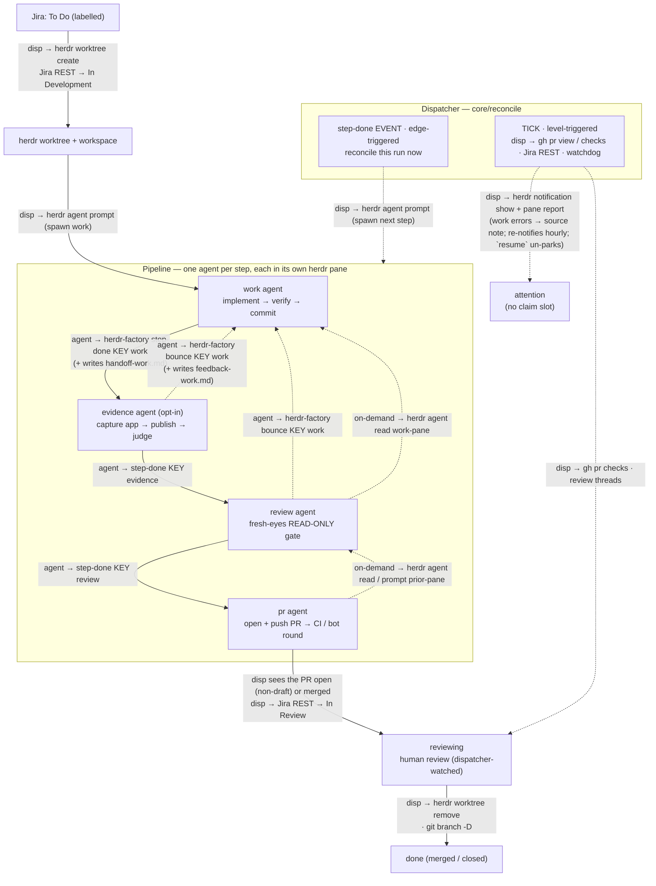

# herdr-factory — Architecture

Autonomous work → PR factory that runs Claude worker agents across one or
more repos, on top of [herdr](https://herdr.dev) worktrees. A single idempotent
reconciler (`reconcileRepo`, looped by the resident **`serve`** daemon — one process
that ticks every configured repo and exposes a local HTTP API), pulls eligible work
from the repo's **work sources**, claims each item onto a **belt** (priority order,
first `match` wins), spins up one herdr worktree + one worker agent per belt step, and —
for a `work_to_pull_request` belt — watches the PR and tears the worktree down on
merge/close. The server is kept alive by a **stateless `ensure-up` supervisor** run on
a schedule (a launchd job on macOS, a systemd `--user` timer on Linux) — see
[§12](#12-server--supervision).

**Work sources** are the pluggable front of the engine (`work_sources`, ≥1 per repo): *where*
work is pulled, with no pipeline attached. Four types ship today — `jira` (poll a board; status
of record lives in Jira), `local_markdown` (a folder of `*.md` briefs; lifecycle tracked
internally in SQLite), `github_issues` (poll a repo's open issues — or, with `kind:
pull_requests`, its open pull requests — by trigger label; status of record lives on GitHub as
labels + open/closed state), and `sentry` (poll a project's issues by a config query — no trigger
label; lifecycle tracked internally in SQLite, and Sentry issues are never mutated for lifecycle).
A source is just a `type` + an optional unique `name` (default = the type) + its backend block.

**Belts** are the pipelines (`belt`, ≥1 per repo): *what* to do with the work. A belt pairs a
`source` with an ordered list of steps and carries the `workspace_name` branch template, a
`priority`, and an optional programmatic `match` predicate (a `.ts` default export
`(ctx) => boolean`, sync or async, with `ctx = { item, source: { name, type } }`; no `match` ⇒
accept all) — at claim time belts are walked in priority order and the first that accepts an
item claims it (**first match wins**). A belt is one ordered `steps[]` list; each step references a
registered **step primitive** by `type`, and the belt's lifecycle is **derived** from what its steps
declare — there is no `belt_type`:

- Five primitives ship (`src/steps/registry.ts`) — **`work`** (implement + commit), **`evidence`**
  (opt-in visual proof; can bounce), **`review`** (read-only gate; can bounce), **`pr`** (open the PR
  + ride CI), and the generic **`custom`** (a user step whose `prompt_file` is the whole body).
- The canonical **`work_to_pull_request`** belt is `steps: [work, evidence, review, pr]`: because its
  `pr` step *produces* a pull request, the belt gets the PR-watch/merge lifecycle (`reviewing` phase,
  resolver) + the `in_review` write-back (see [§7](#7-the-reconciler--multi-agent-pipeline)). A belt
  with no PR-producing step (e.g. all `custom` steps) just runs its steps and ends when the **last**
  signals `step-done` — no PR, no `reviewing`.
- Composition is validated at load: each primitive declares typed `consumes`/`produces`, and a belt
  whose step needs an input nothing upstream (source or an earlier step) produces is rejected — so a
  hand-built belt is as reliable as the shipped one.

A run records its `belt` + active `step`; phases are `claiming | running | waiting_for_human |
reviewing | tearing_down | done | attention` (`waiting_for_human` is the ask-human park,
`attention` the operator park). `repo` and `limits` stay repo-global; everything downstream of
"here is an eligible item" — the worktree, the step gate, the handoff, the watch — is
source-agnostic.

> **Reliability & scale layer.** A six-part hardening for the 50–100
> active-run regime, described inline throughout: **(1)** hard timeouts on every external call +
> a wedged-tick watchdog (`/health` reports per-repo `lastTickAt`/`tickStale`; `ensure-up`
> restarts on staleness — §5, §12); **(2)** herdr-unreachable ≠ pane-dead, with two-strike absence
> confirmation before any respawn (§5, §8); **(3)** a **transition outbox** — source status
> write-backs are persisted intents retried until delivered (a `stale` outcome — the item is gone —
> is delivered too, and flags the run for the run-locked stale policy instead of retrying forever),
> with a claim guard against known-stale eligibility (§6, §7); **(4)** an **attention workflow** —
> `resume` un-parks runs, parked runs stop holding claim slots, escalations write back to the work
> source and re-notify
> (§8, §11); **(5)** parallel Phase A + **per-run locks** + heartbeat-extended locks (§7, §12);
> **(6)** rate limiting — a Jira token bucket + a process-wide GitHub REST budget, both with
> Retry-After-honoring retries, a per-source **rate-limit gate** that holds a source until the
> reset the backend named (the account-wide budget is shared with other hosts), one batched GitHub
> GraphQL query per tick for all watched PRs, a flat human-reply poll cadence, and per-tick claim
> admission (§5, §7). Migrations v10–v13 (v14 added the stale two-phase columns — §15).

This document is the canonical design of the TypeScript implementation
(run directly by Node's built-in type stripping, no build step) backed by SQLite.

---

## 1. Principles

1. **herdr owns the terminal world; herdr-factory orchestrates it.** All
   workspace / worktree / tab / pane / agent lifecycle is performed by the
   `herdr` CLI. herdr-factory never reimplements pane splitting, terminal
   multiplexing, raw `git worktree add`, or spawning `claude` as a bare child
   process. It *does* orchestrate **layout application** — deciding a tab/pane
   plan and issuing the herdr commands that build it — but every split/spawn
   itself is herdr's. See [§4](#4-herdr-ownership-boundary).
2. **SQLite is the single source of truth for runtime state**, designed as the
   data contract for a future web UI — including a rich **event timeline**, not
   just current state. Config is never in SQLite.
3. **The reconciler is pure and testable.** It depends on injected interfaces
   (`Store`, `HerdrClient`, `WorkSource`, …, `now()`), so it runs against fakes
   and an in-memory DB in tests.
4. **Repo-specifics are decoupled into per-repo config**, not code. The engine
   is generic; onboarding a repo is pure data.
5. **Stop/restart safe.** State is on disk (SQLite); every action is idempotent;
   stopping the server never kills in-flight workers (they live in herdr). The DB —
   not the server — is the source of truth, so **the server is a coordinator, not a
   single point of failure**: every CLI command runs in-process when no server is up
   (see [§12](#12-server--supervision)), so a worker's `step-done` lands even mid-restart.

---

## 2. Stack

| Concern | Choice |
|---|---|
| Language / runtime | TypeScript on Node ≥26 (`.node-version` pins the exact build — **vendored** into `<state>/runtime/` in managed installs), run via **native type stripping** (no build step) |
| CLI | **commander** |
| State store | **node:sqlite** (`DatabaseSync` — Node built-in, synchronous; no native module) |
| Config | **`yaml`** + **`zod`** (parse + validate → types) |
| Subprocess (herdr/gh/git) | **`node:child_process`** `execFile` (arg arrays, no shell; **hard timeout on every call** — default 60s, kills the child) |
| Local API server | **Hono** on **`@hono/node-server`** (resident `serve`, 127.0.0.1); **`@hono/zod-openapi`** validates requests + generates the OpenAPI doc, **`@hono/swagger-ui`** at `/ui`; native **`fetch`** clients |
| HTTP (Jira + GitHub REST) | **`clients/http.ts`** — an **Effect**-based pipeline over native `fetch`: interruption-wired timeouts, shared (chainable) token buckets, and `Schedule` retries (exponential + jitter) honoring `Retry-After` |
| Effects / concurrency | **`effect`** — the HTTP retry/rate-limit pipeline, bounded-concurrency Phase A (`Effect.forEach`), and the OpenTelemetry runtime (`@effect/opentelemetry`) |
| Evidence publish | a **publisher seam** (`evidence.publisher`, default `s3`) behind `EvidencePublisher`: **`s3`** — **`@aws-sdk`** (`client-s3` + `lib-storage` multipart; ambient credential chain, no `aws` CLI); **`local`** — copy into the resident server's serve dir; **`command`** — a user executable (`execFile`) that uploads + prints URLs |
| TUI | **`@opentui/core`** (native renderer — Node ≥26 with FFI; the launcher adds the flags) |
| Tests | **vitest** (dev-only) |
| External CLIs | **herdr**, **gh**, **git** (+ **claude**, launched inside herdr panes) |

Runtime dep footprint: `commander`, `yaml`, `zod`, `hono` + `@hono/node-server` +
`@hono/zod-openapi` + `@hono/swagger-ui`, `effect` (+ the OpenTelemetry exporters, `mime-types`,
and the AWS SDK for evidence upload) — all pure-JS. SQLite is Node's built-in `node:sqlite` — the
engine has no native module (`@opentui/core`'s prebuilt native renderer is TUI-only, resolved per
platform by pnpm). Everything else is Node built-ins or the external CLIs; the `.ts` sources run
unbuilt via Node's native type stripping (which is also why the code avoids TS **constructor
parameter properties** — strip-only mode rejects them at runtime even though `tsc` and vitest
accept them). In a managed install Node itself is **vendored**: `install.sh` / the self-updater
download the `.node-version`-pinned build into `<state>/runtime/<ver>` (SHA-256-verified against
`SHASUMS256.txt`) and flip an atomic `current` symlink — no system Node, no version manager.

---

## 3. Layered architecture

```
  launchd / systemd timer ─60s─► ensure-up ──spawns / health-checks──► serve.ts (resident daemon)
  (one job: watchers/service.ts)                                      │  Hono API @127.0.0.1
                                                                      │  + per-repo tick loops
  herdr-factory <cmd> ──► cli/index.ts ──POST /repos/:repo/… (else in-process)─┤
  (--repo · dispatch · --json)        via server/client.ts             │
                            serve + cli both build/inject Deps (build-deps.ts)
                                                                      ▼
        ┌──────────────── core/ (PURE, testable) ────────────────┐
        │  reconcile · watch · step · branch · phases              │
        │  depends only on interfaces ↓↓↓                          │
        └───────┬───────────────────────────────┬─────────────────┘
                ▼                                 ▼
      ┌──── db/ store (SQLite) ─┐       ┌──── clients/ (thin glue) ───────┐
      │ runs · events · locks  │       │ HerdrClient  JiraClient          │
      │ repos · migrations     │       │ GithubIssuesClient GitHubClient  │
      └────────────────────────┘       │ GitClient  exec()                │
                                       └───────────┬──────────────────────┘
                                                    ▼
                                 herdr · gh · git · fetch(Jira + GitHub REST)
```

**Dependency rule:** `core` imports *interfaces*; `cli` **and** `server` construct the concrete
implementations (via `build-deps.ts`) and inject them. The CLI routes mutating commands to a
running `server` and falls back to the same in-process path when none is up (`server/client.ts`).
Tests substitute fakes + `:memory:` SQLite.

### Repo layout

```
herdr-factory/
  package.json  tsconfig.json  README.md  docs/ARCHITECTURE.md  install.sh
  bin/herdr-factory          cwd-robust launcher → `node src/cli/index.ts` (resolves its own dir through
                          symlinks; Node >= 26 — active, else the baked node-path; no args → the TUI)
  bin/herdr-factory-tui      TUI launcher: same Node resolution + --experimental-ffi (opentui's renderer)
  herdr-plugin.toml          herdr plugin manifest — registers the layout hook (worktree.created/workspace.*)
  .node-version              exact Node pin (26.x) — drives the vendored-runtime provisioning
  src/
    cli/index.ts          commander program; routes via server (else in-process), dispatches
    cli/layout-hook.ts    lean herdr-hook entry (worktree/workspace events + the one-shot [[startup]] hook) — kept out of index.ts
    build-deps.ts         buildDeps(repo) — shared by the server + every command's local path
    resolve.ts            pure resolveSourceName / resolveActiveRun (throw, not exit; CLI+server)
    config.ts             env map (repos/<name>/env: loadEnvMap/saveEnvValues) + repos/<name>/config.yml
                          → zod → typed Config (work_sources[] — union assembled from the source
                          registry — + belt[]); listConfiguredRepos + server path/port helpers + the
                          editor JSON Schema
    doctor.ts             the doctor checks: managed / you-provide / per-repo (--deep = live probes).
                          you-provide widens with `--repo`: agentTooling() reads the loaded config
                          for the harnesses a belt starts (layout panes + the resolved agent block),
                          its Cursor --model ids, and the skill names its prompts reference — each
                          check reports "not configured" when the config doesn't ask for it
    types.ts              shared domain types (incl. Phase, WorkState, WorkItem)
    version.ts            VERSION = package version + git HEAD sha (a new commit changes it, so
                          ensure-up restarts an outdated serve — stamped into /health + server.json)
    server/
      serve.ts            resident `serve`: multi-repo tick loops + binds Hono via @hono/node-server
      app.ts              OpenAPIHono: routes → handlers, OpenAPI doc (/doc) + Swagger UI (/ui)
      schemas.ts          zod request/response schemas + createRoute defs (validation + the doc)
      client.ts           CLI side: readServerInfo / pingHealth / serverFetch / viaServerOrLocal
    watchers/
      service.ts          platform dispatch: darwin → launchd.ts · linux → systemd.ts (+ servicePath():
                          the baked PATH the doctor resolves you-provide tools against)
      launchd.ts          the macOS LaunchAgent (com.herdr-factory.server) running `ensure-up`
      systemd.ts          the Linux systemd --user service + timer (herdr-factory.timer)
      supervisor.ts       stateless `ensure-up` / killServer (health-check + detached serve spawn)
      updater.ts          selfUpdate: git fetch + hard-reset to the channel target (HERDR_CHANNEL:
                          main=upstream / stable=newest release tag); dirty-checkout guard (skip +
                          notify); records each attempt to update-status.json for doctor/TUI;
                          re-provisions Node / re-installs deps when .node-version / the lockfile change
      checkouts.ts        per-repo MAIN-checkout sync: fetch + `merge --ff-only` when clean and on
                          the base branch, throttled to 10min/repo; records checkout-sync.json
      provision.ts        vendored-Node download + SHA-256 verify + atomic `current` flip
    db/{index,migrate,store,tx}.ts
    clients/{exec,http,herdr,herdr-socket,jira,jira-source,local-markdown-source,
             github-issues,github-issues-source,github-budget,github,git,sentry,sentry-source}.ts
    sources/registry.ts      the source REGISTRY: one descriptor per type (zod configSchema /
      + sources/<type>/descriptor.ts   resolveConfig / create / secrets manifest / TUI fields) —
                             the single edit surface for adding source N+1 (checklist in its header)
    core/{deps,branch,step,watch,reconcile}.ts
    core/{layout,layout-match,layout-hook}.ts   layout subsystem: tree builder+runner / pure matching / herdr event+startup hooks (§4)
    core/gate-receipts.ts    the `gate` wrapper + the receipt reader: run a verification command, pin
                          its verdict to the commit it ran at, so a later step reads it instead of re-running it
    core/pane-display.ts     display-only pane metadata (what the operator sees on a run's pane) — never a rename
    runtime/effect.ts        the shared Effect ManagedRuntime (also hosts the OTel layer)
    telemetry/…              OpenTelemetry spans/metrics (no-op unless HERDR_FACTORY_TELEMETRY)
    tui/…                    the opentui TUI (Dashboard · Config editor · Doctor)
    prompts/{work,evidence,review,pr}.md + prompts/resolver.md   step-primitive prompts (work.md
                          source-neutral) + the PR-watch resolver (tokenized + source-overridable, rendered by core/watch.ts)
    prompts/jira/work.md + prompts/github_issues/{work,pr}.md   per-source-type overrides
    prompt-packs.ts          the repo-level prompt-resolution chain (repo-checkout ▸ config-folder ▸ shipped);
                          import-free leaf shared by config.ts (load) · core/step.ts (render) · core/watch.ts (resolver)
    steps/registry.ts + steps/<name>/descriptor.ts   the STEP_DESCRIPTORS registry (work/evidence/review/pr/custom)
    products/registry.ts · signals/registry.ts       PRODUCT_CAPABILITIES + SIGNAL_DESCRIPTORS registries
  examples/example-repo/{config.yml, guidelines-prompt.md, match-bugs.ts, prompts/…}
  test/                   vitest
```

Code/config/state live OUTSIDE any repo: the managed code checkout at
`~/.local/share/herdr-factory/` (install.sh + auto-update own it);
`~/.config/herdr-factory/{config.schema.json, repos/<name>/{config.yml, env, guidelines-prompt.md, prompts/}}`;
`~/.local/state/herdr-factory/{herdr-factory.db, runtime/<node>/, node-path, server.json, logs/, <repo>/logs/}`.

---

## 4. herdr ownership boundary

This is a load-bearing principle, not an aside. herdr already implements
worktrees, workspaces, tabs, panes, layouts, and agent lifecycle — **we do not
rebuild any of it.** `HerdrClient` is a *thin typed wrapper*: every method shells
out to `herdr …` and parses its JSON; it contains zero terminal/worktree logic.

**herdr owns (via the CLI — never reimplemented):**

- worktree **create / open / remove** (incl. deleting the checkout dir + git
  worktree registration)
- workspace **close / get / list**
- tab **create / rename / list**
- pane **run / list / read / close / layout / process-info** (+ display-only **report-metadata**)
- agent **start / list / status / prompt / focus / read / wait** — note `agent start` ADOPTS an
  existing pane (herdr 0.7.5): the factory creates the pane, herdr brings the harness up in it and
  blocks until it is ready for input
- pane **list / current** (incl. the `focused` flag — which pane the user is viewing)
- desktop **notifications**

**One exception to "via the CLI": `layout.apply`.** herdr exposes it on its socket API but not its
CLI, and it is what makes a layout build atomic — a whole tab's pane tree (splits, ratios, labels,
cwds, envs) in ONE call that answers with the pane ids. `src/clients/herdr-socket.ts` is a minimal
request/response client (one call per connection, hard timeout, no subscriptions) used for that alone;
everything else still shells out. The boundary is unchanged in substance — herdr still performs every
split and spawn — only the transport differs for this one call.

**Layouts** — the tab/pane arrangement a worktree comes up with — are applied by **herdr-factory
itself** (absorbed from the workspace-manager plugin). It registers as a herdr plugin
(`herdr-plugin.toml`) and handles `worktree.created` / `workspace.created` / `workspace.focused`; on
the event it matches the new worktree's repo root to a repo config, picks the layout (a
factory-claimed worktree uses its owning run's belt and *only* that belt — no layout there means no
layout at all; a hand-created one walks the repo's belts), and
*builds* it: **one `layout.apply` per tab** hands herdr the tab's whole declarative pane tree
(`tabTree` — splits, ratios, labels, cwd, env, and each pane's `command` as ARGV) and gets the created
pane ids back. Applying with a `tab_id` REBUILDS that tab (herdr builds the replacement first, then
closes the old one, and `tab_label` names it — so no follow-up `tab rename`); applying with a
`workspace_id` appends one. The rebuild re-ids the tab, which is safe because layouts are built into a
freshly-created 1-pane worktree before any pane id is recorded, and steps resolve panes by label.
Afterwards, only what a tree can't express: the layout's `setup` command (its script records its own
exit status to a status FILE the runner polls) and then, per pane, its agent
(`agent start --kind --pane`, which blocks until herdr has detected the agent and marked it ready for
input — preceded by polling `pane process-info` until the pane's shell is actually idle, since herdr
refuses a pane that isn't). A failed setup or agent is reported (log + pane token + notification) but
never tears down the built layout; a failed agent reports **herdr's own error code and message**
(`agent_not_ready: … blocked during startup`), which is what distinguishes a harness stuck on a prompt
from a missing binary or a busy pane.

**Before a `claude` agent is started — in a layout pane or a dedicated one — the worktree is marked
trusted in Claude Code's own config** (`core/claude-trust.ts`): `projects[<worktree path>].hasTrustDialogAccepted = true`
in `$CLAUDE_CONFIG_DIR/.claude.json`, else `~/.claude.json`, written by read → set the one key → temp
file → rename, so every other key survives and a config that won't parse is reported rather than
rewritten. Otherwise a fresh worktree can stop `claude` at its folder-trust prompt: herdr never marks
the agent ready, and the step targeting that pane burns its whole layout-wait budget on an agent
nobody is bringing up. Trusting the PARENT (`~/.herdr/worktrees`) is not reliable — one host honoured
it for folders inside it and another did not — so the worktree path itself is trusted, on every start
(a running claude rewrites this file, so the read sits immediately before the write; a lost update
costs one re-trust, not a park). **An AGENT pane never carries the setup command as its process**:
baking it in ends that pane's script with `exec $SHELL -i`, and herdr will not adopt an agent into the
re-exec'd shell — `agent start` accepts the pane, launches nothing and times out, so every step
targeting it burns its layout wait and parks (found end-to-end; `test/e2e/scenarios/layout-setup-on-agent-pane.e2e.ts`).
The runner instead runs setup IN that pane with `pane run` as soon as it exists — through the same
login+interactive shell a pane-process command gets, so an rc-hook toolchain (mise/asdf/nvm) resolves
identically either way, but as a CHILD, never `exec`, so herdr's own shell — the thing `agent start`
attaches to — survives. It is issued without blocking the remaining tabs (a non-blocking setup delayed
nothing when it was the pane's process, and must not start delaying them now), and a pane that never
reaches a prompt is reported as a setup failure rather than left to time out the 10-minute wait for a
status file that will never be written.
The hook is idempotent (a per-checkout-path filesystem claim + a fresh 1-tab/1-pane
guard + a per-workspace "decided" cache) and sits behind a **lean entry** (`src/cli/layout-hook.ts`,
routed by `bin/herdr-factory`) that lazy-loads the heavy graph, so the constantly-firing focus event
stays cheap. The freshness guard is a gate this hook can LOSE: it boots Node, loads config and queries
herdr first, so a pane the engine spawns in-process during the same claim shows up as a second tab and
the guard declines a workspace it should have built (visible only in `herdr plugin log list`). Config
load now guarantees a `default_layout` belt cannot defeat its own guard — its first surviving step must
target a layout pane ([§10](#10-config)) — leaving that failure mode only to a `layout_matching`-only
belt, a hand-built workspace, or a second layout plugin. A one-shot **`[[startup]]` hook** (same lean entry, `--startup`) owns the per-server-session
state hygiene the event path used to pay for on every firing: reaping claims whose worktree vanished
while herdr was down, and clearing the "decided" cache, whose keys are workspace ids the next herdr
server recycles. Modules: `src/core/layout-match.ts` (pure matching), `layout.ts` (tree builder +
runner), `layout-hook.ts` (the event + startup handlers).

**A config that fails to load never settles a workspace.** When the hook can't find the owning repo
AND some repo's config threw while it looked, it returns `no factory repo config for <root> (repo
"<name>" config failed to load: …)` **without** the focus event's `decided` marker, so the next focus
after the fix builds the layout (a plain "no repo owns this" still settles). A
FAILURE (that config-load skip, or a thrown apply error) is recorded per workspace
(`<state>/layout-hook/failed/<workspaceId>`, cleared with `decided/` at `[[startup]]`), and every
other outcome — a build, a deliberate skip — clears it, so only a build that genuinely failed can take
the blame; `lastHookFailure` is what a `layout_wait_timeout` park
quotes. The body after repo resolution is `buildLayoutInto(deps, repo, workspaceId, info)`, which
the reconciler also calls: at each layout-wait window expiry, a run whose workspace has **none** of
its (pruned) layout's tab labels (`herdr.tabLabels`; an empty answer is herdr not answering, not
"nothing built") gets the layout built from the server's own config, after dropping the stale
per-path apply claim — a hook that failed on a broken config fires no new event once it's fixed.
A workspace with any of the layout's tabs is left to the agent-restart retry: a second tab set
would be worse than the wait.

The freshness guard counts only the panes the user or an agent could have opened. A herdr PLUGIN that
adds its own pane to every new tab (`herdr-sidebar`'s `Sidebar`) puts a second pane in every
brand-new workspace, which read as "arranged" and declined **every** layout build on such a host —
the run then waited out its whole `layout_wait_seconds` window. So when `pane_count` isn't 1 the hook
asks herdr for the workspace's actual panes (`pane list --workspace`) and discounts those labelled by
a plugin: `machine.yml`'s `layout_hook.ignore_pane_labels` (host-local, because the installed plugins
are the HOST's; default `[Sidebar]`, matched case-insensitively, `[]` to discount none — §10). One
remaining own pane ⇒ fresh. `tab_count` is still checked raw, and a pane the user opened in a
HAND-created worktree still declines the build (that's the case the guard exists for).

**A factory run's worktree is built even when it isn't fresh.** Its run is waiting on the layout's
panes (`layout_wait`), so a decline there is not "leave the user's arrangement alone" but a run that
parks after `(1 + 3) × layout_wait_seconds` over a file preview someone glanced at in the first
seconds after a claim — and, on a focus event, a `decided` marker that makes the skip permanent. So
when `activeRunForWorktree` finds the owner, a non-fresh workspace gets the layout as a **new tab
set**: `applyLayout` is called with no `rootTabId`, every tab (tab 0 included) is appended with
`workspace_id`, and nothing already there is rebuilt or closed. The `layout_applied` event carries
`detail.appended: true`. The per-path claim still makes it exactly-once, so a restored workspace of a
run whose layout was already built is untouched.

**A factory-owned run builds only the tabs its belt uses.** Layouts are a shared LIBRARY: the same
entry commonly serves several belts and is written for the longest of them, so applying it whole gave
a short belt idle terminals — and idle agents — for steps it never dispatches (a `work`→`pr` belt on a
four-tab ship layout came up with four tabs, two of them running Cursor for nobody). `pruneLayoutToBelt`
(`layout-match.ts`, pure) keeps the tabs whose title some step on the OWNING belt targets, plus the
tabs with work of their own: the one hosting the `setup: true` pane (the setup command runs nowhere
else) and any tab with a pane carrying its own `prompt` (the documented way to put agent work in a
pane no step targets — §4/README). The pruning is deliberately narrow: it applies only where a belt is
actually dispatching (an owned run — a hand-created worktree gets the layout as written), it is a
no-op when the belt targets no layout pane at all, and it never reduces a layout to nothing — a belt
whose `tab` titles match none of the layout's leaves it whole, so the mismatch still surfaces as the
step's own `layout_wait` rather than as an empty build. What was dropped is logged and recorded on the
`layout_applied` event (`detail.prunedTabs`). It is the other half of the rule above that a layout-LESS
belt inherits no neighbour's layout: a belt that *has* one still doesn't build the half it never uses.

A belt step then simply *targets* a resulting pane via its own `tab`/`pane` (from its `steps[]`
entry); that pane declares its own agent (`agent: claude` + `agent_args`) so the build brings one up
there (config-load rejects a step whose target pane starts no agent at all, and a `default_layout`
belt whose FIRST surviving step targets no pane at all — see [§10](#10-config)).
herdr-factory **waits** for a targeted pane to come up (re-arming an expired
`layout_wait_seconds` window a bounded number of times, then escalating to `attention` —
[§8](#8-step-agent-model)) and only spawns a pane itself for steps that have **no** tab/pane
configured — except `evidence`, which never spawns its own: with no tab/pane that step is
skipped entirely (see [§8](#8-step-agent-model)).

**herdr-factory performs git/filesystem ops ONLY for things outside herdr's model:**

- `git branch -D <branch>` on teardown — the one remnant herdr leaves (herdr
  models worktrees, not branches)
- read/maintenance git: `show-ref`, `remote get-url`, `rev-parse HEAD` (the worker
  heartbeat), defensive `worktree prune`
- everything non-terminal: Jira + GitHub REST, GitHub via `gh`, SQLite, config, the
  reconciler logic

If a future need looks like "manage a pane/tab/worktree/agent," it belongs in
`HerdrClient` as another CLI call — not as reimplemented logic.

---

## 5. Clients

Thin, typed wrappers. Types encode the real `herdr --json` shapes
reverse-engineered during the bash prototype.

- **`exec.ts`** — `run(cmd,args,{cwd,allowFail,timeoutMs,env})`, `runJson<T>()` over
  `execFile` (promisified; arg arrays → no shell injection). `env` overrides the child's
  environment (default: inherit the parent's) — used by `doctor` to resolve the you-provide tools
  against the **service's** PATH rather than the checking process's (§11). **Every subprocess is time-bounded**
  (default 60s; herdr worktree ops pass 180s) via execFile's native `timeout` — which actually
  kills the child, unlike a promise race. A timeout throws `ExecTimeoutError` **even under
  `allowFail`**: `allowFail` means "a non-zero exit is expected data"; a timeout is
  infrastructure failure the caller must see. This is the load-bearing guarantee that a hung
  `herdr`/`gh`/`git` can never wedge the tick loop.
- **`http.ts`** — the Effect-based outbound HTTP pipeline for backend clients (Jira + GitHub
  issues). Per-attempt timeouts are interruption-wired (`Effect.tryPromise`'s AbortSignal fires
  on fiber interruption, so `Effect.timeout` genuinely cancels the in-flight fetch); non-2xx
  becomes a typed `HttpStatusError` carrying status + parsed `Retry-After` (`parseRetryAfter`
  also synthesizes the wait from GitHub's `x-ratelimit-remaining`/`x-ratelimit-reset` pair when
  the header is absent) **and the raw `x-ratelimit-remaining`**, so a caller can tell an exhausted
  budget from a merely-throttled or permission-denied 403. `httpWithPolicy` layers shared **`TokenBucket`s** (a token per attempt;
  `HttpPolicy.buckets` chains several — e.g. a per-minute AND a per-hour mutation cap — with the
  wait recorded as `herdr_factory.rate_limit.wait_ms`, and each response's
  `x-ratelimit-remaining` as `herdr_factory.rate_limit.remaining`) and an Effect `Schedule`
  retry — exponential + jitter for 429/5xx/timeout/network, honoring a server-sent `Retry-After`
  (capped 60s, or lower via `HttpPolicy.maxRetryAfterMs` for callers with their own durable
  retry loop) before the schedule's own delay; 4xx fails fast unless the policy's `isRetryable`
  override widens it (GitHub's 403+Retry-After secondary limits). `HttpRequest.redirect:
  "manual"` surfaces 3xx as typed status errors instead of transparently following them —
  load-bearing for the GitHub issue calls (a transferred issue answers 301; default stays
  `"follow"`).
- **`herdr.ts`** —
  - `worktreeCreateOrOpen(repoCwd, branch, baseRef) → {workspaceId, worktreePath, paneId}`
    (parses `.result.workspace.workspace_id` / `.worktree.checkout_path` /
    `.result.root_pane.pane_id`; **only from the main checkout** — herdr refuses
    linked worktrees)
  - `worktreeRemove(workspaceId)` — removes workspace + dir + git registration
  - `agents() → Agent[]` (`.result.agents`; status field is `agent_status` ∈
    `idle|working|done|blocked|unknown`). **Throws `HerdrUnreachableError`** when herdr can't be
    queried — an empty list is a real "no agents", never a masked failure (masking is what used
    to make one herdr hiccup look like mass pane death → duplicate-agent respawns). The result is
    **memoized ~5s** (one `herdr agent list` answers a whole tick's liveness questions instead of
    O(active runs) subprocess spawns); `paneAlive`/`paneState` accept `{fresh:true}` to bypass
    the memo, and `agentStart` invalidates it.
  - `agentStart({workspaceId, cwd, argv, name, kind, env}) → paneId` where
    **`argv = [command, ...flags, prompt]`** (first token is the executable — the configured
    `agent.command`, default `claude`). herdr 0.7.5's `agent start` ADOPTS an existing pane, so this
    is two steps: `tab create` (carrying the cwd + the env that used to ride on `agent start`), then
    `agent start <name> --kind <k> --pane <id>`, which
    blocks until the harness is ready for input — retiring the old "sleep and hope the shell is up"
    guesswork. A failed adoption CLOSES the pane it created and answers null. The kind comes from
    argv[0]'s basename (`agentKindForArgv`) or an explicit `agent.kind`; a harness herdr can't adopt
    (absolute path, wrapper script) is typed into the pane instead (`spawnStrategyForArgv`) — and
    ONLY that typed path carries herdr's `HERDR_AGENT` foreground hint, which names the integration
    when the process tree can't: on the adopt path the same hint makes the pane read as one that
    already hosts an agent, and `agent start` answers `agent_pane_busy: … not an available shell`. The
    harness is the resolved [`agent:` config](../README.md#agent-optional) (step over belt over repo
    over the default `claude --dangerously-skip-permissions`), threaded through `StepConfig.agent`.
  - `agentAdopt(pane, {name, kind, args, timeoutMs}) → ready?` — the same bring-up into a pane that
    already exists: how a LAYOUT pane's `agent:` kind is started during the build. `agentOpenPrompt`
    submits such a pane's optional opening `prompt:` (waiting for the agent to SETTLE only when
    `prompt_timeout_ms` is set — the opposite question from `agentSend`'s "did it start?").
  - `paneAtShellPrompt(pane)` — one `pane process-info` sample of "is this pane's shell idle?", which
    `agent start` requires; the layout runner and the dedicated-spawn path both poll it instead of
    sleeping a fixed guess. The predicate is subtle: a shell sourcing rc files keeps its OWN process
    group, so the pane is only idle once the shell is the single foreground process (`isAtShellPrompt`).
  - **herdr's agent NAME is not a label**: it must match `[a-z][a-z0-9_-]{0,31}` and be unique among
    live agents (`invalid_agent_name` otherwise), so a run's `<step>:<KEY>` can never be one —
    `agentNameFor` derives a legal name and the readable identity is display metadata.
  - `layoutApply({workspaceId, tabId | tabLabel, root}) → {tabId, paneIds}` — a whole tab's pane tree
    in one socket call (see §4); `tabArea(pane)` measures the TAB once (`pane layout`'s `layout.area`)
    so `cells` sizes convert to exact ratios as the tree is walked.
  - `paneByLabel(ws, tabLabel, paneLabel)`, `paneAlive(pane)` (any agent present),
    `paneRun(pane, cmd)`, `paneClose(pane)`, `notify(title, body)`
  - `agentSend(pane, text, {confirm}) → landed?` — `herdr agent prompt` is ATOMIC (it types and
    presses Enter itself; callers must not send their own Enter). Under `confirm` it waits for herdr
    to observe the agent react (`--wait --until working|blocked`) and answers false when the
    submission stalled — i.e. the keystrokes were dropped. That verdict is what keeps a lost prompt
    from looking like a successful dispatch (§8).
    **A stall is not taken at face value.** herdr's state detection is per-harness and not every
    harness flips: `cursor-agent` on Linux takes the prompt and works while herdr keeps reporting the
    pane `idle`, so `--until working` always times out. So a stalled verdict falls back to a
    **progress probe** — herdr's per-pane `revision` (its terminal-content counter, already carried by
    `agent list`) read fresh before and after the submission. A pane whose revision ADVANCED reacted
    to the prompt and the dispatch is confirmed; only a pane that did nothing at all is unconfirmed.
    `revision` is the chosen signal because it costs one extra `agent list` and no new herdr surface,
    where `agent_session` is present for any live agent (so it says nothing about *this* submission)
    and a worktree diff or `pane read` capture answers the same question later and less directly.
    The probe is deliberately optimistic — unrelated pane output can confirm a dispatch that never
    landed — because the two failures are not symmetric: a false confirm starts the step's budget
    clock, which the budget watchdog already backstops by re-prompting, while a false stall re-sends
    the prompt every tick for the whole layout window and buries the agent in duplicate queued
    follow-ups.
  - `reportPaneDisplay(pane, {agentName, title, tokens})` — DISPLAY-ONLY pane metadata
    (`pane report-metadata`), the channel that replaced renaming panes to convey run state. See
    `core/pane-display.ts`: the pane's real `label` stays whatever the layout built (so a step's
    `pane:` target keeps resolving for the pane's whole life) while the operator still sees
    `<step>:<KEY>`, an `⚠ ATTENTION <KEY>` title on a park, and `hf_step`/`hf_key`/`hf_state` tokens
    a user's `[ui.sidebar]` rows and herdr's agent-view queries can render, style and filter on.
    **`hf_step` always names the step that OWNS the pane, never merely the run's current step.**
    `run.paneId` is whichever step *dispatched last*, so a step still waiting for its own layout pane
    has dispatched nowhere — publishing its name on `run.paneId` retagged the PREVIOUS step's
    (finished) pane as the waiting one, while the pane the step was actually waiting for carried no
    tokens at all. Every reconciler write to `run.paneId` therefore goes through `showRunPaneOwner`,
    which resolves the owner from the run's own `run_steps` rows. The run-level posture (`hf_state`)
    still rides on the last active pane: that is a property of the RUN, and it is the pane the
    operator is looking at.
  - `agentFocus(pane)` (bring a pane + its tab to the front) and `focusedPane() →
    {paneId, workspaceId, tabId, label}` (the one globally-focused pane, from `pane list`'s
    `focused` flag — herdr exposes no focus-change event to subscribe to, so it's polled)
- **Work sources** — the polymorphic front of the engine. The core depends only on the
  `WorkSource` interface (in `core/deps.ts`) and the canonical `WorkState` lifecycle
  (`todo → in_development → in_review → merged|aborted|done` — `done` is the custom-belt
  terminal). The interface's doc block is a numbered **charter** (INV-1..11: re-claim
  convergence, idempotent retry-safe transitions, zero-network unmapped states, idempotent
  best-effort materialize, durable idempotent askHuman, marker-based self-authorship, key
  safety, bring-your-own rate limits, durable source names, single-factory claiming,
  canonical-key echo), enforced as a
  parametrized contract suite over every shipped source (`test/work-source-contract.test.ts` —
  §13). Nine methods plus a declarative spec:
  - `readonly spec: WorkSourceSpec` — declared ownership/capabilities: `statusOfRecord`
    (`external` | `internal`), `mappedStates`, `replyChannel` (`comments` | `file`), optional
    `terminalAutomation` note. Consumed by `doctor` and the contract suite ONLY — the
    reconciler never branches on it, so it can't drift into a second state machine.
  - `listEligible() → MatchItem[]` (a bounded batch of todo items, in claim order)
  - `describe(key) → Ticket` (metadata for the manual `claim`; may accept an alternate
    identifier but returns the CANONICAL key — the engine re-checks active-run dedup against
    the returned key before claiming, INV-11)
  - `transition(key, WorkState) → TransitionResult` — `{kind: applied|noop|stale, detail?}`
    replaces the old boolean. `noop` = already at the target, or the state is unmapped for this
    source (**decided with no network call** — `spec.mappedStates`), or the backend's own
    automation won the race; `stale` = the item is gone (deleted/transferred — retrying cannot
    help): the outbox marks the intent delivered and flags the run for the run-locked stale
    policy (§7). A throw means "retry me". **Every EXTERNAL-status source must map its own gone
    responses onto `stale`** — jira and github_issues both map 404/410 (and their
    `askHuman`/`pollHumanReply` throw `StaleItemError`); one that rethrew instead would leave the
    outbox retrying a deleted item until it suspends AND, through the Phase-B claim guard
    on undelivered write-backs, hold that item un-claimable behind it. Callers never invoke this fire-and-forget — the
    reconciler routes every transition through the **outbox** (§7). An optional 4th arg
    (`TransitionContext`) carries the merged PR's number+URL, built by the outbox delivery from the
    run + resolved GitHub repo: an internal-ledger source with an external reply channel (`sentry`)
    uses it to drop a "fixed by PR" note at merge. Every other source ignores it, and it may be
    absent (a retried terminal intent for an ended run), so no source may depend on it.
  - `materialize(key, memDir, log)` (write the work doc + any media; idempotent, best-effort)
  - `workDoc(memDirAbs) → WorkDocInfo` (`{path, kind}` — describes what materialize wrote,
    driving the `@@WORK_DOC@@`/`@@WORK_DOC_KIND@@` prompt tokens; this replaced the per-type
    switch that used to live in `step.ts`. Local-fs-only, never throws; async only because
    `instrumentObject` wraps every client method in an async telemetry proxy)
  - `postNote(key, note)` (source-native operator-facing note — a Jira/GitHub comment / local
    marker file; used when a run parks for a WORK error (`bounce_limit`/`pr_closed`/`work_item_edited` — mechanical
    parks report into the run's pane instead) and for the moot-question closer; **marker-tagged**,
    see below)
  - `askHuman(input)` / `pollHumanReply(input)` (the ask-human park: post a source-native
    question, poll for the reply — a flat 30s cadence per question; a poll throw counts as
    a poll ERROR on the same cadence, escalating after 10 consecutive; both throw
    `StaleItemError` when the item is gone, escalating the run instead of polling a nonexistent
    item forever)
  - `health()` (throws if misconfigured/unreachable — the `doctor` per-source check)
  - `workContent?(key) → WorkContent` (OPTIONAL, `jira`/`github_issues`: the item's editable content
    — `{updated, fields}`, fields keyed by display name: Jira's description + every other ADF
    rich-text field, GitHub's body — for edit detection, `core/work-edits.ts`; see *Operator rework*
    in §7. Status/label/assignee churn must never appear in `fields`)
  Every artifact a source writes to its reply channel carries the exported **marker prefix**
  (`markerPrefix(brand)` — `"[herdr-factory"` by default, `"[hf"` under `source_comments.brand: hf`),
  and reply polling drops marker-bearing comments via `bearsHerdrMarker(body, brand)` — which accepts
  the LEGACY `"[herdr-factory"` prefix too, so artifacts written before a brand switch are still
  recognised as ours — and is
  **blockquote-aware**, so a human quote-reply that embeds the question as `> ` lines still
  counts as a reply (INV-6). Author identity never decides self-authorship: under gh-CLI
  auth the bot login IS the operator's login. The one author filter is the opt-in
  `human_reply.authors` allowlist (jira / github_issues / sentry, `isReplyAuthor` in
  `core/deps.ts`): a non-marker comment from an unlisted author is skipped and reported through
  `HumanPollInput.onIgnored`; the reconciler records it once as `human_reply_ignored` (deduped per
  question + comment id via `Store.ignoredReplyIds`, since every poll re-reads the thread), and
  `explain` counts them.
  A `SourceRuntime` bundles a source's identity (`name`/`type`) with its live `client`;
  `resolveSource` maps a run's `work_source` back to its runtime. `Deps.belts` is the
  priority-ordered `BeltRuntime` list (a belt's resolved config — ordered `steps`, `watchPr` —
  plus its loaded `match` predicate); `resolveBelt` maps a run's `belt` back to its runtime.
- **`sources/registry.ts`** — one `SourceDescriptor` per type: the zod `configSchema` (the full
  `.strict()` source object), `resolveConfig` (snake_case parse → camelCase block), `create`
  (build the live client), the `secrets` manifest, the TUI `defaultBlock`/`fields`, and the optional
  `itemUrl(cfg, key, ghRepo)` — the item's web URL **from config alone, no network**, so the
  dashboard's 3 s status poll can carry it (`local_markdown` omits it: its items have no web page).
  `config.ts` assembles the `work_sources` discriminated union from the descriptors,
  `build-deps` constructs clients via `descriptorFor(type).create(ctx)`, and `doctor`'s secrets
  check + the TUI's type enum / field / credential rows are all descriptor-driven
  (`WorkSourceConfig` is just `{name, type, cfg: unknown}` — `cfg` is opaque to everything but
  the type's own descriptor). The registry header documents the whole **adding-source-N+1
  checklist**: the `WorkSource` impl in `src/clients/`, a descriptor in
  `src/sources/<type>/`, one literal in the `SourceType` union (`src/types.ts`), one
  `SOURCE_DESCRIPTORS` entry, `npm run schema`, and a contract-suite harness — plus optional
  per-type prompt overrides and a `MatchItem` convenience interface + type guard. Zero other
  core edits. Secrets are a raw per-repo **env map** (`loadEnvMap`/`saveEnvValues` in
  `config.ts`, same chmod-600 `repos/<name>/env` file as before): the engine never interprets
  keys — each descriptor's manifest declares what matters (`JIRA_EMAIL` + `JIRA_API_TOKEN`
  required for `jira`; `GITHUB_TOKEN` optional for `github_issues`, falling back to
  `gh auth token`).
- **`jira.ts`** (basic auth over `clients/http.ts`) — the low-level Jira REST client:
  `listEligible()` via the Agile board endpoint `/rest/agile/1.0/board/<id>/issue?jql=…`;
  `getIssue`, `currentStatus`, `transition(key, statusName)` (case-insensitive `.to.name` match,
  no-op if already there), `downloadAttachments` (image/* and video/*, count + per-type size
  capped). **All calls share one `TokenBucket` (5 req/s sustained, burst 10)** and the
  Retry-After-honoring retry policy, with hard timeouts (30s JSON, 120s media). Writes (comment /
  transition POST) retry at most once: a 429 was definitively not processed; a lost 5xx write may
  have landed, and a rare duplicate comment beats a retry storm of writes. **`jira-source.ts`**
  adapts it to `WorkSource`: it holds the configured status map and maps canonical→Jira status —
  `aborted` is always **unmapped**, and `merged`/`done` are unmapped **unless** the source sets the
  optional `status.done` (opt-in: a merged PR then moves the ticket there at teardown). While a
  terminal is unmapped, `transition` answers `noop` **before any network call** and teardown stays
  Jira-silent (its GitHub integration owns closure). `materialize` writes `ticket.json` + attachments. `postNote` is marker-tagged and
  `pollHumanReply` drops **every** marker-bearing comment (questions AND notes — an unmarked
  attention note posted while a question was pending used to poison the reply loop), per INV-6.
- **`local-markdown-source.ts`** — a folder of work items (top-level only; dot-prefixed and
  `__`-prefixed names skipped — `__` marks work still being prepared). Each item is a single `*.md` file **or** a top-level subdirectory holding ≥1 top-level
  `*.md` (only that level is checked; a `<key>.md` file wins a collision with a `<key>/` dir).
  herdr-factory owns the status of record in the `work_items` table (the source is never modified).
  Key = filename stem / dir name; title/type from optional YAML front-matter, else the first H1 /
  humanized name and `"task"` (a directory seeds these from its primary md — `README.md` if present,
  else the first `*.md`). `listEligible` returns items whose `work_items.status` is absent/`todo`
  AND have no active run (a backstop over the run-table dedup); `transition` upserts
  `work_items.status`; `materialize` snapshots a file to `task.md` or copies a directory whole to
  `task/`; `health` stats the folder.
- **`github-issues-source.ts`** (+ **`github-issues.ts`**, **`github-budget.ts`**) — the
  `github_issues` source. GitHub is the **status of record** (spec `external`; `work_items`
  never touched), projected onto the issue: eligible = open + the belt's pickup label (`belt.label`,
  the trigger — passed into `listEligible`) + the configured `kind` + no in-flight state label, listed
  **oldest-first**; `in_development` swaps in its state label then **consumes the trigger label
  last** (a partial swap keeps the item filtered, never double-claimed; re-adding the trigger is the
  retry affordance); `in_review` swaps
  labels; `merged`/`done` strip state labels and close the issue as `completed` per `close_on` —
  the idempotent backstop over the PR's `Fixes #n` auto-close (which only fires on
  default-branch merges and can be disabled repo-wide); it never reopens. `aborted` strips
  in-flight labels, adds the aborted label, and leaves the issue **open** (a visible,
  retriageable failure artifact) unless `close_on.aborted` (then `not_planned`). Every mapped
  transition is an idempotent GET → diff → apply; a human closing the issue pre-merge is a
  cancel signal (→ `stale` — except a `completed` close seen at `in_review`, which is almost
  always `Fixes #n` auto-close racing a fast merge → `noop`; the PR watch owns that signal).
  **`kind: pull_requests`** inverts one membership test — the issues list/GET endpoints already
  serve both, a PR being the payload carrying a `pull_request` key — so an opted-in source claims
  labelled PRs and skips issues, and a default source still skips every PR. Everything above holds
  unchanged for a PR (its comments ARE issue comments, so the claim ledger and the human loop are
  the same endpoints) with ONE asymmetry: **`close_on` never applies to a pull request**. Closing
  or merging one is the operator's, so a terminal transition on a PR only strips state labels, and
  `materialize` writes head/base/draft/`gh pr checkout <n>` bullets in place of the
  `Closing reference: Fixes #n` line (which would be nonsense on the PR itself). `health` also
  stops requiring the repo's issues tab.
  `github-issues.ts` is a raw REST client on the `http.ts` pipeline
  (deliberately NOT the gh CLI — typed statuses are load-bearing) with `redirect: "manual"`: a
  transferred issue answers **301** (which a followed redirect would silently chase into the
  new repo, auth + method preserved — mutating the issue there), a deleted one **410**, an
  inaccessible one **404** — all mapped to `stale`/`StaleItemError` via `classifyGone`. Auth is
  `GITHUB_TOKEN` else the gh CLI's token (`gh auth token`, refreshed once on a 401). The REST base
  is **`GITHUB_API_URL`** in the same per-repo env file (default `https://api.github.com`) —
  GitHub Enterprise Server, and the seam the e2e GitHub fake needs. Deliberately an env key, not a
  config one: the base and the token sent to it travel together. `resolveGithubApiBase` validates
  it at CONSTRUCTION (so a bad value fails at startup, not at the first poll) and accepts `https`
  only, except on loopback — it is the host the credential goes to.
  `github-budget.ts` holds the **process-wide** budget buckets (module singletons — every repo
  runtime spends the same authenticated user's budget): reads 5/s sustained; mutations chain a
  per-minute (~60/min under GitHub's 80/min secondary cap) AND a per-hour (500/hr) bucket. It also
  holds the **call counters** (`rest` = this client, `cli` = the PR watcher's `gh` invocations,
  counted per ATTEMPT via `HttpPolicy.onAttempt` so retries show up): `reconcileRepo` logs the
  delta each pass — `github: N call(s) this tick (R REST, C gh CLI)` — because the 5,000/hr is
  spent per ACCOUNT and an operator chasing an exhausted budget needs to see who is spending it.
  **The rate-limit gate** closes the loop the buckets cannot: the budget is shared across belts,
  repos, hosts and the operator's own `gh`, so it can be gone before any local bucket notices. A
  403/429 that survives the retries and carries `x-ratelimit-remaining: 0` (primary exhaustion) or
  a `Retry-After` (a secondary limit still asking) is mapped to `SourceRateLimitedError` carrying
  the backend's own reset stamp; `noteSourceRateLimited` then **holds the whole source** until that
  reset (`core/rate-limit-gate.ts` — in-memory, like the auth gate, mirrored to the problem
  ledger), and the Phase B poll skips it **without stamping `lastPolledAt`**: the hold *is* the
  cadence, and re-polling an empty budget is what keeps it empty. The hold is extended, never
  shortened, by a later observation; the gate drops itself at the reset; any successful source call
  releases it early. A 403 with budget left and no `Retry-After` is deliberately NOT a limit — that
  is the missing-scope case, and waiting it out would hide it.
  `materialize` renders `task.md` — sanitized title/body + every non-herdr comment + a
  `Closing reference:` line the pr prompt copies into the PR body verbatim — plus the raw
  `issue.json` sidecar and `attachments/` (media downloaded **immediately** from `body_html`'s
  JWT-signed URLs, the only form that resolves on private repos; capped 12 files / 50MB).
  `askHuman` is idempotent per question (it scans for the question marker before posting); the
  reply filter is blockquote-aware with **no author filtering** (gh-CLI shared identity).
  `health()` checks repo reachability, issues enabled, push permission, and that the trigger
  label exists. `repo` is optional (defaults to the PR repo; the descriptor's `create()` throws
  at startup when neither resolves).
- **`sentry-source.ts`** (+ **`sentry.ts`**) — the `sentry` source. Status of record is INTERNAL
  (spec `internal`, the `work_items` ledger, like local_markdown), so Sentry issues are NEVER moved
  for lifecycle — INV-1 convergence is satisfied by the ledger, not by mutating Sentry. Eligibility
  is a config filter (organization + projects + environment + a Sentry search `query`) with NO
  pickup label, so a `sentry` belt sets no `label` and belts route by `match`/priority. Reply
  channel is `comments` (Sentry issue notes — a stable-in-practice but `publish_status=PRIVATE`
  endpoint). The one optional Sentry-side write is a config-driven `on_merge` note/resolve at teardown
  (comment | resolve | resolve_in_next_release | none), which consumes the merged PR's number+URL via
  the `TransitionContext` 4th arg to `transition` and is best-effort (a Sentry hiccup never wedges the
  ledger transition). `sentry.ts` is a raw **Bearer-token** REST client on the `http.ts` pipeline —
  NO OAuth; the token (`SENTRY_AUTH_TOKEN`, an Internal-Integration or personal token with
  `event:read`+`event:write`) is read from the repo env. A 401/403 maps to
  `SourceUnauthenticatedError` (the auth gate pauses + auto-resumes the source), a 404/410 to
  `stale`/`StaleItemError`. `materialize` renders the issue + its latest event's
  stacktrace/breadcrumbs/request as `task.md` (+ the raw `issue.json` sidecar). `describe` accepts a
  numeric id or a shortId (returns the canonical numeric id, INV-11); `health()` probes the org + each
  configured project. Sentry rate-limits REST polling, so the client's token bucket is conservative
  and a `sentry` source should carry a higher `poll_interval_seconds`. **Release regression reopen:**
  `materialize` records the release the issue was last seen on into the ledger
  (`work_items.last_release`). A later poll REOPENS a terminal item (merged/done → reset to `todo`,
  the row is updated in place, never deleted) when the same issue recurs on a *different* release
  than the one it was fixed on — "we thought we fixed it, but a later release still hits it." The
  release comes from the issue-detail payload (the LIST endpoint omits it), so for a Sentry-flagged
  regression the source spends one bounded detail fetch (`MAX_REGRESSION_PROBES_PER_POLL`, overflow
  retried next poll); a `regressed` issue with no recorded baseline is reopened on Sentry's flag alone.
- **`github.ts`** (`gh` via execFile) — `prForBranch(repo, branch)` (first-sighting discovery
  only), `prByNumber(repo, n)` (the durable identity once adopted — survives head-branch deletion
  on merge; both it and the batched query carry `headRefOid`, which the ready-to-merge watch keys
  its once-per-head mark on, and `mergeable` / `mergeStateStatus`; the batched query also reads the
  base's `branchProtectionRule.requiresStrictStatusChecks` as `strictBase` — null, i.e. no classic
  rule or no permission to read it, is non-strict), `reviewSignature(repo, n) → {unresolved, failing, pending, sig}` (graphql review threads +
  `statusCheckRollup`; `pending` counts checks that have NOT concluded — a CheckRun with a null
  conclusion, a PENDING/EXPECTED StatusContext — and is deliberately **outside** the hash, so a
  check merely finishing is not a new review round for the resolver), and **`prSnapshots(repo, numbers[]) → Map<number, PrSnapshot>`** — one
  aliased GraphQL query (chunked at 25) resolving state + review threads + check rollup for
  **every watched PR in a tick**, replacing 3 `gh` subprocess calls per reviewing run per tick
  (~9k req/h at 50 runs — over the REST budget on its own). Its signature hash is bit-identical
  to `reviewSignature`'s, so batched and per-run polling mix freely.
- **`git.ts`** — `branchExists`, `branchDelete`, `branchRename`, `currentBranch` (what the worktree
  is checked out on — the run's branch is tracked from it), `remoteBranchExists` (local-only: was
  this branch ever pushed), `originUrl`, `worktreePrune`, `headSha` (the worker progress heartbeat),
  `fetchRef` (the only NETWORK git call: refresh the base ref before a worktree is cut from it —
  30s budget, `GIT_TERMINAL_PROMPT=0` so a missing credential fails instead of hanging, and it
  answers false rather than throwing), `refAge` (the tip's relative date, for the stale-base warning).

---

## 6. State — SQLite (node:sqlite)

One global DB `~/.local/state/herdr-factory/herdr-factory.db`, via Node's built-in `node:sqlite`
(`DatabaseSync` — synchronous, no native module; still flagged *experimental*, which the pinned
Node keeps stable for us). `db/index.ts` sets `PRAGMA journal_mode=WAL; PRAGMA busy_timeout=5000;`
then runs migrations (`schema_version` + ordered SQL). `node:sqlite` has no `.transaction()` /
`.pragma()` helper (unlike better-sqlite3), so a small `db/tx.ts` wraps `BEGIN IMMEDIATE`/`COMMIT`/
`ROLLBACK` (used by migrations and `acquireLock`) and PRAGMAs run via `exec`. Per-repo ticks write
concurrently to the one DB; WAL + busy_timeout + the per-repo single-instance lock keep that safe.

```sql
CREATE TABLE repos(name TEXT PRIMARY KEY, repo_path TEXT, base_ref TEXT, github TEXT,
  last_tick_at INTEGER, enabled INTEGER DEFAULT 1,
  claim_deferrals INTEGER NOT NULL DEFAULT 0);  -- consecutive ticks Phase B gave up on `machine:claim` (v40)

CREATE TABLE runs(                       -- ONE attempt at a work item (history kept)
  id INTEGER PRIMARY KEY AUTOINCREMENT, repo TEXT NOT NULL,
  work_source TEXT,                      -- which configured source it was claimed from (v6)
  belt TEXT, step TEXT,                  -- which belt processes it + the active step (v7)
  ticket_key TEXT NOT NULL,
  summary TEXT, issue_type TEXT, phase TEXT NOT NULL,
  worktree_name TEXT,                    -- the name the worktree/workspace was CREATED under (v38):
                                         -- the rendered `workspace_name`, frozen — the run's identity
  branch TEXT,                           -- the branch the worktree is on NOW — tracked, not identity:
                                         -- an agent may rename it to the repo's convention (§7)
  workspace_id TEXT, pane_id TEXT, worktree_path TEXT,
  -- PR-WATCH STATE IS NOT HERE: pr_number / resolver_active (a reviewing run holds a slot only
  -- while resolving — v17, replaced watch_deadline) / last_thread_sig moved to run_products in
  -- v18, keyed by product, so a future plugin watch-product carries its own. `Run.prNumber` &c.
  -- still read the same because store.ts joins them back; a raw SQL reader must join
  -- run_products ON run_id AND product = 'pull_request'.
  focus_pending INTEGER NOT NULL DEFAULT 0, -- active step changed; focus shift deferred (v5)
  -- worker_done/review_done/review_pane/progress_* (migrations v2-v3) are superseded
  -- by run_steps and left in place for history only.
  attention_reason TEXT,
  attention_reason_code TEXT,            -- MACHINE reason of the latest attention park (step_budget /
                                         -- layout_wait_timeout / bounce_limit / …) — the key that
                                         -- routes a park to its rescue class (step-done rescue /
                                         -- bounded respawn / human-only). First-class since v28
                                         -- (was JSON-parsed back out of the events log); written by
                                         -- escalateAttention, backfilled from events, event-log
                                         -- fallback kept for one release (old-code drain window).
  attention_notified_at INTEGER,         -- last operator notification for a parked run (v12)
  outcome TEXT,                          -- merged|closed|abandoned|timeout|completed|NULL
  created_at INTEGER, updated_at INTEGER, ended_at INTEGER);
CREATE INDEX idx_runs_active ON runs(repo) WHERE ended_at IS NULL;
CREATE UNIQUE INDEX idx_runs_active_ticket ON runs(repo, work_source, ticket_key)
  WHERE ended_at IS NULL;                -- ONE active run per item — the claim-race arbiter (v25)

CREATE TABLE run_steps(                  -- one row per pipeline agent (migration v4)
  id INTEGER PRIMARY KEY AUTOINCREMENT, run_id INTEGER NOT NULL,
  step TEXT NOT NULL,                    -- belt step name (work/evidence/review/pr/custom)
  pane_id TEXT, session_id TEXT,         -- on-demand cross-agent query handles
                                         -- NO watch clocks here: the heartbeat's progress signature
                                         -- and the read-only enforcement baseline live in
                                         -- watch_state (v34), keyed (run, step, watch). The frozen
                                         -- progress_*/baseline_* columns dropped in v35.
                                         -- started_at below is NOT a budget clock — it is the
                                         -- layout-wait window + dispatch bookkeeping; the budget
                                         -- window is watch_state('budget'), armed at dispatch.
  done INTEGER NOT NULL DEFAULT 0, started_at INTEGER, done_at INTEGER,
  bounces INTEGER NOT NULL DEFAULT 0,    -- SUPERSEDED (with capture_attempts) by guard_counters (v21),
  absent_at INTEGER,                     -- left unread. absent_at: pane first CONFIRMED absent (v10)
  pass INTEGER NOT NULL DEFAULT 1,       -- which ENTRY into the step this state belongs to (v23):
                                         -- 1 on first entry, +1 per re-entry (bounce rewind /
                                         -- forward re-advance); crash respawns + human resumes
                                         -- CONTINUE a pass. Stamped into the pass's prompt commands
                                         -- (--pass N) so stale signals are rejectable.
  dispatched_at INTEGER);                -- when THIS pass's prompt reached an agent; null = the
CREATE UNIQUE INDEX idx_run_steps ON run_steps(run_id, step);   -- pass still needs its dispatch (v24).
                                         -- UNIQUE since v25: exactly one row per (run, step) — the
                                         -- atomic ON CONFLICT upsert's target (markStepDone runs
                                         -- outside the run lock, so the DB must referee racers).
                                         -- pane_id can't carry this (it's KEPT across re-entries as
                                         -- the reuse handle), so the spawn branch keys on this —
                                         -- an undispatched pass retries under the bounded layout
                                         -- wait instead of tripping the budget watchdog.

CREATE TABLE gate_receipts(              -- one verification command, pinned to the commit it ran at (v39)
  id INTEGER PRIMARY KEY AUTOINCREMENT,
  run_id INTEGER NOT NULL REFERENCES runs(id) ON DELETE CASCADE,
  step TEXT NOT NULL, pass INTEGER NOT NULL DEFAULT 1,   -- ATTRIBUTION only (see the UNIQUE below):
                                         -- which step/pass paid for it — what gateShellMs sums for
                                         -- the step_timing export.
  gate TEXT NOT NULL,                    -- the agent's key for the check: test / typecheck / lint
  command TEXT NOT NULL, head TEXT NOT NULL,             -- what ran, and the worktree HEAD it ran at
  exit_code INTEGER NOT NULL, duration_ms INTEGER NOT NULL,
  tail TEXT, ran_at INTEGER NOT NULL);   -- last ~40 lines of combined output (not a log store)
CREATE UNIQUE INDEX idx_gate_receipts ON gate_receipts(run_id, gate, head);
                                         -- the SHA is what makes a receipt trustworthy, so it is
                                         -- part of the IDENTITY: two steps running the same gate at
                                         -- the same commit are the same fact, and the second write
                                         -- supersedes the first rather than accumulating.

CREATE TABLE guard_counters(             -- capped-guard counters keyed (run, step, guard) (v21) —
  run_id INTEGER NOT NULL REFERENCES runs(id), step TEXT NOT NULL, guard TEXT NOT NULL,
  count INTEGER NOT NULL DEFAULT 0, updated_at INTEGER NOT NULL,   -- 'bounce_cap' (on the target step)
  PRIMARY KEY(run_id, step, guard));     -- + 'capture_cap' + 'layout_wait' (the bounded respawn
                                         -- budget); capped guards on a step don't collide

CREATE TABLE events(                     -- the timeline (web-UI gold)
  id INTEGER PRIMARY KEY AUTOINCREMENT, run_id INTEGER, repo TEXT, ticket_key TEXT,
  ts INTEGER NOT NULL, type TEXT NOT NULL, detail TEXT);  -- detail = JSON
CREATE INDEX idx_events_run ON events(run_id, ts);

CREATE TABLE work_items(                 -- internal lifecycle ledger for sources with no
  id INTEGER PRIMARY KEY AUTOINCREMENT,  -- external status of record (local_markdown). (v6)
  repo TEXT NOT NULL, source TEXT NOT NULL, key TEXT NOT NULL,
  title TEXT, item_type TEXT, path TEXT,
  status TEXT NOT NULL CHECK (status IN                    -- 'done' added v7 (custom terminal)
    ('todo','in_development','in_review','merged','aborted','done')),
  created_at INTEGER NOT NULL, updated_at INTEGER NOT NULL, UNIQUE(repo, source, key));
CREATE INDEX idx_work_items ON work_items(repo, source, status);

CREATE TABLE human_questions(            -- ask-human park: one pending question per run (v8).
                                         -- DOMAIN row only since v32 — the poll SCHEDULING (clock,
                                         -- miss cadence, error escalation) lives on the intent
                                         -- ledger (kind `human_reply_poll`, one waiting row per
                                         -- pending question; the store's methods OVERLAY it onto
                                         -- this shape, and createHumanQuestion arms the row). The
                                         -- old poll_attempts/poll_errors/next_poll_at columns
                                         -- dropped in v35 — the ledger is the clock's only home.
  id INTEGER PRIMARY KEY AUTOINCREMENT, run_id INTEGER NOT NULL REFERENCES runs(id),
  repo TEXT NOT NULL, work_source TEXT NOT NULL, ticket_key TEXT NOT NULL, step TEXT,
  question TEXT NOT NULL, status TEXT NOT NULL CHECK (status IN   -- 'abandoned' added v41 (rebuild):
    ('pending','answered','abandoned')),                   -- Store.endRun closes a run's pending question
  external_id TEXT, external_created_at TEXT,              -- the source-native object (Jira/GitHub comment)
  answer TEXT, answer_external_id TEXT, answer_author TEXT,
  created_at INTEGER NOT NULL, updated_at INTEGER NOT NULL, answered_at INTEGER);
CREATE UNIQUE INDEX idx_human_questions_one_pending_run ON human_questions(run_id) WHERE status='pending';

-- DROPPED in v35 (the contract phase of the v29-v34 cutovers): pending_signals (v22),
-- transition_outbox (v11) and evidence_uploads (v16) — the three outbox-shaped tables that each
-- re-typed the same scheduling spine. v31/v33/v30 converted their live rows onto the ledger as
-- agent_signal / source_transition / evidence_publish; the tables stayed one release as
-- drain-window shims (unions, lazy drains) for rows a still-draining old-code process could
-- write, then went. Their per-kind policy lives in src/intents/kinds/, not in columns.

CREATE TABLE intents(                    -- the INTENT LEDGER (v29): one durable-intent substrate for
  id INTEGER PRIMARY KEY AUTOINCREMENT,  -- the deliver lane. A row is an obligation the engine owes
  repo TEXT NOT NULL, kind TEXT NOT NULL,-- the world, retried/watched until it resolves; behavior
  scope TEXT NOT NULL,                   -- lives in the INTENT_KINDS registry (src/intents/) — the
  run_id INTEGER REFERENCES runs(id),    -- kernel (src/core/ledger.ts) dispatches on it, never on a
  ticket_key TEXT,                       -- kind name. `scope` is the dedup+ordering domain
  dedup_key TEXT NOT NULL DEFAULT '',    -- ('run:<id>' | 'repo'); UNIQUE(kind, scope, dedup_key)
  seq INTEGER NOT NULL DEFAULT 0,        -- makes enqueue idempotent (re-open keeps `seq`, the FIFO
  payload TEXT NOT NULL DEFAULT '{}',    -- slot). Kinds declare ordering (fifo | latest-wins |
  state TEXT NOT NULL DEFAULT '{}',      -- independent), delivery + run reactions.
  status TEXT NOT NULL DEFAULT 'pending' -- 'waiting' rows are the EXTERNAL-TRIGGER capability:
    CHECK (status IN ('pending','waiting','delivered','superseded','failed','abandoned')),
  attempts INTEGER NOT NULL DEFAULT 0, next_attempt_at INTEGER NOT NULL DEFAULT 0,
  suspended_at INTEGER,                  -- v36: stamped at MAX_RETRY_ATTEMPTS (10) failed attempts.
                                         -- Still 'pending' (the obligation stands: claim veto +
                                         -- FIFO hold) but excluded from every due walk until an
                                         -- operator (retry-now / `s`) or a cause-recovery probe
                                         -- clears it and resets `attempts`.
  lease_until INTEGER,                   -- an inline (CLI) attempt's claim vs the Phase-0 flush
  deadline_at INTEGER,                   -- waiting rows escalate via a handoff when it passes
  last_error TEXT, error_class TEXT CHECK (error_class IN ('auth','transient','permanent','stale')),
  cause_scope TEXT,                      -- cause-scoped due-now requeues ('source:<n>'|'publisher:s3')
  notified_at INTEGER,                   -- per-row operator-notify throttle (the one config knob)
  handoff_at INTEGER, handoff_marker TEXT, -- the two-phase handoff, generalized from the stale
  consumed_at INTEGER, consumed_result TEXT, -- pattern: the LOCK-FREE kernel stamps; the run-locked
  created_at INTEGER NOT NULL, updated_at INTEGER NOT NULL, -- Phase A consumes exactly once.
  resolved_at INTEGER,
  UNIQUE(kind, scope, dedup_key));

CREATE TABLE watch_state(                -- per-watch clocks/signatures (v34): one row per
  run_id INTEGER NOT NULL REFERENCES runs(id), -- (run, step, watch) for the harness-evaluated
  step TEXT NOT NULL, watch TEXT NOT NULL,     -- watches (core/watches.ts). budget: based_at = the
  sig TEXT, based_at INTEGER,            -- window's base (re-based at entry/dispatch/resume per
  meta TEXT NOT NULL DEFAULT '{}',       -- GuardSpec.rebaseOn); heartbeat: sig/based_at = last-seen
  updated_at INTEGER NOT NULL,           -- HEAD + when; read_only: sig = the baseline, based_at =
  PRIMARY KEY (run_id, step, watch));    -- the freeze marker; pr_green (step 'pull_request'):
                                         -- sig = the head that is green now (cleared when it stops
                                         -- being green), meta.toldHead = the head the operator was told
                                         -- about (kept across a flicker; a new head is a new
                                         -- green). A plugin watch stores state without a
                                         -- migration. Re-bases WRITE NULL ROWS, never delete — the
                                         -- legacy run_steps-column fallback (one release) must not
                                         -- resurrect a cleared clock. run_steps.started_at remains
                                         -- PASS bookkeeping (the layout-wait window + per-attempt
                                         -- dispatch clock), distinct from the budget watch's clock.

CREATE TABLE problems(                   -- the PROBLEM LEDGER (v37): currently-OPEN mechanical
  repo TEXT NOT NULL, key TEXT NOT NULL, -- problems, recorded by the machinery that observes them
  kind TEXT NOT NULL, detail TEXT NOT NULL, -- (auth gate, auth-classed delivery failures, the
  created_at INTEGER NOT NULL,           -- evidence creds probe) and cleared by the same machinery
  updated_at INTEGER NOT NULL,           -- on recovery. `key` = the CAUSE ('source:<n>',
  PRIMARY KEY (repo, key));              -- 'publisher:<type>'); the dashboard's red light only
                                         -- reads rows — it never re-checks a cause on load (§7).

CREATE TABLE locks(name TEXT PRIMARY KEY, owner TEXT, acquired_at INTEGER, expires_at INTEGER);
CREATE TABLE schema_version(version INTEGER);
```

**The intent ledger** (v29) is the deliver-lane substrate the legacy outbox tables migrate onto,
kind by kind, leaf-first (evidence uploads → agent signals → the human-question loop →
source transitions LAST, because they gate claiming) — each cutover converts in-flight rows in its
migration and keeps a dual-read for one release. The kernel is two halves split on the codebase's
lock-free/run-locked line: `ledgerFlow` (an `OutboxFlow` beside the legacy flushes — kind
pre-passes, the deadline sweep for `waiting` rows, then the due walk with the per-scope FIFO gate
checked against the DB) and `consumeIntentHandoffs` (top of each run's Phase-A pass — each owed
handoff consumed exactly once via the kind's `consume()`, whose verdict, including any attention
escalation, the reconciler applies; kinds never park runs themselves). `status='waiting'` +
`POST /repos/:repo/intents/:id/fulfil` is the genuinely new capability: a first-class "wait for an
external trigger" (webhook, CI callback, remote approval) with deadline escalation — shipped as the
`external_wait` kind, the only externally-enqueuable one (hand-made engine-owned intents would
bypass the reconciler's ordering/monotonicity rules).

`db/store.ts` (synchronous): `countActive(repo)` / `countOccupying(repo)` (active minus parked —
what the claim cap counts) / `countOccupyingBySource(repo)` (the same posture grouped by
`work_source` — the per-source `max_active_workspaces` accounting), `activeRuns(repo)`, `activeRunForTicket(repo,source,key)` (the
Phase-B dedup, **source-scoped** so two sources can carry the same key), `activeRunsForKey(repo,key)`
(key-only, across sources — for the manual CLI; the caller errors on >1 match),
`createRun({…,workSource,belt})`, `updateRun(id,patch)`, `endRun(id,outcome)`, `recordEvent(…)`,
locks: `acquireLock/extendLock/releaseLock` (extend = the heartbeat; owner-checked),
`upsertRepo`, `touchTick`/`lastTickAt` (the wedged-tick watchdog signal), the run-step rows
(`getRunStep`/`upsertRunStep`/`markStepDone`, the generalized guard counters
`bumpGuardCounter`/`guardCounter`/`resetGuardCounter`), the transition outbox
(`enqueueTransition`, `dueTransitions`, `undeliveredTransitionBefore` — in-order-per-run guard,
`markTransitionDelivered`, `recordTransitionAttempt` — flat 30s retry, suspending at 10 attempts,
`pendingTransitionForKey` — the claim guard, and the stale two-phase:
`markTransitionStale`/`unhandledStaleIntentForRun`/`markTransitionStaleHandled`), the
**evidence-upload outbox** (`enqueueEvidenceUpload`, `dueEvidenceUploads` — `next_attempt_at`-leased
so the CLI's inline attempt and the Phase-0 flush never double-claim a row, `recordEvidenceAttempt`
— flat retry + `error_kind`, `markEvidenceDelivered`/`markEvidencePermanentFailed`,
`undeliveredEvidenceUploadsForRun`), the human
questions (`createHumanQuestion`/`pendingHumanQuestionForRun`/`answerHumanQuestion`/
`recordHumanPollMiss`/`recordHumanPollError`), the **pending agent signals**
(`enqueuePendingSignal` — supersedes any unconsumed intent for the run, `unconsumedPendingSignalForRun`,
`markPendingSignalConsumed`, `getPendingSignal`),
the **problem ledger** (`reportProblem`/`clearProblem`/`listProblems` — v37, §7),
and the `work_items` ledger: `getWorkItem`, `listWorkItems(repo,source,status?)`,
`setWorkItemStatus(repo,source,key,status,meta?)` (idempotent, tolerant any→any, returns false
if already there).

**Migration v6** adds `runs.work_source` (nullable — an unresolvable source must surface loudly,
not be masked by a default) and backfills existing rows to `'jira'` in the same transaction, then
creates `work_items`. Because the only pre-existing source was Jira, in-flight runs survive the
upgrade **iff the configured Jira source keeps the default name `jira`** (see §10/§14). `runs`
stays the dedup source of truth; `work_items.status` is the best-effort lifecycle label that gates
which markdown files are eligible.

**Active = `ended_at IS NULL`; the concurrency cap counts `countOccupying`** — active runs whose
phase is NOT `attention`/`waiting_for_human`. Parked runs keep `ended_at` NULL (they hold their
worktree, stay deduped, and still poll for a PR merge) but **no longer hold a claim slot**: a
pile of runs waiting on humans must not starve the belt of new claims. History is never deleted
(we set `ended_at`), so the web UI can show attempts, outcomes, and durations.

**event types** (the `EventType` union in `src/types.ts`): `claimed · claimed_elsewhere · transition · worktree_created ·
layout_applied · layout_apply_failed · step_spawned · step_done · step_done_refused · layout_wait_retry · pane_relaunched · idle_nudge · bounced · rework ·
signal_queued · signal_rejected · capture_attempt · evidence_uploaded · evidence_upload_failed ·
stale · intent_suspended · intent_fulfilled · intent_deadline · human_question · human_question_moot · human_reply · human_reply_ignored · focus_applied ·
pr_opened · resolver_woken · pr_green · torn_down · branch_changed · belt_reassigned · belt_deleted · attention · dev_server_stopped · resumed ·
error`. **`merged` and `closed` are declared but never recorded** — a merge appears as
`transition {to:"merged"}` followed by `torn_down {outcome:"merged"}`, which is what a reader should
match on (the e2e suite asserts exactly that).
(plus legacy `worker_*` / `review_*` kept for old-run history). `belt_reassigned` / `belt_deleted`
are repo-scoped (run-id-less) audit events from the belt rename/delete admin (§9).

---

## 7. The reconciler — multi-agent pipeline

`core/reconcile.ts` → `reconcileRepo(deps)`: **Phase 0** flushes the **transition outbox** —
every due, undelivered source status write-back is retried (in per-run id order, stopping a
run's chain at its first failure), so write-backs converge even at capacity and for
already-ended runs. Delivery is **lock-free**: `applied`/`noop` mark the intent delivered; a
**`stale`** result (the item is gone at the source) also marks it delivered but only *stamps*
`stale_at` + records a `stale` event — the run itself is never mutated here (that would race the
run-locked step machinery; ended/tearing-down runs are closed out silently on the spot). The
run-locked half consumes an unhandled stale intent **exactly once** at the top of each run's
Phase-A pass (`stale_handled_at`): an `in_development` stale — the claim write-back found the
item deleted/closed, i.e. "don't do this work" — aborts the run promptly; a mid-flight stale
(e.g. `in_review` — a PR may be up) parks it for `attention` with **no source note** (the item
the note would go to is what's gone). Phase 0 then walks the **intent ledger** (`ledgerFlow`, the
generic kernel — same due/retry/lease machinery), whose `evidence_publish` kind carries the
evidence media: every undelivered evidence upload is
retried through the run's `EvidencePublisher` (`s3`|`local`|`command`, selected from
`evidence.publisher`) until the backend accepts it, so an AWS SSO session expiring mid-run — or any
transient backend outage — no longer ships a PR with broken evidence links (the `evidence-upload`
CLI publishes the URLs + attempts inline up-front, then enqueues the bytes here). **Background
mode** (issue #90): a `command` publisher that declares `public_base_url` has predictable URLs, so
`evidence-upload` enqueues, prints them, spawns a detached `evidence-deliver <intentId>` child and
returns at once — the agent is not held by a minutes-long upload. The child OWNS the row through the
enqueue lease (sized `max(EVIDENCE_PUBLISH_LEASE_SECONDS, timeout_seconds + 60)`, so the flush never
double-delivers) and runs `deliverIntentNow` (`core/ledger.ts` — the kernel's own deliver + outcome
bookkeeping, so a success records `evidence_uploaded` and a failure clears the lease onto the normal
retry clock). A child that never starts or dies just lets the lease lapse; the flush takes over. It
runs outside the tick on purpose: a Phase-0 delivery blocks the repo's whole pass for its duration.
**The evidence gate** (`holdForEvidenceUpload`, `reconcile.ts`) closes the loop: the advance INTO a
PR-opening step (`opensPr`) reads the run's LATEST `evidence_publish` row — none or `delivered` →
advance; `pending` → hold (checked before any of the advance's side effects, so it re-runs cleanly
each pass while the steps before it have already finished); `failed`, or `pending` but SUSPENDED →
park `evidence_upload_failed` instead of shipping dead links. The kind declares
`refundOnResume: "due_now"`, so a `resume` after the operator fixes the publisher clears the
suspension and the gate holds for the fresh attempt. The kind is
publisher-agnostic: it drives `publisher.publish` / `publisher.classifyError`, and the creds probe
is gated on the publisher exposing `probeLiveness` — only `s3` does, so `local`/`command` (no `auth`
kind, never auth-stuck) skip it entirely. For `s3`, the prePass probe does two jobs: PROACTIVE
detection every `EVIDENCE_PROBE_INTERVAL_SECONDS` (300) — an expired session is recorded on the
problem ledger (below) before any upload fails, so the dashboard's red light needs no failed upload
and no probing of its own — and the SSO auto-resume, probing every pass while a row is auth-stuck:
the moment creds are live again it clears the problem and resets every auth-stuck row due-now —
clearing any suspension, with a fresh attempt window (`requeueIntentsByCause` on `publisher:<type>`,
mirroring `retryTransitionsForSource`) — so the same pass uploads it: no manual retry, no waiting.
A probe THROW is unknown (a network blip is not "creds down"): nothing is recorded or cleared.

**The problem ledger** (v37, the `problems` table) is the generic RECORD of currently-open
mechanical problems, written by the machinery that observes them and cleared by the same machinery
on recovery — the dashboard's red repo light (`/status.problems`) only reads it, it never re-checks
a cause on load. One row per (repo, `key`) where `key` is the CAUSE identity (matching the intent
`cause_scope` vocabulary: `source:<name>`, `publisher:<type>`, anything a future reporter picks);
`reportProblem` upserts (keeping first-observed `created_at`), `clearProblem` deletes. Reporters
today: the **auth gate** (`noteSourceAuthFailure` reports `source:<n>`; `noteSourceAuthRecovered`
clears it UNCONDITIONALLY — the in-memory gate resets on restart, so it alone cannot be trusted to
clear a persisted row); the **rate-limit gate** (`source:<n>:rate-limit`, kind `rate_limit` — a
distinct key so a backoff can never clear, or be cleared by, an auth problem; it is also how the
out-of-process `status`/`explain` commands see a hold that lives in the serve process's memory);
the **ledger kernel** (an `auth`-classified retry outcome reports the row's
`cause_scope`, a delivery clears it); the **evidence prePass probe** (above); the **config gate**
(key `config`, kind `config` — Phase B, below); and the server's
detail-view probes (`?refresh=1`), which write their fresh verdicts to the same keys so opening the
detail syncs the row's light at once. `/status`'s `problems` array is this ledger plus two derived
entries (runs parked for attention, suspended intents — already recorded state in their own tables).

**Suspension** (v36) is the retry policy's cap: every retrying intent runs on a **flat 30s
interval** (`RETRY_INTERVAL_SECONDS`) and, at **`MAX_RETRY_ATTEMPTS` (10) failed attempts**, stamps
`suspended_at` (the choke point is `recordIntentAttempt` — every mechanism funnels through it; only
`pending` rows suspend, `waiting` rows escalate through their own run-locked policy). A suspended row
stops being due — no more retries, no log churn — but stays `pending`: it keeps vetoing a re-claim of
its item and keeps holding its scope's FIFO order. The suspension itself is loud: an
`intent_suspended` event, an error log, an unthrottled operator notification naming both recovery
paths, and a red problem entry on the repo's dashboard row (`/status.problems`).

**The operator due-now** (`retryIntentsNow`) covers what the cause probes cannot: only
`auth`-classified S3 failures and source auth pauses self-heal; a timeout, an unknown SDK error, a
source that was briefly 500ing all classify `transient` and sit suspended after their 10 attempts.
`POST /repos/:repo/retry-now` (CLI `retry-now [KEY]`, `s` on the TUI board) clears every **suspended**
pending row in the repo — or one run's, with `key` — with `attempts` reset to 0 (a fresh 10-attempt
window; a still-broken cause re-suspends after ~5 minutes and flags again), makes every merely
mid-interval pending row due immediately (those keep their `attempts` — they count toward the same
cap), and then runs `flushDurableIntents` (Phase 0 as a callable unit) under the **repo tick lock**,
so the rows land on that request instead of on the next tick; when a tick already holds the lock the
answer says so (`flushed: false`) and that pass delivers them. Rows already due are not counted, which
is what makes `requeued: 0` a real diagnostic ("the delay is not a retry clock"); `unsuspended` in the
answer counts the cleared suspensions. `waiting` rows are never touched — those are external-trigger
waits the kernel doesn't retry. Unlike `resume` this takes no run lock and reads no phase: it only
touches deliver-lane rows, which is precisely why it works for a healthy run whose evidence bytes are
the one thing stuck (`resume` refuses anything not parked for `attention`). A **re-enqueue** of the
same intent (a fresh obligation) also clears a suspension and resets `attempts` — a suspended row
whose payload silently updated but never became due again would be a delivery lost forever.

Two things make that recovery actually reachable from a **resident** process, both easy to regress:
`evidenceClient` builds its credential provider with **`ignoreCache: true`** (`evidenceCredentialInit`,
test-pinned), because `@smithy/core`'s shared-ini loader memoizes `~/.aws/config` in a module-level
map — without it the server resolves against the snapshot it read on its first upload *forever*, so a
profile added or repointed mid-life reads as a permanently broken credential (the unknown profile
classifies as `auth`) and only a restart heals it. A fresh `S3Client` per upload is NOT sufficient:
the cache is per-process, not per client. (The SSO *token* cache is read uncached by
`getSSOTokenFromFile`, so a plain `aws sso login` was always picked up — it was only the config file.)
And the hint every auth surface prints comes from one place, `credsRefreshHint`, which names the
`~/.aws` visibility trap: the server is launchd-spawned, so a credential helper that exports into an
interactive shell or caches tokens elsewhere (granted's macOS keychain) needs `credential_process` on
the profile — telling such a user only "run `aws sso login`" sends them in a circle.
A non-retryable error or a vanished capture dir is marked permanently failed —
there's no source-stale two-phase, as evidence has no "gone at source". **Phase A** advances every active run one idempotent step, **in parallel
with bounded concurrency** (`limits.reconcile_concurrency`, default 8, via `Effect.forEach` —
most of a run's reconcile is subprocess/network wait, so pass wall-clock stays roughly flat as
the active-run count grows). Each run is reconciled **under its own `run:<id>` lock**; a run
currently held by an event nudge is simply skipped this pass. Before the pass, one **batched
GitHub GraphQL query** fetches state + review signature for every watched PR
(reviewing/attention) into a per-tick `TickCtx` — per-run `gh` polling remains only as the
fallback (nudge callers, batch failure). Run resolution is unchanged: each run's
`work_source`/`belt` resolve once at the top of `reconcileRun` (a run whose source/belt was
removed escalates to `attention`; a `tearing_down` run still finishes local cleanup).
**Config gate (before Phase B, issue #95).** The resident server keeps the config it built its
`Deps` from, but every fresh process — the layout hook above all — reads `config.yml` from disk. An
edit the running code can't load (a key a newer version added, written before this host updated)
used to leave the server claiming on its in-memory copy into workspaces the hook then refused to
build, each run parking ~45 min later. So Phase B first asks `deps.configCheck()` —
`configLoadError(repo)` (`config.ts`: a full `loadConfig` of the file, cached by the file's mtime, so
a steady tick costs one `stat`). A failure reports the problem-ledger row `config`
(`config invalid: <issue lines> — claims paused until the file loads`), `touchTick`s and returns
before the machine gate; the next pass that loads clears it and claims as normal — no restart, no
`reload` (the in-memory config is unchanged; the file only has to load again). Admission only, per
repo: Phase A has already run, other repos tick on. `doctor`'s `config loads + sources buildable`
row asks the same function first, so it names the same error. The TUI's "needs you" lists every
`config`-kind problem. Absent `configCheck` (tests with an in-memory config) ⇒ no gate.
**Machine gate (before Phase B).** `<configDir>/machine.yml` (`src/machine.ts`; host-local, loaded into
`deps.machine` by every `buildDeps`, so `reload` re-reads it) adds two host-wide admission checks, both
skipped entirely when the file/key is absent. `min_free_memory_mb`: if available memory (Linux
`MemAvailable`; macOS `vm_stat` free+inactive+speculative — `os.freemem()` there counts only free pages
and would gate forever; `os.freemem()` elsewhere) is below the floor, the pass `touchTick`s and returns
before claiming. `max_active_workspaces`: the machine count (`countOccupyingAll` — `countOccupying`
without the repo filter, over the one shared DB) and the whole claim section run under the
**`machine:claim`** heartbeat lock. That closes the cross-repo race: repos tick on separate timers and
Phase B awaits the network (`listEligible`, `claimImpl`) between counting and `createRun`, so two
repos could each read `1/2` and both claim. The lock is WAITED on (500 ms polls for HALF a tick
interval, floor 10 s — half, so the pass still finishes inside its own interval and no tick is
skipped for waiting; it scales with the tick because the number of repos sharing the lock does),
not try-locked: `serve` ticks every repo on one cadence and in one order, so a repo that skipped on
contention hit the same mid-hold instant every tick and never claimed again (issue #72 — one repo
starved four hours). Holders release in seconds (a count plus at most `max_claims_per_tick` claims),
so every repo gets its turn inside one tick. A repo whose wait is spent logs `machine claim lock held
(another repo is claiming) — claims deferred N ticks (machine claim lock)` and defers its claims to
the next pass; N is the CONSECUTIVE deferral count, durable in `repos.claim_deferrals` and
cleared by EVERY Phase B pass that does not defer on the lock — the memory gate's return and the
absent-cap return included, so a frozen count can never keep claiming a lock race in a state that
never takes the lock (with the cap removed from machine.yml, nothing else would ever clear it).
A non-zero count therefore means the repo deferred on its most recent pass, which is what lets the
out-of-process `status` / `explain` surfaces report the starvation in the present tense instead of
it staying silent. Under the lock,
`occupying >= cap` ⇒ `touchTick` + return; otherwise the remaining headroom caps `slots` alongside
the repo cap and `max_claims_per_tick`. The manual `claimTicket` takes the same lock and throws
`machine at capacity (n/N)` rather than overshoot (server up or down — it's a DB lock). Gate
transitions log once per process (`machine at capacity (n/N)` / `low memory: <free> MB < <min> MB — not
claiming` / `machine admission resumed — claiming again`). Admission only: Phase A has already run and
nothing in flight is touched.
**Phase B** walks belts in **priority order** and claims eligible work up to the cap — a belt marked
`active: false` is skipped *before* its source is polled (no poll, no poll-window stamp, no claims),
so an inactive belt is a zero-cost pause: it takes on no new work while its already-claimed runs keep
reconciling in Phase A untouched (the flag gates claiming only). It claims eligible work — which
counts **working** runs only (`countOccupying`; parked runs hold no slot) and admits at most
`limits.max_claims_per_tick` (default 10) new claims per pass, smoothing a big-backlog cold
start (each claim ≈ a worktree checkout + ~5 source calls) over successive ticks. A **per-source
concurrency cap** rides alongside the global one: each source contributes at most its own
`max_active_workspaces` (default **2**) occupying runs, summed across every belt that pulls from it
(`countOccupyingBySource` seeds the remaining-slots accounting, decremented as claims land — before
the try, like the global slot, so a claim failure still counts). Claiming stops for a source the
moment it hits its cap (checked *before* the source is polled, so an exhausted source isn't polled
needlessly), so a busy high-priority source can't monopolize the repo-wide cap and starve the
others — the global `limits.max_active_workspaces` stays the ceiling on total worked workspaces.
**Claim ledger (INV-10, `core/claim-guard.ts`).** A source with `claim_guard.enabled` (jira,
github_issues — the sources implementing the optional `postClaimComment`/`listClaimComments` hooks)
arbitrates each claim ACROSS factories with separate DBs, inside `claimImpl` right after `createRun`
and before the `claimed` event, the worktree, the agent, or any status write — so losing costs
nothing. It reads the item's comments; an open claim by someone else ⇒ skip WITHOUT posting (a dead
winner's claim is re-seen every tick, and re-posting would bury the ticket). Otherwise it posts
`[<brand> claim id=<run> host=<host>]`, sleeps `settle_ms`, re-reads, and the open claim (no
matching `[<brand> release id=<run> host=<host>]`) with the LOWEST server comment id wins. The
loser posts its release, deletes its still-pristine `claiming` row (`deleteClaimingRun`), logs
`claimed elsewhere by <host>`, and records a run-less `claimed_elsewhere` event (once per distinct
winner); it is not a claim failure. A backend error releases (if it posted) and deletes the row, then
throws — the next pass retries. `teardownImpl` posts the release (best-effort, loud on failure). Each ledger
read first releases this host's OWN stale claims — an open claim whose `host` is ours and whose run row is
gone or already ended (`claimIsLive`) — so a crashed or half-torn-down factory stops fencing the item, for
itself and every other host; this factory is the only one that can see that row is gone. Another host's dead
winner is FENCED, never reaped: only a human-posted release frees the item. `JiraClient.listComments` pages
the whole thread (`startAt` walked in 100s until the server's `total`), so an old claim comment is never
missed — and neither is askHuman's own question on a busy ticket. Both markers carry the brand's
marker prefix, so reply polling ignores them (INV-6). Guard off ⇒ zero extra calls.

*Brand and host identity.* `<brand>` is `source_comments.brand` (repo config, default `herdr-factory`
⇒ byte-identical lines to before); `<host>` is `claim_guard.host` ?? `machine.yml`'s `host_alias` ??
`os.hostname()` (unsafe chars folded to `-`). A fleet rolls either out host by host, so every READER
must cope with lines it did not write. The ledger is therefore parsed **brand-agnostically**
(`LEDGER_RE` accepts ANY token in the brand position): a host still on the default brand would
otherwise be blind to a flipped host's `[hf claim …]` lines and both would claim the same item — two
worktrees, two agents, two PRs, the exact failure the guard exists to prevent, and intermittent
because the reverse order fences correctly. The rest of the grammar
(`claim|release id=<n> host=<token>` in one pair of brackets, quoted lines stripped first) is
distinctive enough that nothing else writes it, so the brand is purely cosmetic on the ledger. That
is NOT the rule for `bearsHerdrMarker` (INV-6), which has no such grammar: a bare `[<anything>]`
would swallow a human's own bracketed text, so it stays anchored to the configured + legacy brands.
`openClaims`/`claimWinner` take a `LedgerView` and fold its `aliases` tokens (this host's raw
hostname, when `host` came from an alias) onto the resolved host — otherwise a renamed host would see
its own old claim as a foreign one and fence itself forever. Folding is **read-side only**: each open claim also
carries the `rawHost` exactly as the line spelled it, and the stale-claim release is written with THAT
token, never the folded one. A release spelled `host=<alias>` against a claim spelled `host=<hostname>`
pairs in the renaming host's view and in **no other host's** — their `LedgerView` has different aliases,
so they read two different hosts, never pair them, and stay fenced on the item forever, which is exactly
what "nothing else can free those" forbids. Writers otherwise emit the configured brand and the resolved
host. On the MARKER path, `bearsHerdrMarker` and the sources' askHuman idempotence scan accept the
configured brand AND the legacy one — a question posted before the switch must not be asked twice — and
the match is **anchored**: an artifact of ours is the brand token followed by `]` or a space, because a
bare `[<brand>` prefix also matches a human's own bracketed text (`see [hf-204] for context`) and would
silently discard their reply.
**Base-ref fetch.** Right before a run's worktree is CREATED, `reconcileClaiming` fetches the base
ref's remote branch in `repo.path` (`git fetch --no-tags <remote> <branch>`; skipped for a local
`base_ref` with no `<remote>/` prefix, and never on the worktree-reopen path). Nothing else touches
that checkout — the factory only ever works in linked worktrees — so without this a plain clone
keeps the `origin/main` it was cloned with and every run is cut from a base that can be many merges
old. A failed fetch **never blocks the claim**: the local ref is a worse base, not an unusable one,
and parking every run on a network blink would be worse than building on a known-old base — so the
claim continues and the run logs `could not fetch <base_ref> … (<base_ref> is <age>); the base may
be stale`.
Each source's
`listEligible` poll is **rate-gated by its `pollIntervalSeconds`** (the resolved per-source
`poll_interval_seconds` ?? `limits.source_poll_interval_seconds` ?? `tick_interval_seconds`): the
gate engages only when that interval **exceeds** the tick (so the default polls every tick,
unchanged), and between polls the source contributes **no** eligible items — so its backlog drains
at `max_claims_per_tick` per *poll window*, not per tick (**drain-per-window**). The last-poll time
is held per `(source, label)` in-memory on the long-lived per-repo runtime (`SourceRuntime.lastPolledAt`),
stamped on the *attempt* so a paused/erroring source still backs off to its interval; a fresh
process (a one-shot `tick`) starts empty and polls immediately. A **successful** poll also stores its
items under the same key (`SourceRuntime.lastEligible`, with the time it was taken): that snapshot is
what `GET /repos/:repo/eligible` serves, so the tick's poll is the **only** thing that ever queries a
source for eligible work (a failed, gated or held poll leaves the last good list standing). What is
stored is **match-filtered**: the `match` predicates of the active belts sharing that `(source, label)`
fetch run over the items once, and only the accepted ones are cached (a belt with no `match` accepts
everything, so the filter collapses to a no-op; a throwing predicate drops the item, logged). Without
it, two repo configs polling one Jira query each listed the *other* repo's tickets as ready — items their belts would never claim. Those verdicts are then **read again at the
claim** rather than recomputed, so a predicate is evaluated (and a throwing one logged) exactly once
per pass and a claim can never disagree with what `/eligible` showed as ready. The one behavioural
consequence: every belt in the fetch's group is asked about every item, where the claim loop used to
stop at the first belt that accepted one — a `match` is a pure predicate on the item, so the cost is
the extra calls and nothing else. An item with an **undelivered status write-back is skipped** — its "eligible" listing is known-stale (this is
what prevents a merged run whose transition never landed from being claimed and re-done). One
source's backend hiccup is caught per-source and never starves the others. Per-run errors are
caught → recorded as an `error` event → the tick continues; the per-repo tick lock prevents
overlapping passes. Each claim stamps `run.work_source`/`run.belt` and renders the WORKTREE NAME from
the belt's `workspace_name` (`runs.worktree_name` — the run's identity; the branch starts on it and
may later move off it, see *Branch tracking* below). Status transitions (`in_development` on claim, `in_review` when the
PR opens, terminal at teardown) are **enqueued as outbox intents and attempted immediately** —
the healthy path is unchanged (status moves the same tick), but a failure is retried every 30s —
suspending, loudly, at 10 failed attempts — until the source confirms or an operator steps in,
instead of the old logged-then-dropped "deferred".

**Effects — configurable task progression.** Those three transitions are the engine *defaults*; a
belt's optional `effects` block declares more (see README). Every source transition — default or
belt-configured — routes through one `fireEffect(trigger, defaultTo?)` seam: it looks up the belt's
effect for the trigger (entering a step / producing a product / a teardown outcome), else the engine
default, and enqueues it on the outbox. An effect may target a **source-native custom status**
(`to_status`) beyond the six canonical `WorkState`s — the engine's vocabulary stays canonical and
the *source* maps the extra name (jira `status.<key>`, github_issues `state_labels.<key>`) onto its
backend, so `WorkState` and the outbox CHECK are untouched. Effects are **forward-only/monotonic**:
each carries a rank (its canonical anchor's rank, minus ½ for a custom status, which sits just before
its anchor stage), and `fireEffect` refuses one whose rank is below the run's highest already-enqueued
rank — so a bounce re-entry or forward re-advance can never walk the source backward (the outbox's
re-open-on-enqueue would otherwise re-deliver an earlier transition). Internal-ledger sources
(`local_markdown`, `sentry`) keep the canonical states only in v1; a custom-status effect on them is
rejected at config-load.

### The pipeline (work_to_pull_request)

An item flows through a sequence of **single-responsibility agents**, each a separate
herdr agent in its own tab/pane, dispatched and gated by the reconciler. The run's phase is
`running` throughout; `run.step` names the active station:

| Step | Does | Hands off |
|---|---|---|
| **work** | read the work doc + attachments → implement → lint/type/tests (each through `gate`, leaving a receipt) → commit | `handoff-work.md` + `step-done work` |
| **evidence** *(opt-in)* | derive a test plan from acceptance criteria → read the repo's guidance/skills/local memory *first* (by path) → run the app and **sign in** via the repo's own dev-server/login helpers and credentials (right persona; an SSO+MFA redirect is expected, an un-completable login is ask-human, not a bounce) → capture before/after screenshots+video (`capture-attempt` signals each try) → publish via `evidence.publisher` (s3/local/command) → per-criterion verdict: pass forward or **bounce to work** | `handoff-evidence.md` + `step-done` / `bounce` |
| **review** | fresh-eyes **read-only** gate — never edits or commits (enforced: a commit parks the run): reads the work step's gate receipts rather than re-running its suites, then passes forward or **bounces to work** with findings | `handoff-review.md` + `step-done` / `bounce` |
| **pr** | *(starts only once the run's latest evidence publish has landed — the evidence gate, §7)* push + open the PR (evidence URLs embedded) → drive the automated round (CI green + bot comments) | `step-done pr` → human review |

The steps come from the run's **belt**: each `steps[]` entry names a primitive `type`, resolved
against its `StepDescriptor` (`src/steps/registry.ts`) onto a generic `StepConfig` — budget,
heartbeat, bounce-targets, read-only, and typed consumes/produces — so `core/step.ts`/`reconcileStep`
stay declaration-driven (they branch on the resolved `StepConfig`, never a step name). The step ref
supplies each station's layout pane + optional augmenting `prompt_file`. **`evidence` is opt-in**:
its descriptor is `requiresLayout`, so it materializes only when its step ref sets `tab`+`pane` —
otherwise the pipeline is work → review → pr; it never spawns its own pane. A **bounce**
(`bounce <KEY> work --reason-file … --step review --pass N`, the target resolved to the earliest
earlier step that consumes
`bounce_feedback`) rewinds `run.step`, writes the findings to `feedback-work.md` in the worktree,
clears the target's *and* the intermediate steps' completion
so they re-run, and counts toward `max_bounces` (default 6; per-belt override; `0` disables —
past the cap the run parks for `attention`). Every (re-)entry into a step opens a new **pass**
(`run_steps.pass`): the target's pass bumps on the bounce rewind, an intermediate's on the forward
re-advance, and each pass's re-rendered prompt stamps its `step-done`/`bounce` commands with
`--pass N` (+ the bounce's issuing `--step`). A signal carrying a stale stamp — a duplicated CLI
call, a server+fallback double-apply, an agent re-running a remembered command from a previous
pass — is **rejected** instead of completing (or rewinding) a pass it doesn't belong to; a
`step-done` naming a non-active step is likewise rejected loudly (or acknowledged as a no-op when
that step is already done) rather than recorded and silently wiped by the next entry's re-base. The
one exception is the belt's PR-opening step while the run is in `reviewing`: the hand-off to the PR
watch clears `run.step` before that agent signals, so its `step-done` is accepted there — and it has
to be, because the ready-to-merge watch waits on it. That one skips the signal's usual inline
reconcile: there is no belt move left to make, and an out-of-tick reconcile would cost a per-run PR
poll instead of riding the tick's single batched snapshot. The next pass lifts the gate.
When a rework pass completes, its `feedback-<step>.md` is archived as
`feedback-<step>-addressed-pass<N>.md`, so a later pass's re-render can't resurrect
already-addressed findings. The bounce re-dispatch goes through `spawnStep` — the single dispatch
path — so the target's prompt is re-rendered (rework banner first, fresh pass stamp) and its own
live pane re-prompted, layout and dedicated panes alike (a dedicated-pane step is re-prompted, not
duplicated). The evidence step separately signals each capture try
via `capture-attempt`; past `max_capture_attempts` (default 5, reset per fresh pass into the step)
the run parks for `attention` — a flaky app that can't be captured cleanly surfaces instead of
looping. That park is a backstop, not a gate: it's raised by a step-execution watchdog (the capture
cap or the per-step budget/stall), and if the parked step's agent goes on to reach a **terminal
signal**, the run follows it — a `step-done` un-parks and advances (`reconcileAttention`), and a
**bounce** from the parked step un-parks and rewinds the same way (`bounceStep` accepts a
watchdog-parked bouncer) — an agent that reaches a terminal is by definition not looping, so
neither completed evidence nor a completed send-it-back verdict is ever vetoed. The
**layout-pane wait** is the one watchdog that trips *before* the step's agent exists (no pane ⇒ no
agent ⇒ its `step-done` can never arrive), so a `layout_wait_timeout` park is instead rescued by
**re-attempting the spawn**: the guard's bounded respawn budget (`autoRespawnLimit`, 3) re-arms an
expired wait window in place — and auto-un-parks + re-dispatches an already-parked run — until the
budget is exhausted, after which the park is a genuine human park (a successful dispatch or a human
`resume` refunds the budget).

The **ask-human park is rescued identically** — `rescuablePark` routes both kinds. A step that asked a
question and then got past the blocker on its own signals `step-done`, and
`reconcileWaitingForHuman` honors it *before* the reply poll: it closes the now-moot question
(`answered`, with a synthetic answer, plus a `human_question_moot` event and a courtesy note to the
source so a human isn't answering into the void), un-parks, and delegates to `reconcileStep`, which
advances on `rs.done`. A **bounce** from a human-parked step lands the same way. Without this a
finished step waited forever on a reply nobody was going to send (RWR-18609: an evidence step blocked
on a local login asked a human, unblocked itself an hour later, signalled `step-done` — the flag was
recorded and every later tick went straight back to polling for a reply). The *mirror* ordering —
a reply landing on a step that has just recorded `done` — stays `resumeAfterHumanReply`'s: it clears
the flag so the human's guidance wins, which still matters because `markStepDone` runs outside the run
lock and can land concurrently with the pass that consumes a reply.

**The wait is visible and bounded by the run.** `waiting_for_human` holds no slot, so a question
nobody saw would leave the fleet looking healthy — `postHumanQuestion` therefore notifies on a
successful post (first line of the question + the item's `itemUrl`) and stamps
`runs.attention_notified_at`; `reconcileWaitingForHuman` re-notifies on that same clock every
`attention_renotify_seconds` while the question is pending (reading the run fresh, so a post on the
same pass never double-notifies). And a question never outlives its run: `Store.endRun` — the one
place every run ends (teardown for merged / completed / abandoned / closed) — closes any pending
question as `abandoned` and resolves its `human_reply_poll` ledger row; migration v41 did the same
for questions already stranded on ended runs.

A source-stale / PR-closed / bounce-limit / failing-reply-poll / config park stays put for a human. The `pr` step hands off to
the `reviewing` human-review watch (watches the PR, wakes a resolver) **the moment it opens a
review-ready PR — it need not signal `step-done`**: once the PR exists the run's job is to watch it,
so a `pr` agent that keeps working, blocks on a question, or is abandoned can't strand a mergeable PR
(a **draft** PR keeps the `step-done` gate until it's marked ready; a **merged** PR always hands
off). A merge is caught even while the run is parked in `attention` or `waiting_for_human` (both poll
the adopted PR) — it tears the run down with outcome `merged`.

**Ready-to-merge notification (the factory never merges).** Every `reviewing` pass evaluates the
PR's *green* predicate on the signature it already has — open, not a draft, `unresolved === 0`,
`failing === 0` **and `pending === 0`** ("not failing" is true the instant CI starts; green means
every check CONCLUDED), mergeable (`mergeable` not `CONFLICTING` or still `UNKNOWN`, and not
`BEHIND` a `strictBase`) — **and the PR-opening step finished**: `enterReviewing` hands off the moment
a review-ready PR is adopted, *before* `step-done`, so that agent may still be polling CI and may
still push. While its `run_steps` row exists and is not `done` the PR is treated as not green (any
existing mark is cleared), so the first tick after its `step-done` is the one that notifies — and a
bounce back into the step re-arms it. A run adopted into `reviewing` without ever spawning the step
has no row and keeps the unconditional behaviour. Because the run's active step is `null` by then,
`step-done` for the belt's PR-opening step is accepted in `reviewing` as the one exception to the
"must name the active step" identity check. On the first pass that sees it green, notify once through the
same `deps.herdr.notify` path as attention/auth escalations, with the key, PR title, repo and URL.
It is a notification *only*: nothing in the engine merges, and `gh pr merge` appears nowhere in the
codebase. The episode state is one row in `watch_state` (run, `'pull_request'`, `'pr_green'`):
`sig` is the head that is green *now* (cleared when it stops being green — the dashboard's `prGreen`
reads it) and `meta` (`{"toldHead": <sha>}`) is the "told them" mark — **the head commit SHA the operator was notified
about** (issue #114). A red flicker clears `sig` but keeps `meta`, so the same head never notifies
twice; only a **new head** that is green is news — a push is a new green even where there is no CI
and the rollup never moves. A lookup with no head SHA marks `"green"` and degrades to once per
green episode (that mark alone is cleared on not-green). A row written before `meta` carried the
mark (its `meta` is the column default `{}`) is read from `sig`.

**A conflicted PR wakes the resolver.** `baseMergeNeeded` is `conflicting` for `mergeable ===
CONFLICTING`, `behind` for `mergeStateStatus === BEHIND` on a `strictBase`, else null — a BEHIND
PR on a non-strict base is left alone, so PRs don't churn every time main moves. A non-null value
makes the round actionable, and the round signature (`lastThreadSig`) becomes
`<sig>:<conflicting|behind>:<head>`, so the resolver wakes once per conflicted head; its prompt
tells it to merge the base (never rebase, never force-push, never merge the PR). The merge commit is
a code change past the evidence head, so the stale-evidence rule sends the run back through the
gates. Merging stays with the operator (decision 0005). No duration is reported: the watch fires on the first
tick that sees green, so any "green for …" would be zero or invented. The check costs nothing extra:
it rides the batched snapshot the watch already fetches (`headRefOid` is one more field on a query
that was already being made). **Accepted edge:** on a repo that *does* run CI, GitHub can report a
pushed commit for a few seconds before its check runs exist — an empty rollup reads as green, so a
tick landing in that window pings early. Waiting a tick to confirm would break the "within a tick of
the rollup going green" requirement for every normal case; since that head is then marked told, the
real green on it stays quiet.

**Evidence belongs to a head (`core/evidence-head.ts`, issue #84).** CI green alone is not "ready":
the belt's evidence and review judged one commit, and anything pushed during the watch (a resolver's
review-thread fix, the `pr` step's CI fix) is unjudged. Every `reviewing` pass compares the PR head
(`headOid`, already on the snapshot) with the **evidence head** — the pinned `read_only` baseline of
the first of the belt's *verification steps* (the contiguous read-only steps right before the
PR-opening step, e.g. `evidence → review`). The verdict is one `watch_state` row (run,
`'pull_request'`, `'evidence_head'`): `sig` = the PR head, `meta` = `{evidenceHead, stale, files}`,
recomputed only when either SHA moves. `stale` means `git diff --name-only evidenceHead prHead` (in
the run's worktree — one `fetchRef` retry if the head was pushed from elsewhere; an un-diffable pair
counts as code) names a file that is not docs/Markdown/translations (`isNonCode`: `*.md`, `*.mdx`,
`*.rst`, `*.txt`, `*.adoc`, `docs/`, `locales/`, `i18n/`, `translations/`). A stale verdict (a) vetoes
`noteGreenPr`, and (b) once the pushing agent is done — `resolverActive` false and the PR-opening
step's row `done` — sends the run back through `bounceStep(..., { watch: true })`: the rewind starts
from the PR-opening step (so it re-runs too and relinks the fresh evidence), targets the first
verification step, ends the `pr_green` episode, drops `resolverActive`, writes a `feedback-<step>.md`
naming both SHAs and the changed files (and telling the step to mark the PR body's old evidence
`superseded … re-filming` — the engine's GitHub client stays read-only), counts toward
`max_bounces`, and records a `rework` event with `by: "pr_watch"`. The forward pass re-enters
`reviewing` through the normal PR adoption; the re-spawned gate's baseline is the new head, so the
verdict clears and the next green notifies. The dashboard (`active[].evidenceStale`) and `explain`
(`RunObligations.evidence`) read the same row. Known edge: a rebase onto the base branch diffs as
code, so it re-runs the gates. A **custom** belt runs the same
machinery over user-defined steps with no PR watch — its last `step-done` tears the run down with
outcome `completed`.



Every edge is labelled with the command(s) that propagate state across it, by actor:

- **`agent →`** — run by the step agent in its pane. The `herdr-factory step-done KEY <step>` /
  `bounce` / `ask-human` calls are *all* an agent issues to steer the pipeline (it also writes
  its handoff note first); the dispatcher does everything else.
- **`disp →`** — run by the dispatcher (`core/reconcile`) over the herdr socket
  (`herdr worktree …`, `herdr agent prompt`, `herdr notification show`), `gh`, and `git`,
  plus Jira REST for the status transitions (not a CLI).
- **`on-demand →`** — optional cross-agent context pulls a later agent may make.

Solid edges are the deterministic forward flow; dashed edges are orchestration + queries.

#### Operator rework (`rework`) and the tree guard

Two controls sit *outside* the belt's own control flow, because the incident they exist for sits
outside it too: an operator prompted a work pane after its `step_done` (a layout belt reuses that
pane for the next pass, so it is still there), the agent edited a file and left it **uncommitted**,
and the evidence step filmed a tree that was about to change.

- **`rework <KEY> <toStep> --note …`** is the operator's counterpart to an agent's `bounce`. It is a
  `scope: "run"` signal (`SIGNAL_DESCRIPTORS`, `lockDiscipline: "waiting"`, **no prompt token** — an
  agent has `bounce`) that runs `bounceStep(..., { operator: true })`: the same rewind, feedback
  note, rework banner, pass bump, re-dispatch and `max_bounces` cap. Operator mode relaxes exactly
  the three guards that exist to keep *agents* inside the belt's control flow — it lands from any
  park (not only the terminal-rescuable ones), ignores the issuing step's `canBounceTo`, and allows
  `idxTo === idxFrom` (re-run the running step) — and records a **`rework`** event
  (`{by: "operator", fromStep, toStep, pass, bounces, notePath, reason}`) instead of `bounced`
  (`{fromStep, toStep, bounces, notePath, reason}`). `reason` is capped at `BOUNCE_REASON_MAX` (500)
  chars — the feedback note is deleted at teardown, so the event is the only durable record of *why*. It is refused once the
  belt is over (`reviewing`/teardown): there is no step to rewind, only a PR. (The engine's own
  watch-phase rework — `by: "pr_watch"`, below — is the one path back from `reviewing`.) Unlike the agent
  signals it enqueues **no durable intent** — a person retries; an agent that has already stopped
  cannot.
- **The tree guard** (`core/tree-guard.ts`) holds every step whose resolved `StepConfig.readOnly` is
  true to the tree it was handed. Each step is pinned to the HEAD it was spawned on
  (`step_spawned.detail.head`), and `checkStepTree` refuses on a DIRTY worktree (`git status
  --porcelain`, so untracked files count), carrying the diff stat. It is applied at the two seams
  where a read-only verdict is about to be trusted: `applySignal`'s `step-done` (refused —
  `ok:false`, so the CLI exits non-zero and the *agent* reads why; a `step_done_refused` event is
  recorded) and `parkIfTreeDirty` before every dispatch of such a step — the forward advance (before
  any of the next step's entry bookkeeping, so the park leaves the run on the completed step and the
  resume re-runs the advance), the undispatched-pass spawn branch, and a rework's re-dispatch — where
  it parks the run as `dirty_tree` (human-only rescue: only a person can decide whether the edit
  should be committed or dropped). The refusal is stamped into the `read_only` watch row's `meta`,
  so `runObligations`/`explain` can tell an operator why a step will not finish; the row's
  `rebaseOn: ["entry", "resume"]` re-base clears it.

  **It says nothing about HEAD, deliberately.** A commit by (or under) a read-only step is the
  `read_only` WATCH's park, and that park is auto-rescued by the step's own `step-done` — the engine
  never throws away a completed verdict over misbehaviour on the way to it (RWR-18204). Refusing
  that step-done here as well WEDGES the run: an agent cannot un-commit, so no action of its own
  could clear the refusal. (Issue #66's text reads "dirty or HEAD moved"; the literal reading breaks
  the rescue, which the `read-only-violation` e2e scenario catches. Its own "Done when" is the
  uncommitted-edit case, which this covers.) An uncommitted edit is the opposite: invisible to HEAD,
  and trivially actionable.
  Every step prompt's finish protocol now requires the handoff note to open with `sha: <commit>`.

#### Work item edited after the claim (`core/work-edits.ts`, issue #97)

A run snapshots its work item once, at claim, and every step builds against that copy. If the ticket
is edited later (a real run: new surfaces and a new instruction added after the PR opened), the PR
reaches the operator missing requirements none of its steps saw. For a source that implements
`workContent`, `materializeWork` also writes `work-content.json` next to the work doc (idempotent,
best-effort). The forward advance into a step that is `readOnly` or `opensPr` then calls
`parkIfWorkItemEdited`, right after `parkIfTreeDirty` and at the same seam (before any entry
bookkeeping). It reads the content again and compares it **field by field**. `updated` is only
informational, because labels and status bump it too. On a difference it:

1. moves the work doc aside and re-runs `materialize` (it is skip-if-exists). The first claim-time
   copy is kept as `<doc>.claimed<ext>`, and a failed refresh restores the old doc;
2. writes the before/after of each changed field to `work-item-edits.md`;
3. moves the baseline to the new content;
4. parks `work_item_edited` (`ticket edited after claim: <fields>`). This is a WORK_ERROR reason, so
   the note goes on the item.

Because of step 3, `resume` re-runs the advance and passes ("ship as is"), and `rework <KEY> <step>`
re-runs the work against the refreshed doc. `bounceStep` clears the target's `done` even when the
target is the step the run sits on. Without that, an operator re-run of a step parked at its advance
would advance again untouched. A failed read, or a run claimed before this existed (it takes its
baseline at the first check), never blocks the advance. The park is `attention`, not
`waiting_for_human`. `resume` only un-parks `attention`, and the human-park rescue would advance the
completed step at once.

#### Gate receipts (`core/gate-receipts.ts`) and the per-step timing export

A belt re-derives the same fact once per step unless something records it. On the run this came from
(a one-cell UI change that took 126 minutes) the full spec suite ran six times, the unit suite six
times and the scoped typecheck four times, all against one unchanged SHA; the review step's second
pass alone re-ran 6.2 minutes of the work step's gates. Nothing was wrong with any individual
decision — a reviewer with no evidence that a check passed can only run it.

`herdr-factory gate <KEY> <name> -- <cmd>` is a **transparent wrapper**: it spawns the argv verbatim
in the run's worktree (no shell — the argv comes from the prompt, so a gate is not an injection
seam; env assignments and compound commands therefore go through `-- sh -c '…'`), tees stdout/stderr to its own streams so the agent still sees the output, exits with the
child's own exit code, and records a **receipt** — command, worktree HEAD, exit code, duration,
bounded output tail — into `gate_receipts`. It deliberately has **no timeout**: a gate is a whole
test suite, which the engine's 60 s default exec budget would kill; the step's own budget/heartbeat
watchdog is the real bound. It is not a `SIGNAL_DESCRIPTORS` entry — it nudges nothing, it writes a
fact — so its prompt token renders in `step.ts` alongside the capture-lock commands rather than from
the signal registry.

The receipt's identity is `(run, gate, head)`. The SHA is the whole point: a receipt is trustworthy
exactly when it was taken at the tree the reader is looking at, so a re-run at the same commit
SUPERSEDES its receipt instead of accumulating one, and the row count is the honest "how many
distinct (gate, SHA) pairs did this run actually verify". `herdr-factory gates <KEY>` renders them
marked **CURRENT** (`head === the worktree's HEAD now`, and the tree was clean) or **STALE** or
**DIRTY** (a gate run with uncommitted work stores `${HEAD}+dirty` so it can never equal HEAD — the
tree guard does not cover the work step). The `review` prompt is
written against that: a current passing receipt is evidence, a current *failing* receipt is re-run
once through the wrapper and bounced only if it fails again (a flake is not a bounce), and a gate is re-run only when its receipt is missing, stale,
dirty, or the reviewer has a concrete suspicion about that specific check.

The same rows give `step-done` a **timing export**. At each `step-done` the engine records a
`step_timing` event — `{step, pass, wallMs, shellMs, modelMs, gates}` — where wall is the pass's
`dispatched_at → now` and `shellMs` is `gateShellMs(run, step, pass)`, the receipts that step and
pass paid for. Before this, the split needed decoding the agent harness's own chat store by hand.
The engine reports only what it MEASURED: a gate run bare, or any other subprocess the agent
spawned, lands in `modelMs`. Widening it means reading a harness transcript (Cursor's chat store,
Claude Code's transcript), which is the upgrade path, not a claim this makes.

### Handoff between steps

A step never inherits the prior step's chat context — that would bloat tokens and,
for `review`, destroy the fresh-eyes value. Context crosses a boundary two ways:

- **Structured handoff doc (default).** The outgoing agent writes
  `.memory/herdr-factory/handoff-<step>.md` against a **fixed template** the finish protocol spells
  out: a `sha: <commit>` line, then `## Did`, `## Decisions`, `## Uncertain`, `## Found` (out-of-scope
  problems, each with `file:line`), `## Next step should verify` — capped at 40 lines (`## Found` included), empty sections deleted rather than padded, plus any section this
  step's prompt requires (verbatim findings, repro steps, verdict tables), which is exempt from
  the cap. Deliberately lossy —
  keeps the signal, drops the transcript noise. This is the next agent's primary input. The template
  is not cosmetic: free-form notes had grown to where streaming one cost 40–80 s of a step's budget
  and the reader still had to hunt for the three facts it needed. The same cap is stated for PR
  bodies, which have the same failure mode. Bounce notes are not capped — they travel via
  `bounce-<step>.md` → `feedback-<step>.md` and the target step needs them in full.
- **On-demand pointer to the prior session.** The dispatcher hands the next agent the
  prior step's **pane id + session id** (herdr exposes `agent_session.value` per pane via
  `agent list`; captured into `run_steps.session_id`). When the doc isn't enough, the next
  agent escalates cheapest-first — see [§8](#8-step-agent-model).

The git worktree is the shared medium: commits flow forward automatically; the
handoff doc + session pointer carry the *intent* the commits don't.

### Branch tracking (`core/run-branch.ts`)

A run's identity is its **worktree**: `runs.worktree_name` (the rendered `workspace_name`, frozen at
claim), the herdr `workspace_id`, and the checkout path. Its **branch is state**, not identity.

The factory can only mint a branch name from what the work source knows at claim time, while a repo's
branching/CI convention may demand one it cannot know then — a ticket key the agent creates during
the work step, a required prefix, a validated shape. So the branch may move, two ways:

- **`set-branch` signal** (the front door, rendered into every step prompt as `@@SET_BRANCH_CMD@@`) —
  `setRunBranch` validates the name (git ref rules, no collision, not a protected branch, and **not
  after the run's PR is open** — the PR's head is the pushed branch), performs the `git branch -m` in
  the worktree, patches `runs.branch`, and records a `branch_changed` event. It also warns when the
  OLD name had a remote-tracking ref: that head is now orphaned and only the agent can clean it up.
- **`syncRunBranch`** — once per pass, before the phase dispatch, the engine reads the worktree's
  actual HEAD branch and follows it. This is what makes a bare `git branch -m` (or a human in the
  worktree) safe, and it guarantees the branch this pass renders into prompts, discovers the PR by,
  and later deletes is the branch that exists. A **detached** HEAD reads as unknown and changes
  nothing; a **protected** branch (base ref / the main checkout's branch) is refused, since a
  worktree sitting on one is a mistake, not a rename.

Three consequences the rest of the engine relies on:

- **Layout-hook ownership** resolves by checkout path first, then by `worktree_name` OR the current
  branch (`store.activeRunForWorktree`) — the create-time event has no path yet, and a renamed run
  must still answer to the worktree it lives in.
- **PR discovery** (`currentPr`) tries every name the run may have pushed — current branch, then
  `worktree_name` — and, on FIRST sighting, requires the PR to be **newer than the run**
  (`prForBranch` carries `createdAt`). A head branch name is not unique over time: a re-claim, or a
  convention-shaped rename that drops the per-claim uid, can otherwise resolve to a previous
  attempt's merged PR and tear this attempt down on someone else's merge.
- **Teardown** deletes the whole name set, never a protected branch (§9).

### Orchestration — hybrid tick + event

A single global poll fits a many-handoff pipeline poorly: internal handoffs need no
polling (the dispatcher has everything the instant a step signals), so folding N of
them into a 60 s tick injects N× latency for nothing. The target splits transitions
by what they actually need:

- **Tick (level-triggered) — robustness backbone.** External-state polling
  (PR / CI / Jira — no cheap event source locally; new-work polling can additionally be gated to a
  slower per-source `poll_interval_seconds`, decoupling a rate-limited board's poll cadence from the
  tick — the Phase B poll gate in §7), per-step watchdogs / timeouts /
  liveness, and the self-healing reconcile pass that re-derives truth and catches a
  dropped signal. *More* valuable here than before: more steps = more signals = more
  chances to miss one.
- **Event nudge (edge-triggered) — latency.** A `step-done <step>` signal triggers an
  immediate reconcile of that run, dispatching the next agent without waiting a tick.
  The tick stays the backstop if a nudge is lost. Nudges serialize on the **per-run lock**
  (`run:<id>`), not the repo-wide tick lock — so they land immediately even while a long tick is
  mid-pass, only contending with work on their own run (in which case the flag is already down
  and the pass advances it anyway). The non-monotonic nudges — `bounce` (rewinds `run.step` +
  re-dispatches), `ask-human` (flips the phase), `resume` (un-parks) — use the waiting variant
  (`withRunLockWaiting`, ~15s bounded) because a concurrent reconcile from a stale snapshot would
  fight the mutation. **bounce and ask-human are additionally DURABLE**: the signal is persisted
  as an `agent_signal` ledger intent *before* the lock is attempted, so a lock that stays contended
  past the bounded wait (a slow herdr subprocess can hold a run's reconcile for minutes) queues
  the signal instead of dropping it — the agent is told "recorded; applies on the next pass", and
  `reconcileRun` consumes any unconsumed intent at the top of each pass (`consumePendingSignal`,
  under the same run lock). A bounce intent whose issuing step is no longer the run's active step
  is rejected as stale rather than applied to the wrong step. This mirrors the transition outbox:
  the healthy path is unchanged (apply-on-the-spot), and only delivery *assurance* moved to the
  tick. `step-done` needs none of this — its done flag is durable before the nudge fires.

### How it's wired

- **State (§6):** a run tracks a *sequence* of panes (earlier ones stay alive for
  querying) in `run_steps`, not a single `pane_id`. `run.pane_id` is kept pointed at the
  *latest* step's pane, and in `reviewing` to the pane actually resolving (idle detection reads it). The
  resolver runs on the belt's first `type: work` step: its pane is re-prompted if alive, else a fresh
  pane is spawned with that step's `agent:` (else the repo's) and recorded as the work step's pane —
  never the pr step's agent (`core/watch.ts`). Teardown (herdr `worktree
  remove`) reaps all of a run's panes at once.
- **Liveness:** the commit-HEAD heartbeat applies to `work` / `pr` (they commit) but not
  `evidence` / `review` (derived from the primitive's guards; a `custom` step opts in); each step
  also has its own budget (the step ref's `budget_seconds`, else the primitive's default — `work`
  5400 / `evidence` 2400 / `review` 1800 / `pr` 3600 — else `step_budget_seconds`).
- **Coordination:** on-demand `agent read` / `agent prompt` is agent-to-agent traffic
  *outside* the tick, so the dispatcher is no longer the sole coordinator and the DB
  timeline no longer captures every inter-agent interaction.
- **Focus follows the active step.** `spawnStep` sets `run.focus_pending` instead of focusing
  a pane outright. On every reconcile pass `applyPendingFocus` brings the active step's pane to
  the front **only if** the user is currently viewing *this* worktree (the globally-focused
  pane — from `herdr pane list` — is in this run's workspace) **and** is on one of its pipeline
  panes, then clears the flag. Otherwise the shift is deferred and retried on later ticks, so a
  transition in an unfocused worktree is applied when the user navigates to it — never stealing
  focus from another worktree, never yanking the user off an unrelated (editor/scratch) pane.
  herdr has no focus-change event, so the focused pane is polled — but only when a focus is
  actually pending (the common case reads one boolean and stops). A single tick handles this
  (no second timer): the same-worktree transition focuses within the tick that advanced it;
  only the deferred case waits a tick.

### Trade-offs (why this isn't an obvious win)

- **Lossy handoffs + feedback loops.** CI failures and review comments loop *back* to
  code-fixing, so a clean linear relay fights the work's real, iterative shape. The
  evidence/review → work **bounce** now models the biggest loop explicitly, and on-demand query
  softens the lossy handoffs; the CI/comment loops remain in `pr` and `reviewing`.
- **Cost & accountability.** ~3–4 panes / sessions per ticket vs. 1; no single agent
  owns the outcome end-to-end (diffusion of responsibility).
- **Why keep the dispatcher in charge anyway:** the `pr` step does *not* re-implement
  CI watching as an idle LLM — the **tick** still owns external watching
  (deterministic, cheap). Separation is reserved for steps with genuine fresh-eyes /
  specialization value (review), not "one agent per verb."

---

## 8. Step-agent model

Each step is an agent (`core/step.ts`) dispatched **by the reconciler, never by
another agent**, through the shared `dispatchToLayout(tab, pane, prompt, …)` helper. Per
step (`spawnStep`):

0. **Record the active step FIRST.** `run.step` is written before the dispatch, never after: a
   dispatch BLOCKS until herdr reports the agent ready for input, and the agent's prompt already rode
   in on its argv, so it can be working — and can signal — while the call is still outstanding. A
   signal naming a step the run isn't on is rejected, and the run would then wait for a signal that
   never comes again until its budget expired. The forward advance in `reconcileStep` always did
   this; `reconcileClaiming` now agrees. The phase stays `claiming` until the dispatch lands (the
   layout-wait path needs that), so "is this run still claiming?" is read from `isPreDispatchClaim` —
   has ANY step of this run ever had a pane — rather than from `run.step == null`. That question is
   asked of the run, never of `firstStep(belt)`: belts are edited mid-flight, and keying on the
   current first step would read a run parked at a later step as an un-dispatched claim.
1. **Dispatch** — two modes, by whether the step has a configured `tab`/`pane` (from the step's
   `steps[]` entry, resolved onto its `StepConfig`):
   - **Configured** (a pane the belt's layout built — see [§4](#4-herdr-ownership-boundary)): find
     that pane and require an agent that is present and **may accept a dispatch**
     (agent-agnostic — claude *or* opencode), then `agent prompt`
     it (atomic submit + Enter). "May accept" is `mayAcceptDispatch` in types.ts: `idle`/`done`
     (`isReadyForInput`) **plus `unknown`**. herdr derives `agent_status` from the harness's own
     lifecycle hooks, and a harness that has never been prompted may never have fired one — a freshly
     adopted cursor-agent sits at its prompt reporting `unknown` indefinitely, and gating on
     idle/done alone burned every wait window and parked `layout_wait_timeout` against a pane that
     was ready the whole time. `unknown` is not a claim of readiness, only that herdr cannot say; the
     confirmation below is what settles it, so an `unknown` pane that was *not* ready costs a retry
     rather than a bad dispatch. `working`/`blocked` (a real busy) and `gone` (no agent at all) stay
     out — those herdr *can* read. The wider gate is deliberately NOT `isReadyForInput` itself: its
     other callers (the resume and idle nudges) act on an agent the factory already dispatched to,
     where the cost of guessing wrong is a message mid-turn rather than a parked run. The submission is **confirmed**: herdr reports whether it actually
     moved the agent — or, when this harness's status never flips, whether the pane's `revision`
     advanced (see [§4](#4-herdr-ownership-boundary)) — and an unconfirmed one is treated as `waiting`:
     the pass stays undispatched and
     retries, instead of starting the step's budget clock against an agent that never got the work.
     Confirmation is what makes a dispatch **idempotent from the agent's point of view**: the pass is
     marked dispatched and no later tick re-submits, so an agent herdr merely *reports* as idle is
     never handed the same prompt twice.
     If the pane isn't up yet or its agent is still busy starting up,
     `spawnStep` returns `waiting` — the run stays in its phase and retries on later ticks
     (the wait is bounded by `layout_wait_seconds`, measured from the `run_steps` row's
     `started_at`). A **re-entry** (bounce rework, forward re-advance) re-prompts the step's own
     pane via its recorded id — the durable handle, preferred because it survives anything else
     re-labelling the pane; the configured label itself now stays valid for the pane's whole life
     (run state is published as display metadata, not by renaming the pane — §5) — and
     defers the same way while that pane is actively `working` (mid-answer to an on-demand
     agent-send question, or human-driven), rather than queueing the prompt into a foreign turn
     and starting the budget clock under someone else's work. An expired window is **re-armed in place** up to the layout-wait guard's
     `autoRespawnLimit` (3) — a transient herdr/layout race must be retried by the engine, not
     handed to a human; each expiry first builds the layout when the workspace has none of its
     tabs (`buildLayoutInto`, §4) or else re-starts a layout agent sitting at a shell prompt (typing
     the layout's command into the pane when `agent start` is refused `agent_name_taken` /
     `agent_pane_busy` — a stale herdr registration that nothing frees) — and
     only once that budget is spent does the reconciler escalate to `attention`, the park's reason
     suffixed `— layout hook: <its failure line for the workspace>` when the build failed (`explain`
     quotes it instead of the generic causes, pointing at `doctor` only for a config-load line; a
     successful or deliberately-skipped build leaves the reason and the generic causes as before; a
     successful engine rebuild clears the line, a failed one records `engine rebuild failed: …`); a run already parked with `layout_wait_timeout` is likewise auto-un-parked and
     re-dispatched while budget remains (see [§7](#7-the-reconciler--multi-agent-pipeline)), so
     such a park needs no `step-done` (its agent never existed) and no human `resume` unless the
     pane is genuinely never coming up. One state is handled before any window is spent: a pane
     herdr lists `unknown` with **no agent label** (`paneAgentLabel` → null) holds an agent herdr
     never detected, so every confirmed dispatch fails and no amount of waiting helps. After
     `min(120 s, layout_wait_seconds)` the wait **relaunches** it (`relaunchUndetectedAgent`): `/quit`
     via `pane run`, `awaitShellPrompt`, `pane run` of the layout's command, then up to 30 × 2 s for
     herdr to detect it. It records `pane_relaunched` and re-arms `started_at` without bumping the
     layout-wait counter. It runs once per step, tracked by the `pane_relaunch` guard counter, which is
     refunded wherever the layout-wait budget is (dispatch, resume). If the run still parks, the
     reason reads `<step>: agent in pane <id> was never detected by Herdr (status unknown)`
     (`detail.undetectedPane`), and `explain` gives that cause instead of the plugin-link / tab-name
     hint. It **never** spawns
     its own pane when a tab/pane is configured — so the user's auto-spawned layout (setup
     commands, dev servers, agent startup) can settle before work begins.
   - **Not configured** (no tab/pane): create a dedicated pane (a new tab) and adopt the harness
     into it — the only path that creates a pane. The prompt rides in on the argv, and the adoption
     blocks until the agent is ready for input, so nothing is typed into a shell that isn't listening.
   On dispatch: publish `<step>:<KEY>` as the pane's display name (metadata, never a rename); record
     the pane on the `run_steps` row (and as
   `run.pane_id`, the latest active pane) and reset `started_at` (now the per-step budget
   clock); set `run.focus_pending` so the worktree view can follow the active step (§7,
   *Focus follows the active step* — applied later, never stealing focus from another worktree).
2. **Prompt** — the step body is resolved by the step's descriptor: a step with a `basePrompt`
   (`work`/`evidence`/`review`/`pr`) uses that engine base prompt, optionally **augmented** by the
   step ref's `prompt_file` — or **replaced** by it when the ref sets `prompt_mode: replace` (the
   file owns the body, the shipped prose is dropped; only valid on a `basePrompt` step *with* a
   `prompt_file`, enforced at load); a `custom` step (no `basePrompt`) body *is* its (required)
   `prompt_file`. Whichever body is chosen, the scaffold/guidelines/token wrapping is applied on top.
   Each `prompt_file` carries a `prompt_file_source` —
   `config` (the repo's config folder, read + existence-checked at load) or `repo` (the target
   repo checkout, read from the run's **worktree at render time**, so prompts can live
   version-controlled next to the code). The base itself resolves through the **prompt-pack chain**
   (`src/prompt-packs.ts`), highest precedence first: a repo-checkout pack
   (`<worktree>/.herdr/prompts/`, render-time) ▸ a config-folder pack (`repos/<name>/prompts/`,
   load-time) ▸ the engine-shipped `src/prompts/` (always present). The first file found *replaces*
   the shipped base — as opposed to `prompt_file`, which *augments* whichever base wins — and within
   any layer the per-source variant beats the shared one. The repo-checkout layer lives in the
   per-run worktree (absent at config-load), so config-load bakes layers 2–3 into `enginePrompt` and
   the render step (`stepBody`) layers the worktree pack on top; the PR resolver
   (`core/watch.ts`) runs the same chain. The built-in is resolved **per source type**:
   `src/prompts/<type>/<step>.md` if present, else the shared `src/prompts/<step>.md`. The
   shared `work.md` is source-NEUTRAL (`@@WORK_DOC@@`-based, with the rework + ask-human
   guidance); `jira` and `github_issues` override `work` with source-flavored versions, and
   `github_issues` also overrides `pr` (it mandates copying the work doc's
   `Closing reference:` line into the PR body verbatim — the issue-linkage/auto-close hook);
   evidence/review/pr otherwise share the defaults. `renderStepPrompt` then substitutes tokens
   (`@@KEY@@`, `@@WORK_DOC@@`/`@@WORK_DOC_KIND@@` — from the source's own `workDoc()`
   (`ticket.json` for Jira, `task.md`/`task/` for local_markdown, `task.md` for
   github_issues) — `@@HANDOFF_IN@@`, `@@PRIOR_PANE@@`/`@@PRIOR_SESSION@@`,
   `@@STEP_DONE_CMD@@`/`@@BOUNCE_CMD@@`/`@@EVIDENCE_UPLOAD_CMD@@` — each carrying `--source` so
   the signal resolves unambiguously, …), appends `guidelines-prompt.md`, and appends the
   **handover scaffold**: where you are in the belt, the prior step's handoff + session pointer,
   the keep-going / never-destroy rule (don't pause for confirmation; stop only via ask-human; no force-push, no deleting what you didn't create, nothing outside the worktree), the ask-human protocol, the bounce protocol (when the step declares a bounce), and the
   finish protocol — write your handoff note, then signal `step-done`. The rendered prompt is
   written to `.memory/herdr-factory/prompt-<step>.md`; the agent is told to read it.
   Two dataflow refinements keep a primitive honest in any belt (`productActiveFor` in `step.ts`,
   mirroring the load-time check): **capability-scoped tokens**
   (`@@EVIDENCE_DIR@@`/`@@EVIDENCE_UPLOAD_CMD@@`/`@@CAPTURE_ATTEMPT_CMD@@`) are injected only when
   their product is live upstream — an evidence token reaches `review`/`pr` only if a step *produces*
   `evidence` — and **product-gated clauses** `@@WHEN:<product>@@ … @@END@@` are stripped (prose +
   tokens) when their product is inactive. So a work→review→pr belt's prompts carry no evidence
   references and no dangling tokens. Base prompts name neighbours only through
   `@@HANDOFF_IN@@`/`@@STEPS@@`, never literally, so a primitive composed into a differently-ordered
   belt still reads correctly.
3. **Handoff out** — before signalling, the agent writes
   `.memory/herdr-factory/handoff-<step>.md` (did / why / uncertain / verify-next).
4. **Signal** — `herdr-factory --repo <name> step-done <KEY> <step>` sets the step's `done`
   flag + records a `step_done` event, then **event-nudges**: it grabs that run's `run:<id>`
   lock and reconciles the run immediately (dispatching the next agent) — landing even while a
   long tick is mid-pass on other runs. If this run itself is being reconciled right now, the
   flag is already durable and that pass (or the next) advances it.

### On-demand context — the handoff+query protocol

The next agent defaults to the handoff doc and escalates only when it's insufficient,
cheapest-first, using herdr's agent-awareness:

| Need | Mechanism | Cost / caveat |
|---|---|---|
| factual detail ("what did you try for X?") | `herdr agent read <prior-pane> --source recent`, or read the session transcript by its id | cheap; works even if the prior agent has exited |
| intent ("*why* not handle Y?") | `agent prompt <prior-pane> "<q>"` → `agent wait --until idle` → `agent read` | needs the prior agent still alive; slow; prone to post-hoc confabulation |

The example prompts tune this per step: **review** leans on the handoff note + session id
for *factual* lookups only (to protect its independence); **pr** queries more freely since
it must describe and defend work it didn't do. Prior agents stay alive until run teardown,
so live Q&A is available — at the cost of up to 3 panes/sessions per run.

### Per-step liveness

The tick's watchdog (`reconcileStep`) gates each step on `step-done`, with safety nets:
the commit-HEAD **stall** heartbeat (`work` / `pr` only — `evidence`/`review` don't commit) and a
per-step **budget** (the ref's `budget_seconds`, else the primitive's default, else
`step_budget_seconds`). Past the budget while the
agent isn't actively `working`, or stalled past `stall_seconds`, the run → `attention`.

**In front of both: the idle nudge.** The commonest wedge is an agent that finished its work — or
drifted off — and never ran `step-done`: perfectly alive, sitting at its prompt, invisible until a
watch expires 45-60 minutes later and parks the run for a human who types `resume` and watches it
finish in three. So a step whose watches evaluated to *none* and whose pane has been continuously
`isReadyForInput` for `limits.idle_nudge_seconds` (default 300, `0` disables) is re-prompted,
with the same message `resume` sends (continue the step, re-read its prompt and `TASKS.md` if it exists) — both callers go through one `nudgeStepAgent` helper, because
a drift in the TEXT between them would be a silent bug. The nudge parks nothing; it only tries to
make the park unnecessary.

Four rules keep it cheap and non-destructive:

- **At most two nudges per idle EPISODE, not one per tick.** The first goes out at the window, the
  second at 2× the window and carries the step's exact `herdr-factory … step-done … --pass N` command
  (an agent that ignored "run the command from your prompt" often runs a command it is handed). The
  mark is one `watch_state` row (`run`, the step, `idle_nudge`) — no new run column: `based_at` =
  when the pane was first seen idle, `sig` = the branch HEAD when the latest nudge went out, `meta` =
  `{pass, n, at, rev, over, held}` (nudges sent, when the latest went out, the last pane revision
  seen, and the park-hold marks below). A row whose `meta.pass` is not the step's current pass reads
  as empty. The episode ends — clock and count clear — when the pane goes `working` again, or when
  HEAD moves (a turn can start and finish between two ticks, so `working` alone would miss it). A
  `resume` clears the row too: the step starts over.
- **`unknown` panes only when proven quiet.** A harness with no herdr lifecycle hooks (cursor-agent)
  reports `unknown` forever. Its pane is nudged only once herdr's per-pane `revision` has held still
  for the whole window — a revision that moved since the last tick counts exactly like `working`,
  and a herdr that reports no revision means the pane is never nudged. Its nudge goes down the
  confirmed path followed by one `enter` key (`agent send-keys`): Cursor can take the text into its
  input box without submitting it, and a revision probe can't tell that from a real submission. The
  revision is re-read after the send, so the nudge's own echo is not mistaken for the agent working.
- **Memoized pane state, never `fresh: true`.** The resume path forces a fresh read because it is a
  one-shot interactive action; this runs every tick for every running step, so it rides the ~5s
  agent-list memo — otherwise it re-adds the O(runs) herdr call per tick the batched snapshot work
  exists to avoid (asserted in the `idle-nudge` e2e lane, the way `graphqlCallCount` is for the PR watch).
- **Fire-and-forget for idle/done panes, never `confirm`.** `agentSend({ confirm: true })` is `agent prompt --wait
  --until working --timeout 20s`, and both callers run inside the run lock. For a human resume that
  is fine — one action, one run. For the per-tick nudge it is self-defeating: the lock it would pin
  for up to 20s is the same lock the `step-done` it is trying to elicit needs, so the agent's signal
  comes back `run busy — the next pass will advance the belt` and the step advances a tick late. An
  agent that never reports `working` (a quiet harness) makes that the common case. So the idle nudge
  submits and moves on; its `nudged` flag means "herdr accepted the submission", and the next tick's
  pane state says the rest for free. Only `resume` keeps `{ fresh: true, confirm: true }`, where
  `nudged` still means "the agent demonstrably woke up" — and an `unknown` pane, which has no other
  way to show the prompt landed.

**The park hold.** The nudge runs only when the watches say *none*, so a step whose budget or stall
window expired while its agent was `working` (the veto extends it) used to park on the very first
tick that found the agent at its prompt — the nudge never got a look (this is how runs parked on
`step_budget` with worker `done` and no `idle_nudge` event at all, when the agent finished a turn
after its budget, or after a tick gap). So an extend stamps `meta.over`, and a later `step_budget` /
`step_stalled` park against an idle, done or `unknown` pane of that step is **held** while the
nudges run: at most 3× the window from the first held tick, and not at all once both nudges are out
and a window has passed since the second. A step that never ran over, a dead or blocked pane, and
a plugin watch's trip all park exactly as before.

A `working` pane is never nudged (injecting a foreign turn interleaves two conversations) and a gone
pane is the respawn machinery's job. Each nudge records an `idle_nudge` event (`detail.nth` = 1 or
2, `detail.worker`), and `explain`'s
`step_budget` / `step_stalled` narratives report it — "the engine already nudged this idle agent N
ago and it still never signalled" is what tells an operator this is a wedged agent, not a slow one.

**Liveness never acts on uncertainty.** herdr being unreachable (`HerdrUnreachableError`) defers
both the watchdog and the dead-pane check to a later tick — a false "worker: gone" must not park
a healthy run, and a false "pane dead" is worse: the respawn would put a **duplicate agent** into
a worktree whose original agent is still working (and the load respawning adds peaks exactly when
the machine is already struggling). A respawn therefore requires the absence to be **confirmed**:
a fresh (unmemoized) re-read of the agent list, then a **second confirmed absence ≥45s after the
first** (`run_steps.absent_at`; a pane seen alive again clears the mark) — long enough to ride
out a herdr daemon restart, short enough that a genuinely dead pane restarts within ~a tick.
**A finished step is never re-spawned.** The undispatched-pass spawn branch runs before the
done-advance, so it is vetoed by `run_steps.done`: a dispatch can FAIL to record (a dedicated spawn
whose readiness wait timed out throws, leaving `pane_id`/`dispatched_at` unset) while the agent it
started is alive, does the work and signals `step-done`. Without the veto every later pass started a
*second* agent on a finished step — and on the belt's **last** step the run could never end, because
the advance that completes it sits below that branch (issue #6: a dedicated-pane belt whose last
step's spawn timed out kept re-spawning and the run was eventually torn down `abandoned`). The step's
work is done: fall through and advance it. The dedicated-spawn failure is also reported as what it
is — the pane could not be created, or its agent never became ready — not as "no tab/pane
configured", which is the *path*, not the cause.

**An ended run is never dispatched.** Phase A reconciles a SNAPSHOT of the active runs taken at the
top of the tick, so a run torn down while it waited its turn (by a nudge, the CLI, or an earlier run
in the same pass) would otherwise be advanced on a stale `running` phase — spawning an agent into a
worktree that no longer exists, minutes after teardown. `reconcileRun` re-reads the run under its
lock and stops if `ended_at` is set.

When the confirmed respawn (or a bounce / forward re-entry's re-dispatch) returns **waiting** —
the recorded pane is dead and the configured layout pane isn't resolvable — the pass is marked
undispatched (`dispatched_at` null) with a re-based wait clock, handing the retry to the bounded
layout wait: the run escalates as `layout_wait_timeout` after its windows are spent, instead of
the budget watchdog reading the prior pass's stale clock and parking it as "over budget
(worker: gone)".

**Attention is a workflow, not a dead end.** On escalation, `escalateAttention` flips the phase,
records the event, fires a notification, **flags the run's active pane** with an `⚠ ATTENTION
<KEY>` title + an `hf_state=attention` token (herdr's `agent_status` is owned by the agent's own
lifecycle hook and can't be set externally, so a display cue is the persistent signal — published as
metadata so the pane's real label, which a step's `pane:` target resolves by, is never touched; its
`hf_step` names that pane's OWNING step, which for a layout-wait park is the previous one — see §5's
`showRunPaneOwner`), and
**routes the reason by what broke** (`WORK_ERROR_REASONS`): a *mechanical* failure — every factory
watchdog and plumbing code (budgets, stalls, layout waits, capture caps, poll failures, config
drift, plugin guards) — is reported into the run's own agent pane (`reportToPane`, a framed
`agentSend`; a ticket comment about factory plumbing is noise to whoever reads the ticket), while an
error about the *designated work itself* (`bounce_limit`, `pr_closed`, `work_item_edited`) is **posted on the work item**
(`postNote` — including the ready-made `resume` and `triage` commands) — except on a source whose
`spec.replyChannel` is `"file"` (local_markdown: its notes are hidden files nobody watches), where it
goes to the pane too. While
parked, the run **re-notifies every `attention_renotify_seconds`** (default 1h) and — for a
belt with a PR — keeps polling for a merge (which still tears it down). The operator
un-parks it with **`herdr-factory --repo <name> resume <KEY>`**: back to its active step (budget/
heartbeat/absence clocks reset — the stale clocks are usually why it parked — and the capture +
layout-wait respawn budgets refunded; a `bounce_limit` park also refunds the **bounce budget**,
since the human has judged the rework loop worth continuing and the next bounce would otherwise
re-park at cap+1 immediately), to the PR watch
(fresh deadline, cleared thread signature), or to `claiming` (with the first step's wait clock +
respawn budget likewise refreshed), and it reconciles on the same pass. A step resume also
**re-prompts the step's own agent when that agent is at its prompt** — the commonest watchdog park is
an agent that finished without running `step-done`, which un-parking alone would leave sitting there
until the fresh budget re-parked it (resume was a dead end for exactly the case it exists to heal).
"At its prompt" is `idle` OR **`done`** (`isReadyForInput` in types.ts): herdr latches `done` once an
agent has completed a turn, which is precisely the state such a park leaves behind, so gating on
`idle` alone nudged nobody in the common case. The pane state is read FRESH (bypassing the ~5s
agent-list memo, which exists to collapse per-tick liveness polling): a human resume is a one-shot
action arriving just after the agent stopped, and deciding from a stale snapshot silently skips the
nudge. The observed state is recorded on the `resumed` event, so a `nudged:false` is diagnosable.
A `working` pane is left mid-turn, and a dead one is respawned by the liveness path.
Parked runs hold **no claim slot** (§6). Teardown remains the abandon path.

Resume is **`attention`-only** by design (it moves `run.phase`), so it is not the tool for a run that
is fine except for a suspended (or mid-interval) background retry — the deliver-lane sibling `retry-now`
is (§6, the operator due-now). The TUI's `s` picks between them from the highlighted card's phase, so
an operator needs one key rather than the distinction.

The capture lock stays **machine-global** (one dev-server / browser across all
repos), acquired with a TTL via the CLI.

---

## 9. Teardown

**First: never saw off the branch we stand on.** Every terminal signal — a `step-done` on a belt's
last step, a `bounce` that ends the run, an operator's `teardown` — is applied **in-process by the
CLI the agent runs**, and that CLI's cwd is the run's own worktree, in a pane of the workspace the
sequence below removes. `herdr worktree remove --force` HUPs every pane in that workspace, so it
kills the very process making the call, mid-call: the run lock that process holds is never released
and sits stale for its whole 300s TTL while every tick logs `busy (nudge in flight)`, and the run
never reaches `ended_at`. `teardownImpl` therefore stamps `phase = tearing_down` with the outcome
and **hands over** whenever `process.cwd()` is inside `run.worktree_path`; `reconcileRun` re-enters
`tearing_down` idempotently from the top, and the tick loop runs outside every worktree. The cost is
one tick of latency on a self-signalled teardown. A PR belt never noticed this, because its teardown
lands on the merge watch, which only a tick runs — it is a non-PR belt whose last step signals done
from its own pane that wedges.

Then: herdr-first, but **verify-and-fall-back** — because `herdr worktree remove` can
deregister the git worktree and then error before closing the workspace (it exits 0
with an error body, and once the git worktree is gone the command can't recover),
which silently leaks the workspace + checkout dir. So:

```
0. git -C <worktreePath> rev-parse --abbrev-ref HEAD  → the branch it is on RIGHT NOW (read first —
                                                        the checkout is about to be destroyed)
0b. read <absolute git dir>/hf-port                   → the dev-server port this run reserved (also
                                                        read first — the git dir dies with the dir)
1. herdr worktree remove --workspace <id> --force   → workspace + dir + git registration (primary)
2. if workspaceExists(<id>) still true → herdr workspace close <id>   → close panes + workspace
2b. kill the LISTENER on hf-port (group TERM → grace → KILL)          → reap the run's dev server
3. rmrf <worktreePath> (guarded: never the main checkout)             → clear any orphaned dir
4. git worktree prune                                                → drop the stale registration
5. git branch -D <each of: run.branch, run.worktree_name, the observed HEAD branch — never a
   protected one>                                                    → safe now (worktree deregistered)
```

The fallbacks (steps 2–4) are no longer "defensive-only" — teardown actively verifies
the workspace is gone and closes it directly if not, then clears the dir, so a partial
`worktree remove` self-heals instead of leaking. Deleting the local branches (step 5, after
the worktree is deregistered so they aren't "checked out") lets a re-claim of the same ticket
start fresh off the base ref. It is a SET, not one name, because the branch is tracked (§7,
*Branch tracking*): a run renamed to the repo's convention must leave neither the name it was
claimed under nor the one it ended on. **Protected** branches — the `base_ref` and whatever the main
checkout has checked out — are skipped with a warning: a worktree that ended up on one is an
accident, and deleting a shared branch is not teardown's job. The remote/PR branch is GitHub's
domain (merge auto-delete or left as-is).

### The dev server dies with its step (the `hf-port` handshake, `core/dev-server.ts`)

Steps 1–5 touch workspaces, dirs and refs — never processes. A dev server started inside a layout
pane is **reparented** when the workspace closes, so it outlived its own worktree and kept its port
and its whole RSS forever: capacity the scheduler believes it has and does not, and a stale server
on old code still answering on the conventional port (which is how an evidence pass films the wrong
thing, and how the next run's server silently moves up its range).

The handshake is one line on each side:

- **The target repo** writes the port it picked into the worktree's own git dir —
  `echo "$PORT" > "$(git rev-parse --absolute-git-dir)/hf-port"` — from whatever already chooses it
  (a `setup-worktree.sh`, or the dev pane's command in `config.yml`). The git dir is the right home:
  per-worktree, not the checkout the agent edits, and alive until step 3's `rmrf`.
- **Teardown** reads it at step 0b and, at step 2b, kills whatever still LISTENs on that port:
  `lsof -nP -ti tcp:<port> -sTCP:LISTEN` → group `SIGTERM` → grace → `SIGKILL` on whatever is left.

Two rules hold this in place. It kills the **listener's process group**, not a parent pid: pnpm is
the parent and the dev server is its child — that split is exactly why the orphans survived — and
the group kill reaps the `esbuild`/cli helpers too (never our own group). And it is **never a
pattern kill**: no `pkill -f`, no `killall`, or a host running three or four runs would lose its
siblings' servers. Only the pid(s) holding this run's own port.

And the port alone is **not proof of ownership**: concurrent runs have shared one, and a teardown
killed a sibling's server. Before any signal, each listener's cwd is read (`lsof -a -p <pid> -d cwd
-Fn`, Linux's ` (deleted)` suffix stripped) and the listener is signalled only when that cwd is
inside this run's worktree — a realpath prefix match, resolved through the deepest existing ancestor
because teardown reaps after the worktree is removed. Any other cwd, or one that can't be read, is
**left running** and logged as `<key>: dev server port N (<why>) — pid P belongs to <cwd>, not this
run; left running` (warn). The `SIGKILL` sweep re-applies the same check.

A missing, unreadable or implausible `hf-port`, and a port nothing is listening on, are each **one
log line and carry on** — teardown must never fail because a server was already gone. The kill line
carries each pid's RSS (read before the `SIGTERM`) and cwd — `killed pid(s) P (N MB RSS, cwd <dir>)`
— and the empty case names the `lsof` command it ran, so a v6-only or respawned listener can be told
apart from a true "nothing".

**Not only at teardown — at every step change and park** (`stopDevServer` in `core/reconcile.ts`).
A work step's `pnpm dev` otherwise keeps its port and its RSS through evidence, review and any park
(a 2.4 GB `nuxt dev` starved a sibling run's `pnpm build`). So the same kill runs, under the run
lock, when a step-done advances to the next step (after the tree guard, before the pointer moves)
or hands off to the PR watch, when `bounceStep` rewinds (agent bounce and operator rework alike),
in `escalateAttention` (every attention park, including the bounce cap and the tree guard) and in
`requestHumanInput` (waiting_for_human). The next step starts whatever server it needs itself. A
kill that found a listener records a `dev_server_stopped` event — `{port, pids, rssKb, why, step}`
(RSS read just before the SIGTERM) — which `timeline` and the `run` feed show. No `hf-port` ⇒ a
no-op, so a run without the handshake transitions exactly as before.

`doctor --deep` reports what already leaked — a listener under the worktrees root whose run is
finished **or parked** (`Store.workingWorktreePaths` excludes `attention`/`waiting_for_human`),
with its RSS. It never kills: the engine kills only its own run's port.

The terminal status write-back (`merged`/`aborted`/`done`) is **enqueued in the transition
outbox before cleanup** and attempted immediately — teardown never blocks on it, and a failed
write-back keeps retrying on later ticks *after the run has ended* — suspending at the 10-attempt
cap like every intent (this, plus the Phase-B claim guard on pending write-backs — which a
SUSPENDED write-back still holds — is what stops a torn-down item whose status never moved
from being claimed again).

The herdr-first, verify-and-fall-back worktree removal (steps 1–5) is factored into an exported
`removeRunWorktree(deps, run)` so it lives in exactly one place — teardown calls it, and so does
belt **deletion** (below) to reap a leaked worktree.

### Belt rename / delete cleanup (`core/belt-admin.ts`)

A belt's identity is its `name`, recorded on each run (`runs.belt`, written once at claim). Editing
that name — or removing the belt — would otherwise orphan its in-flight runs (their belt no longer
resolves → parked `belt_missing`). The admin makes both edits clean:

- **rename** → `reassignBelt(repo, from, to)` migrates **every** run (active *and* historical) onto
  the new name. runs.belt's only mutation after claim.
- **delete** → **guarded**: refused (`BeltHasActiveRunsError`) while the belt has any non-ended run
  (including parked `attention`/`waiting_for_human` — they hold a worktree). Once idle,
  `removeRunWorktree` reaps any leaked worktree for its ended runs, then `purgeBeltRuns` deletes the
  belt's run rows and every run-referencing child row (`run_steps` / `run_products` /
  `guard_counters` / `human_questions` / `intents` / `watch_state` — so no orphaned ledger intent
  survives to retry, and no watch clock outlives its step). The **events timeline is
  kept**: with `PRAGMA foreign_keys = ON`, `events.run_id` (which `REFERENCES runs(id)`) is
  **detached to NULL** rather than deleted, so the audit rows survive the runs' deletion.

`applyBeltChanges(deps, {renames, deletes})` is **guard-first, all-or-nothing**: if any deleted belt
is busy it applies nothing and returns the blockers, so a rename never migrates runs a caller is
about to revert. It's driven two ways:

- **TUI save** — the config editor diffs the old→new belt set (`diffBelts`; a rename is inferred
  only when exactly one belt name disappears and one appears with an identical body, else it's a
  safe delete+add). It writes `config.yml`, then routes the change through `POST
  /repos/:repo/belt-apply`, which runs `applyBeltChanges` + the Deps reload **atomically under the
  repo tick lock** (so no reconcile pass sees a run whose renamed belt isn't yet in the swapped-in
  config) — falling back to an in-process apply when no server is up (`viaServerOrLocal`). A blocked
  delete comes back → the editor **reverts the file** (keeping the in-memory draft) with a clear
  message.
- **Hot reload** (`loadRepos`, a hand-edit + `herdr-factory reload`) diffs each repo's old→new belt
  set: a removed belt with in-flight work **refuses that repo's reload** (the old config keeps
  running); an idle removed belt is purged. A **cold** server start has no prior config to diff
  against → lenient (a belt already gone at boot just parks its orphaned runs reactively — the
  machine-wide daemon must never refuse to boot).

---

## 10. Config

- **Per-repo secrets** — `repos/<name>/env` (chmod 600), loaded as a raw **env map**
  (`loadEnvMap(repoDir)` reads only `<repoDir>/env`; `saveEnvValues` merges TUI edits back,
  preserving unrelated keys). The engine never interprets the keys — each source descriptor's
  secrets manifest declares what matters: `JIRA_EMAIL` + `JIRA_API_TOKEN` (required, `jira`) ·
  `GITHUB_TOKEN` (optional, `github_issues` — falls back to the gh CLI's token) · `GITHUB_API_URL`
  (optional, `github_issues` — the REST base; default `https://api.github.com`, set for GitHub
  Enterprise Server). Secrets are strictly per-repo; there is no shared/global secrets file.
  *Where* work is polled from (the Atlassian site `base_url`, the GitHub `repo`) is per-repo
  config, not a secret — `GITHUB_API_URL` is the exception that lives here anyway, because it names
  the host the token is sent to and the two have to move together.
- **Host-local** — `~/.config/herdr-factory/machine.yml` (optional, `MachineConfigSchema` strict zod;
  `machine.schema.json` is written next to `config.schema.json`): `max_active_workspaces` (machine-wide
  cap on occupying runs across all repos), `min_free_memory_mb` (claim floor), `host_alias` (what this
  host calls itself in the claim ledger — host-local because it names the HOST, not any repo), and
  `layout_hook.ignore_pane_labels` (pane labels the layout hook's freshness guard discounts as plugin
  furniture — default `[Sidebar]`; see [§4](#4-herdr-ownership-boundary)). Deliberately outside
  `repos/` so a config dir shared by git across hosts can gitignore it. Read by `buildDeps`; a hot
  reload validates it first and refuses the whole reload when invalid (§7 *Machine gate*).
- **Per-repo** — `~/.config/herdr-factory/repos/<name>/`:
  - `config.yml` — parsed with `yaml`, validated with `zod` → typed `Config`:
    - `repo` — `path` / `base_ref` / `github` (repo-global). `path` (and any source path) supports
      `~` / `$HOME` expansion (`expandHome`), a safe no-op when already absolute.
    - `limits` — repo-global, shared across every source: `max_active_workspaces` (the cap on
      concurrently **worked** workspaces — one worktree per run; a run holds a slot while
      claiming/running/tearing_down, and while `reviewing` ONLY when its resolver is actively working
      (`resolver_active`); parked `attention`/`waiting_for_human` runs and idle PR-watches hold no
      slot, so neither human-blocked runs nor long-lived PRs-in-review starve the belt. The PR watch
      has no time limit — there is no `watch_hours`.)
      / `attention_renotify_seconds` / `stall_seconds`
      / `idle_nudge_seconds` (the proactive idle nudge's window — default 300, `0` disables)
      / `max_bounces`
      / `max_capture_attempts` (evidence capture attempts per pass before `attention`)
      / `step_budget_seconds` (fallback per-step budget — used when a step sets no `budget_seconds`
      and its primitive declares no default; the primitive defaults are `work` 5400 / `evidence` 2400
      / `review` 1800 / `pr` 3600) / `tick_interval_seconds`
      / `source_poll_interval_seconds` (how often a source is polled for new work — defaults to
      `tick_interval_seconds`, i.e. every tick; a per-source `poll_interval_seconds` overrides it;
      `≤ tick` is a no-op — see the Phase B poll gate in §7)
      / `reconcile_concurrency` (Phase-A parallelism, default 8) / `max_claims_per_tick`
      (claim admission, default 10) / `layout_wait_seconds`.
    - `work_sources` — **required, ≥1** (`zod` discriminated union on `type`, assembled from the
      source registry's descriptors — §5; `.strict()`
      members — unknown keys are parse errors). Each entry is identity + backend only, no
      pipeline:
      - `type` — `jira` | `local_markdown` | `github_issues` | `sentry`.
      - `name` — optional identifier, **default = `type`**, must be unique within the repo
        (validated on the *resolved* names, so two unnamed `jira` sources collide). Stored on each
        run's `work_source`. **The pre-existing Jira source must keep the default name `jira`** so
        v6-backfilled in-flight runs resolve.
      - type block: `jira` (`base_url` / `project` / `board` / 3 defaulted `status` names
        `To Do`/`In Progress`/`In Review` + an optional `done` — without `done`, `merged`/`aborted`
        stay unmapped and teardown never transitions Jira; with it, a merged PR moves the ticket to
        `done`) **or** `local_markdown` (`folder`) **or** `github_issues` (`repo` —
        optional, default = the PR repo, throws at startup when neither resolves /
        `state_labels.{in_development,in_review,aborted}`, defaulted `herdr:*` /
        `close_on.{merged,done,aborted}`, defaults `true`/`true`/`false`, and ignored entirely when
        `kind: pull_requests` / `type_labels` map + `default_type` (native GitHub issue type wins
        when present) / `max_pages`, default 1 / `kind`, `issues` (default) or `pull_requests`) **or**
        `sentry` (`organization` / `projects` slugs / `environment` / `query` — the config filter,
        there is NO trigger label / `base_url`, default `https://sentry.io` / `stats_period`, default
        `14d` / `on_merge`, default `comment`; auth is a Bearer `SENTRY_AUTH_TOKEN`, no OAuth). The
        **pickup label is per-belt** (`belt.label`), not a source field — one source can feed
        several belts, each claiming a different label. `descriptor.pickupLabel` marks the
        label-driven types (jira, github_issues) so config validation can require/forbid it; the
        label-less types (local_markdown, sentry) forbid a belt `label` and route by `match`/priority.
    - `belt` — **required, ≥1** (`.strict()` members — unknown keys, including the removed
      `belt_type` / `agents`, are parse errors). Common fields:
      - `name` (unique) · `source` (must reference a `work_sources` name) · `priority` (optional,
        default `100`; **lower = matched first**; ties keep config order — stable sort). The `name`
        is the belt's identity (recorded on each run); renaming or removing it is cleaned up by the
        belt admin (§9) — a rename migrates the runs, a delete is guarded + purges.
      - `label` — the belt's pickup label, threaded into `listEligible`/`transition`/`health`.
        **Required** (no default) for a belt on a label-driven source (`descriptor.pickupLabel` set:
        jira, github_issues); **forbidden** for one without (local_markdown). Two belts sharing the
        same `(source, label)` are rejected — they'd contend for identical items; split a source
        across belts with **distinct** labels.
      - `match` — optional path (relative to the repo's config folder) to a `.ts` module whose
        default export is `(ctx) => boolean` (sync or async),
        `ctx = { item, source: { name, type } }`; no `match` ⇒ accept everything the belt's `label`
        surfaces from the source.
      - `workspace_name` — optional branch-name template (worktree + workspace derive from it).
        Vars: `{{work_id}}` (required by zod) `{{work_slug}}` (≤20) `{{work_full_slug}}` (≤50)
        `{{work_type}}` `{{semantic_work_prefix}}` (`fix`/`chore`/`feature`). Default
        `{{semantic_work_prefix}}/{{work_id}}-{{work_full_slug}}`. A short per-run uid
        (`deps.uid()`) is appended to the rendered name so each claim — incl. a re-claim of a
        merged ticket — gets a distinct branch (the pr step's `prForBranch` then can't match a
        stale merged PR on a reused branch name).
      - `max_bounces` — optional per-belt override of `limits.max_bounces`.
      - `steps` — **required, ≥1**, the ordered pipeline. Each entry references a registered step
        primitive by `type` (`work`/`evidence`/`review`/`pr`/`custom` — the enum is generated from
        `STEP_DESCRIPTORS`), with optional `name` (defaults to `type`, unique within the belt),
        `tab`/`pane` (both-or-neither), `budget_seconds`, `heartbeat`, `prompt_file`
        (+ `prompt_file_source`: `config` | `repo`), and `prompt_mode` (`augment` default | `replace`).
        For a primitive with a built-in prompt (`work`/`evidence`/`review`/`pr`) the `prompt_file`
        **augments** the per-type built-in (`src/prompts/<type>/<slug>.md`, else
        `src/prompts/<slug>.md`), or — with `prompt_mode: replace` — **replaces** it outright (the
        file owns the body; rejected at load if there's no `prompt_file` or the step has no built-in);
        a `custom` step ships no built-in, so its `prompt_file` is **required** and is the whole body
        (`prompt_mode` is meaningless there). `evidence` is
        **opt-in** (its descriptor is `requiresLayout` — skipped when it has no `tab`+`pane`, so the
        pipeline is work → review → pr). The belt's lifecycle is DERIVED from its steps' declared
        `produces` (a `pull_request` producer ⇒ the `reviewing` watch + `in_review` write-back) and
        `controls` (a bounce ⇒ the `max_bounces` cap); `evidence`/`review` are `read_only` (enforced:
        a commit parks the run). Composition is validated at load — each primitive declares typed
        `consumes`/`produces`, and a belt whose step needs an input no earlier step or the source
        produces is rejected.
    - `evidence` — optional repo-wide block: where the evidence step publishes captures. A
      **discriminated union on `publisher`** (same idiom as the source types; default `s3`, so a block
      with no `publisher:` key is unchanged), resolved behind the `EvidencePublisher` seam in
      `clients/evidence.ts`: **`s3`** (`bucket` + `region` + `cloudfront_domain` required together,
      optional `profile`; pure `@aws-sdk` multipart via `lib-storage`, ambient creds), **`local`**
      (optional `public_base_url`; copies captures into the resident server's serve dir, served at
      `/evidence/<key>/…`), **`command`** (`command` argv + optional `timeout_seconds`; a user
      executable run with `(captureDir, keyPrefix)` that uploads + prints one URL per file; optional
      `public_base_url` declares the URL layout `<base>/<prefix>/<file>` — `predictUrls` then answers
      and `evidence-upload` goes BACKGROUND, see §7). All three
      share optional `key_root` (default `herdr-factory`, one path segment) / `key_prefix` /
      `github_username` (default: the `gh` login at publish time) and the key layout
      `<key_root>/<github_username>/<key_prefix>/<key>/<runId>-<timestamp>/` — one prefix feeds both
      `predictUrls` and the upload, so predicted and real links cannot disagree — so the
      "prefix + filename" URL shape is backend-independent. Omit the block and evidence still
      captures/assesses/bounces — it just publishes nothing (`doctor --deep` runs a per-publisher
      round-trip: an S3 write probe, a `local` static-serve fetch, or a `command` dry-run).
  - `guidelines-prompt.md` — optional; appended verbatim to every agent prompt (all sources).
- **Editor schema** — each `config.yml`'s modeline
  (`# yaml-language-server: $schema=../../config.schema.json`) points at a JSON Schema generated
  from this same zod schema (`z.toJSONSchema`, so it can't drift): autocomplete + unknown-key
  errors in any editor. `herdr-factory install`/`schema` write it to
  `<configDir>/config.schema.json`; a committed repo-root copy serves the in-repo example
  (`npm run schema`, drift-guarded by a test). The structural schema can't express the
  cross-field rules — those stay at load time (below).
- `config.ts` asserts `repo.path` is a **main checkout** (not a linked worktree), since herdr can't
  create worktrees from one. The other load-time cross-field checks: unique source/belt/step names,
  every `belt.source` references a configured source, unique `layouts` ids with each belt's
  `default_layout`/`layout_matching` resolving to a defined one, tab/pane both-or-neither, a
  (tab, pane) target unique across one belt's steps (the first dispatch renames the pane to
  `<step>:<KEY>`, so a second step sharing it could never resolve its label and would burn its
  layout wait into a park — one agent pane per step),
  **step→layout-pane allocation** — every step's tab/pane target must exist (as labeled tab +
  pane titles) in the belt's `default_layout` **and that pane must start an agent** (an `agent:` kind,
  or a `command` that launches one), so a misallocated or agentless step fails at save/reload with
  the layout's actual panes in the message instead of surfacing at runtime as a layout-wait park
  (a belt with no `default_layout` is skipped — its panes come from outside the factory — and
  `layout_matching` targets are exempt, since those rules commonly serve hand-created worktrees
  whose layouts legitimately omit the step panes; the TUI editor mirrors this rule as *pick-lists* —
  a step's tab/pane are chosen from the belt's `default_layout`, and renaming a layout id / tab /
  pane title repoints every belt + step reference in the same edit, so this check fires on
  hand-edits, not on the editor's own output — `src/tui/layout-refs.ts`),
  **first-step layout targeting** — a belt with a `default_layout` must give its first SURVIVING step
  (a `requiresLayout` step dropped for want of a pane is not it) a `tab`/`pane`, because a claim
  dispatches that step in the same reconcile pass and a dedicated pane's new tab makes the
  out-of-process layout hook decline the build ([§4](#4-herdr-ownership-boundary)) — after which every
  later layout-targeted step parks with `layout_wait_timeout`, blaming herdr for a belt-ordering
  mistake; reported at `belt.<i>.steps.<j>.pane` (j indexing the WRITTEN steps), and scoped to
  `default_layout` like the checks above, so a `layout_matching`-only belt can still lose its build at
  runtime,
  `{{work_id}}` in `workspace_name`, and `match` / `config`-sourced `prompt_file` existence — all
  with readable errors. The work-source *clients* are constructed in `build-deps.ts`'s `buildDeps` via each
  type's registry descriptor (`descriptorFor(type).create(ctx)` — the ctx carries the env map,
  `Store`, and resolved `ghRepo`); `config.ts` stays pure data + prompt resolution.

Onboarding a repo is pure data: drop a `repos/<name>/` folder, optionally define its `layouts`
(built by the factory's own worktree hook — [§4](#4-herdr-ownership-boundary)), and `herdr-factory reload` so the running server discovers it (or
`restart`). There is **no per-repo install** — the supervisor + `serve` are machine-wide and
serve every repo under `repos/` (`listConfiguredRepos`); the one-time `herdr-factory install`
sets up the supervisor itself, not a repo.

---

## 11. CLI surface (commander)

```
# repo-scoped
herdr-factory --repo <name> tick | status | eligible
herdr-factory --repo <name> claim <KEY> [--belt <name>] | teardown <KEY> [--source <name>]
herdr-factory --repo <name> resume <KEY> [--source <name>]        # un-park an `attention` run
herdr-factory --repo <name> retry-now [KEY] [--source <name>]     # clear suspensions + retries due now + flush (after fixing the cause)
herdr-factory --repo <name> step-done <KEY> <step> [--source <name>]  # agent → dispatcher (event-nudges)
herdr-factory --repo <name> ask-human <KEY> <step> --question[-file] …  # agent → park until a human replies
herdr-factory --repo <name> set-branch <KEY> <branch> [--source <name>]  # agent → put the run's worktree on the repo's branch convention
herdr-factory --repo <name> bounce <KEY> <toStep> --reason[-file] …     # agent → send work back for rework
herdr-factory --repo <name> rework <KEY> <toStep> --note[-file] …      # OPERATOR → send a live run back for another pass
herdr-factory --repo <name> capture-attempt <KEY> [--source <name>]   # evidence agent → count a capture try (flaky-capture cap)
herdr-factory --repo <name> evidence-upload <KEY> [--source <name>]    # publish captured evidence (via evidence.publisher)
herdr-factory --repo <name> evidence-deliver <intentId>                # [hidden, internal] the detached child evidence-upload spawns in background mode
herdr-factory --repo <name> gate <KEY> <name> [--step <s>] [--pass <n>] -- <cmd>  # agent → run a check + leave a receipt (exits with the check's code)
herdr-factory --repo <name> gates <KEY> [--json] [--source <name>]     # agent → which checks already ran, at which commit, with what result
herdr-factory --repo <name> runs [--all] | timeline <KEY> | logs [n]   # read the DB / repo log
herdr-factory --repo <name> explain <KEY> [--source <name>]   # why the run is where it is, in plain language
herdr-factory --repo <name> triage <KEY> [--print]            # open the operator's agent CLI on the run, pre-briefed
# machine-wide (no --repo)
herdr-factory serve                       # the resident daemon: tick every repo + Hono API (+ /doc, /ui)
herdr-factory ensure-up [--restart]       # supervisor one-shot: auto-update + (re)start serve if down/wedged/outdated
herdr-factory restart                     # graceful restart of the running server (pick up new code)
herdr-factory update                      # pull latest (hard reset to the channel target) + restart onto it
herdr-factory reload                      # hot-reload config + re-discover repos (no restart)
herdr-factory provision-node              # (re)download the pinned vendored Node runtime
herdr-factory schema [--stdout]           # write the config.yml JSON Schema for editors
herdr-factory install | uninstall | start | stop   # the supervisor service (launchd / systemd)
herdr-factory capture-lock acquire|release <resource> [owner] # machine-global exclusive_resource lock
herdr-factory doctor [--deep] [--repo <name>]      # managed / you-provide / per-repo health (--deep: live probes; --repo also checks cursor-agent, its --model ids, the skills the prompts name, ocr)
herdr-factory fleet [--json] [--timeout <ms>]      # every run on every machine (fleet-wide; --repo narrows it)
herdr-factory help
```

Plain `herdr-factory` (no arguments) opens the **TUI** (Dashboard · Config editor · Doctor) via
`bin/herdr-factory-tui`. The Dashboard's job table paints a run **amber with a `⚠`** when it carries
a background `problem` — a signal orthogonal to the per-step done/pending cells, so a stuck async
upload shows even while its `evidence` step reads _done_. It's computed server-side per active run
(`/status` `active[].problem`, from `undeliveredEvidenceUploadsForRun` where a failure has been
recorded) so any `/status` reader sees it; the needs-a-human red (attention/failed) still outranks it.

**What the board says, and how often.** A fleet board is mostly repos with nothing happening in
them: on three hosts, 17 of 19 rows carried no work, and the host-wide `machine.yml` gate was printed
on every one of them. The render therefore has four editorial rules, all of them pure functions in
`tui/fleet-view.ts` so they unit-test as data:

- **`needsYou(machines)`** builds the section that heads the board — green PRs waiting on a merge,
  runs parked for `attention`, runs in `waiting_for_human`, and `unverifiable` machines, in that
  order. It reads the whole fleet, not the filtered view: a PR waiting on another box is still
  waiting. Empty ⇒ the section is not drawn at all, because a heading that usually reads "nothing"
  teaches an operator to skip the top of the screen. The green half needs a fact the API had to start
  carrying: `active[].prGreen`, read straight off the `pr_green` watch state (`watch_state`, step
  `pull_request`) — a DB read on the quick path, never a GitHub call on the 3 s poll.
  The same payload carries `active[].prUrl` and `active[].itemUrl`, which is what the dashboard's
  `o`/`O` open and what its OSC 8 `#NN` refs point at. Both are resolved **server-side, from config
  only** — `prUrl` from the resolved PR repo, `itemUrl` from the source descriptor's `itemUrl` — by
  the machine that OWNS the run, so a remote machine's row opens in the browser of the machine you
  are sitting at. A descriptor that throws on a half-resolved block degrades to `null`: a cosmetic
  link must never cost a status poll. The opener choice itself (`$BROWSER` → `open`/`xdg-open`, and
  print-instead-of-open on a displayless SSH session) is a pure function in `tui/open-url.ts`.
  Because the section REPEATS rows that also appear under their machine, its targets carry
  `section: "needs"`, which is part of the dashboard's `rowKey`. Without it the two focusables share
  a key, and the highlight — restored by key across every 3 s refresh — snaps back to the section's
  copy each poll, dragging the scroll with it. (Found by `tui-board`, not by a unit test.)
- **`hostLines(m)`** is the machine's own facts — the host-local `machine.yml` gate (cap occupancy,
  free memory) and `sharedProblems` below — built in ONE place and printed ONCE per machine. Where
  they land depends on the shape of the install, and that is the whole subtlety: a fleet board hangs
  them under the machine header (`machineHeader` insets them), and a **one-machine** board, which
  draws no header at all, emits them unindented directly above its repo rows (`pushMachine`, gated on
  the same `badge`/fleet flag). Dropping them from the one-machine board — the common install —
  would leave "why has nothing been claimed?" answered nowhere on the Dashboard, which is the
  question the gate exists for. `tui-boot` holds that line on a real one-machine pane.
- **`sharedProblems(m)` / `shortProblem(detail)`** name a problem on its row by its cause rather than
  counting it, and hoist a cause **more than one** of a host's repos reports identically into
  `hostLines` — so it is said once per machine on BOTH shapes of board. The rows stay (so `d` still
  reaches each repo's full detail) — only the repetition goes. `shortProblem` cuts the detail at its
  ` — <hint>` half, which is written for the modal. The row's own red suffix is rendered as
  `   ⚠ <cause>`, so the cause string carries no glyph of its own: supplying one is where the
  issue's `▲▲ 1 problem — press d` came from.
- **`isIdleRepo(r)` / `idleLine(names, stale)`** collapse the repos with no active run, no eligible
  work and no problem into one line. A repo whose status failed to load is **not** idle (that is
  news), a repo with eligible-but-unclaimed work is **not** idle (it is one keypress from running),
  and on an `unverifiable` machine the line reads `unverified`, never `idle` — the collapsed rows are
  a remembered read, and "idle" would be a claim about now. `i` expands them.

`tui/kanban.ts` adds **`compactBoard(lanes, width)`** for the same reason: a belt holding one or two
cards renders one line per card (`● 54  work  48m  nudge an idle agent…`) instead of spending five
column headers and a rule to say it. Cells keep their lane/card indices, so hit-testing and target
resolution are identical to the grid's, and the grid returns the moment work is spread across steps.

**Theme.** `src/tui/theme.ts` is the only module in `src/tui` that names a color, and it resolves
which palette to build at **module import** — i.e. once, on the TUI's startup path, before the
renderer exists: `HERDR_FACTORY_THEME`, else `[theme] name` from herdr's own `config.toml`
(`$XDG_CONFIG_HOME`/`$HOME`-resolved, read rather than stat'd so a symlinked config works), else the
light palette the TUI shipped with. Resolution is a `readFileSync` and a scan for one scalar — no
TOML dependency, nothing async, and nothing that can throw: an unreadable or unknown-theme config
falls back to the nearest palette rather than failing the boot, which is what keeps it safe to run
where it does. Because the resolver cannot print (stdout belongs to the renderer), the outcome is
**reported** instead: as a `This TUI:` row in the Doctor tab, and as `theme`/`theme_source` on the
`HERDR_FACTORY_TUI_TIMING` startup record — which is also what the `tui-theme` e2e scenario asserts.

**Server routing.** The mutating + nudge commands (`tick`, `step-done`, `ask-human`, `bounce`,
`resume`, `claim`, `teardown`) route through the running server (`POST /repos/:repo/…`) when it's
up — a warm, in-process reconcile in ~ms — and **fall back to direct in-process execution** when
it isn't (`viaServerOrLocal`). Because the DB is the source of truth and the tick/run locks
coordinate any actor, the fallback is fully correct: a worker's `step-done` lands even while the
server is restarting, and the next tick is the backstop. **Read** commands (`status`/`runs`/`eligible`/`timeline`/`explain`) stay direct-DB (always correct,
no server needed); the server exposes the same reads as JSON (`GET /repos/:repo/…`) for the future
web UI ([§16](#16-web-ui-future)).

`explain <KEY>` is the plain-language face of the obligations view ([§12](#12-server--supervision)'s
`GET /repos/:repo/obligations`): it resolves the run (`--source` disambiguates, an ended run gets a
one-line pointer to `timeline`), computes `runObligations`, and renders it through the pure
`src/core/explain.ts` — the run's phase story (or its attention park, keyed by
`attention_reason_code` with its rescue class), every deliver-lane debt with its attempt count and
next-retry time, the armed clocks (budget/stall/layout-wait) with when they fire, counted bounces,
and ready-made next commands. It ends with a warning when no server is ticking the repo (retries
and clocks only advance on ticks — the single most misread "stuck" state). The renderer is a
zero-heavy-import leaf shared verbatim by the TUI run detail's "What's happening" section (the
narrative shape lives in `src/core/obligations-shape.ts` so the TUI's eager startup graph never
touches the engine — see `test/tui-startup-graph.test.ts`), and is unit-tested per
phase/reason-code in `test/explain.test.ts`.

`triage <KEY>` (`src/cli/triage.ts`) escalates from reading to a conversation: it composes a
briefing (the `explain` narrative, the last events, the worktree/config/log locations, the shipped
skill's playbook paths, and ground rules that forbid `teardown`/`bounce`/proxy signals without the
operator's explicit OK), writes it into the run's `.memory/herdr-factory/` (or the repo state dir
pre-worktree), and launches the repo-level `agent:` **command** interactively in the operator's own
terminal — `stdio: "inherit"`, cwd = the run's worktree. The worker **flags are deliberately
dropped** (they configure the unattended posture; a triage session has a human present), and it is
deliberately **not a herdr pane** — no pane/agent lifecycle is managed, so it works when herdr or
the server is the thing that's broken and stays outside the §4 ownership boundary. `--print` emits
the briefing instead of launching. Attention notes posted by `escalateAttention` advertise the
command next to `resume`. The engine never launches it — triage is always operator-invoked, keeping
tokens off the factory floor.

`eligible` lists todo items **across all sources** (each annotated with its `source`). `doctor`
reports three groups: **managed** (node runtime ≥26 — vendored or ambient; **auto-update** — the
channel + its target, amber when the last attempt failed / was skipped for a dirty checkout / left
the box behind its target (from `update-status.json`); **main checkouts up to date** — each repo's
`repo.path` vs its base branch from `checkout-sync.json`, amber while one is skipped or failing;
**live config up to date** — the config dir's HEAD vs `origin/main` plus tracked-file edits, amber
when behind or dirty; `--deep` runs `git fetch origin` first (the shallow run compares against the
last-fetched ref), and nothing ever pulls it — the operator rolls it out by hand;
supervisor service loaded, server responding, DB present), **you-provide** (`git` / `herdr` /
`gh` / `claude` on PATH; `--deep` exercises herdr and `gh auth status`), and — with `--repo` —
**per-repo** (config loads + valid, main checkout, origin resolved, per-source `health()`, the
descriptor-declared required secrets present, a local **evidence-upload-outbox** health check
(pending uploads still retrying; an auth-class stuck upload is flagged ✗ with the `aws sso login`
fix — the AWS session expired), and a `--deep` per-publisher round-trip of the evidence backend
(S3 write-probe · `local` static-serve fetch · `command` dry-run)). The you-provide tools are resolved against the **service's** PATH (`service.servicePath()`
reads the PATH baked into the launchd plist / systemd unit — §12), not the checking process's,
falling back to `process.env.PATH` only when no service is installed. So the answer reflects the
environment `serve` actually runs its tools in and is identical whether `doctor` runs from a
terminal (CLI or a terminal-launched TUI) or a GUI-launched TUI — the latter inherits only the bare
`/usr/bin:/bin:…` launchd PATH, under which every you-provide tool except `git` (which has a
`/usr/bin` fallback) would otherwise read as missing while `serve` finds them fine. `claim` takes `--belt` (defaulted when there's a single belt, required
when >1); `teardown`/`step-done`/`ask-human`/`bounce`/`resume` resolve the run by key and take
`--source` to disambiguate when a key is active in more than one source (the agent's rendered
commands always carry `--source`).
`status` is a dashboard: a header listing the configured **sources** (name/type/priority), then an
**ACTIVE** section (each run's `work_source` + ledger phase + **live** herdr agent status + PR +
summary) and a **FINISHED** section (outcome, newest first), under a `Runs: N running (cap M) · K
finished` line, ending with the **server** + **supervisor** state.

`--repo` is a global option; repo-scoped commands assert it. The supervisor commands
(`serve`/`ensure-up`/`restart`/`install`/…) are repo-agnostic — the server discovers every repo
under `~/.config/herdr-factory/repos/`. The shared `buildDeps(repo)` (open DB, construct clients
from config) backs both the server and every command's local path.

### 11.1 The fleet — machine-aware reads and action routing (`src/fleet/`)

Everything above is single-machine: one `serve`, one DB, one `server.json`. The fleet layer makes a
caller **machine-agnostic** without changing any of it — `herdr-factory fleet` is its first consumer,
the TUI's fleet dashboard is the next.

| module | job |
| --- | --- |
| `fleet/machines.ts` | **Who is in the fleet**: this machine, plus every *enabled* entry of `herdr machine list --json`. No new config — herdr's saved machines are the register, and `herdr machine disable` is how a box leaves. Parsing is defensive (another tool's output): an entry with no label or target is dropped, `enabled: false` is excluded, and a herdr that cannot be asked leaves the local machine alone. |
| `fleet/transport.ts` | **How a machine's API is reached.** Local: `server.json`, as `tui/api.ts` has always read it. Remote: an SSH local forward (`ssh -N -o BatchMode=yes -o ExitOnForwardFailure=yes -L <free port>:127.0.0.1:8765 <target>`) with ControlMaster reuse, so every server keeps binding `127.0.0.1` only and nothing is exposed. `HERDR_FACTORY_FLEET_ENDPOINTS` overrides a machine's base URL by name — the seam the e2e suite substitutes for SSH, and the escape hatch for a host off the default port. **The ControlPath is length-checked** (`resolveControlDir`): `<stateRoot>/fleet-ssh/%C` when it fits a 104-byte `sun_path` with 20 bytes of headroom for the suffix ssh appends while binding the master, else the short per-user `/tmp/hf-<uid>/` (0700), else no multiplexing at all (`ControlMaster=no`). Getting this wrong is not a degraded forward but no forward: ssh exits 255 with `unix_listener: path … too long for Unix domain socket` before the tunnel is up. When ssh does exit early, its **first line of stderr is kept** (`failureDetail`) and becomes the machine's `unverifiable` reason. **A forward is judged by `/health`, not by ssh's exit**: with `ControlPersist` a new master is forked into the background and the client we spawned exits **0** as soon as the tunnel is up, so only a **non-zero** exit (or the deadline) is unreachable — reading exit 0 as failure reported every remote `unverifiable: ssh exited 0` while the tunnel was answering. `ControlPersist` is kept rather than dropped because the connection it leaves behind is the reuse the next fleet read (and a box that prompts for a passphrase) depends on; the cost is that tear-down is a control command, not a signal: `close()` signals a foreground client but sends `ssh -O cancel -o ControlPath=… -L <port>:127.0.0.1:8765 <target>` for a backgrounded one — `cancel` (that forward) and not `exit` (the shared master), so the reuse survives the command. **A stale master is replaced once**: that same reuse means a master can outlive the connection it multiplexes (the remote server restarted under it, the path moved), and `ssh -O check` still answers `Master running` because it only pings the local socket. Staleness is therefore diagnosed as a *pair* — master running AND a forward through it that did not come up — and answered with `-O exit` and one retry on a fresh connection (`replaceStaleMaster`, never a loop: a second failure is the remote's). Failure reasons carry ssh's exit code and how many `/health` attempts actually ran, so a fast failure does not read like a slow one. **One open per machine, and a forward that can be recovered**: `client.ts` resolves the endpoint on *every* call and the TUI reads every repo concurrently, so N concurrent reads of one machine each missed the empty cache and forked their own `ssh -N` on their own port — a burst per 3s poll, all racing the same ControlPath. Resolution is now shared through an in-flight promise per machine (`resolving`): one ssh, one port, and the probe below runs once per poll rather than N times. A cached forward is never replaced or forgotten without being torn down (`retire`) — dropping the losers of that race still running is what left hours-old orphaned `ssh -N` clients behind — and a forward that comes up after `close()` is torn down rather than cached. And a **held forward is re-probed**, not trusted: a backgrounded client's `exitCode` is 0 whether the tunnel is alive or dead, so a ControlMaster that outlived the remote server's restart (a self-update) made every read through it fail until the TUI was restarted. `/health` on the loopback port decides; a forward that stops answering is retired, the next `endpoint()` calls `open()`, and the stale-master retry above brings the machine back on its own. |
| `fleet/client.ts` | **`MachineClient`** — the whole set a UI needs (status, eligible, timeline, obligations, health, claim, teardown, resume, retry-now, tick, reload), resolved through the transport on every call. It is what the TUI reads and acts through for *every* machine, this one included; `tui/api.ts` keeps only the local hot-reload nudge the config editor fires. Reads answer `null` for an unreachable machine; actions answer `{ ok: false, error }`. Nothing throws for unreachability: that is data. `failureDetail()` passes the transport's reason (ssh's stderr) through to the view. |
| `fleet/shapes.ts` | The API response shapes, as a zero-import leaf — moved out of `tui/api.ts` (which re-exports them) so a UI or a CLI reader can depend on what the server answers without dragging in reconcile. |
| `fleet/read.ts` | The **merged view** (`readFleet`), the **routing rule** (`routeRun`), and the primitive both the CLI and the TUI read through: `readMachines(clients, read)` — every machine in parallel under its own budget, each answering `ok` with whatever the caller went there for, or `unverifiable` with the time it last answered (and the transport's reason when it has one). WHAT is read differs per surface (the CLI wants statuses, the TUI also wants eligible work); the timeout, the verdict and the last-seen memo must not, or one surface will eventually report a machine it could not reach as a machine with nothing on it. |
| `tui/fleet-view.ts` | The **TUI's** window onto the fleet: the merged per-machine view the Dashboard renders (repos, runs, eligible work), the carry-forward that keeps an unverifiable machine's last known rows on screen, the header/status formatting, the board's editorial rules (`needsYou`, `sharedProblems`/`shortProblem`, `isIdleRepo`/`idleLine` — see below), and `clientFor` — the one route an action may take. Eligible work is read in a second phase, as the single-machine dashboard always has, so a lagging source query can never turn a healthy machine `unverifiable`. |
| `tui/eligible-cache.ts` | The one rule about the board's **ready** lane: an item that is already an active run must not also render as ready. `fleetClaimed(machines)` collects the `(source, key)` of every active run across **every machine and repo** in the view — a ticket is claimed once for the whole fleet, and a server only knows its own runs — and `withoutClaimed(eligible, claimed)` drops any ready item in that set. Stale machines count: their rows are last-known, and last-known-claimed still beats showing it ready. The set is built from all machines, not just the shown ones, so the machine filter cannot resurrect a claimed item. |

Two invariants carry `read.ts`, and both exist because the alternative misleads an operator:

1. **One slow machine never blocks the rest.** Every machine is read concurrently under its own
   budget (`--timeout`), so the view's latency is the slowest machine's *budget*, not its actual
   latency. The default is **per kind**: 5000ms for the local machine (one loopback round trip to a
   server that is either up or is not) and **15000ms for a remote one**, which must first BUILD its
   transport — dial the host or reuse a master, bring the forward up, poll it until it answers. Held
   to the local number, a distant box was cut off mid-connect and reported `no answer within 5000ms`,
   hiding whatever ssh or the API was about to say — the one thing the row needed.
2. **Silence is never emptiness.** A machine that times out or refuses is reported `unverifiable`,
   carrying the last time it *did* answer (remembered in `<state>/fleet-last-seen.json`, written
   atomically). Reporting it as "no runs" would invite exactly the wrong action — claiming an item
   another machine is already working. `routeRun` carries the same posture: an action goes to the one
   machine that owns the run, a key active on two machines is **refused** rather than guessed, and a
   key found nowhere says so *with* the names of the machines this read could not verify. An
   unreachable remote machine's reason is the transport's when it has one (ssh's first line of
   stderr, plus its exit code and the number of `/health` attempts that ran), then the **client's**
   when the forward came up and the API is what did not answer (the call and the budget it missed),
   and only the generic "could not reach its API" when neither knows anything — which, after #34,
   means a case nobody has seen. The client's read budgets are loopback numbers (500ms for `/health`
   and a quick status, so a local server that is down costs a blink); on a machine reached through a
   forward they are floored at **2500ms**, because 500ms expires on a wide-area hop while the API is
   answering perfectly well. That was the whole of #34: a forward that came up in ~2.2s, a `/health`
   that missed a 500ms budget, and a row that said `could not reach its API`.

Tested with a fake transport over throwaway loopback servers (`test/fleet.test.ts` — merged view,
disabled machine excluded, unverifiable + last-seen + the transport's reason, the timeout, and an
action that hits only its own machine; `test/tui-fleet-view.test.ts` — the same for the TUI's view,
plus the carried-forward rows and the header lines), with the forward's own argv and early-exit
reporting driven through a fake `ssh` on `PATH` (`test/fleet-transport.test.ts` — the stale-master
replacement, one forward for N concurrent reads, the replaced forward's tear-down, a held forward
that stops answering `/health` re-opened, the probe count, ControlPath length
fallback, unmultiplexed fallback, ssh's stderr surfaced), and end to end against **two real `serve`
processes** — at the CLI (`fleet-cli`) and through the real TUI in a real PTY (`tui-fleet`, where
`x` on a key BOTH machines are working may only tear down the one the card belongs to), §13.
Those two reach the machine by endpoint override, which is read BEFORE the transport does anything;
`fleet-forward` is the one that goes THROUGH it — a machine declared `ssh: true` gets no override, so
the shipped transport spawns the harness's fake `ssh` (`test/e2e/harness/ssh-fake`, a loopback proxy
onto that machine's own `serve`) and the scenario restarts the remote under a live ControlMaster,
under a TUI kept alive across polls: one forward per machine, `-O cancel` on the forward it replaces,
and the board back on a fresh port **without the TUI being restarted**.

The TUI's chrome for all this appears **only when there is a fleet**: with one machine the dashboard
renders exactly as it did before this layer existed, which is what keeps a single-machine install
from paying for a feature it has no use for. The config editor stays local on purpose — config lives
on each host, and editing another machine's would be a write across a link the factory does not have.

---

## 12. Server & supervision

The work lives in **one resident `serve` process** for the whole machine (not one per repo). It
discovers every configured repo (`listConfiguredRepos`), builds a `Deps` per repo, and runs a
per-repo tick loop (each at its own `tick_interval_seconds`, with an immediate first pass) — exactly
what the old per-repo `watch` did, but collapsed into a single process plus a local HTTP surface.

- **Transport.** **Hono** on **`@hono/node-server`**, bound to `127.0.0.1:<port>` (`HERDR_FACTORY_PORT`,
  default `8765`) — TCP, not a unix socket, so the future browser UI can reach it. Routes are defined
  with **`@hono/zod-openapi`** (`createRoute` + zod schemas in `server/schemas.ts`), so every request
  is validated and the same schemas generate the OpenAPI document. On listen it writes
  `~/.local/state/herdr-factory/server.json` (`{pid, port, version, startedAt}`); clients + the
  supervisor read it to find and health-check the server. The **bind itself is the single-instance
  guard** — a second `serve` loses with `EADDRINUSE` (the server emits `error`) and exits.
- **Routes.** `GET /health` (incl. per-repo `lastTickAt` + `tickStale` — the wedged-tick
  watchdog signal) · `POST /reload` (re-discover repos / reload config) · `POST /shutdown`
  (graceful drain) · `POST /repos/:repo/{tick,step-done,ask-human,bounce,resume,retry-now,claim,teardown}`
  (the mutating CLI paths — `retry-now` is the bulk operator due-now: clear the repo's, or one
  run's, suspensions, re-queue its waiting pending intents, and flush them under the tick lock, §6) ·
  `GET /repos/:repo/{status,runs,eligible,timeline}` (reads for the
  web UI — `eligible` answers from the tick's last poll (`SourceRuntime.lastEligible`, already
  narrowed to what the belts' `match` accepts, each item carrying its `polledAt`), minus anything
  that already has an active run; it **never** calls a source. It used to query live, and one open TUI refreshing every 3s across every machine and repo
  spent the whole account-wide GitHub budget and delayed the factory's own claims. Nothing polled
  yet ⇒ nothing listed) · `GET /repos/:repo/obligations?key=` ("why is this run waiting and what would move
  it": the run's undelivered outbox intents + pending signal/question, and its armed watches —
  the active step's guards with live clocks/counters and rescue class, the engine-universal
  watches, counted bounce caps — all registry-derived, read-only and lock-free;
  `src/core/obligations.ts`) · the intent-ledger routes (`GET /repos/:repo/intents` ·
  `POST /repos/:repo/intents` — externally-enqueuable kinds only, i.e. `external_wait` ·
  `POST /repos/:repo/intents/{id}/retry` · `POST /repos/:repo/intents/{id}/fulfil` — resolve a
  waiting external-trigger row; the run reacts on its next run-locked pass ·
  `POST /repos/:repo/intents/recover` — cause-scoped due-now requeue), which own intent-ROW
  lifecycle only — `run.phase` keeps exactly one writer (§6, the intent ledger) ·
  `GET /doc` (the generated OpenAPI 3.0 spec) · `GET /ui`
  (Swagger UI). Validation
  failures, unknown routes and thrown errors are all normalised to `{ error }` (a `defaultHook` +
  `notFound`/`onError`) — the shape `server/client.ts` parses. Per-repo work logs to each repo's
  own logger; server-lifecycle events log to stdout/err (captured by the supervisor).
- **Per-repo safety.** An in-flight flag stops a slow tick from stacking; `withTickLock` is the
  cross-process backstop (a stray CLI `tick` can't overlap either). Locks are
  **heartbeat-extended** (`extendLock` every ttl/3 while the holder is alive, owner token unique
  per acquisition): a long-but-healthy tick can never have its lock stolen mid-pass — TTL expiry
  now means the holding process is actually gone (crash, kill, or the watchdog restart below),
  and recovery is one TTL away. Individual runs are additionally guarded by `run:<id>` locks
  (§7), which is what lets nudges land mid-tick. Two repos tick concurrently (interleaved
  awaits) — fine: different repos, WAL DB, per-repo lock.
- **Graceful shutdown** (SIGTERM/SIGINT/`POST /shutdown`): stop accepting, clear timers, let any
  in-flight tick finish (idempotent + on-disk, so a hard kill is safe too), remove `server.json`,
  exit 0.

**Supervision is a stateless scheduled `ensure-up`.** One machine-wide job — a launchd
LaunchAgent `com.herdr-factory.server` on macOS, a systemd `--user` timer `herdr-factory.timer`
on Linux (`watchers/service.ts` dispatches by platform; the installer runs
`loginctl enable-linger` so it survives logout) — runs `herdr-factory ensure-up` every 60s.
`ensure-up` is a **one-shot**: optionally
self-update (see *Updates* below), then read `/health`; if healthy **and** the version matches
**and no repo's tick loop is stale** → no-op; else kill any stale/wedged pid and spawn a detached
`serve`. The detached `serve` leaves the process group but not the service cgroup, so the systemd
unit sets `KillMode=process` — otherwise systemd kills `serve` when the oneshot exits.
The kill is graceful-first with a grace period sized to the server's own drain: `POST
/shutdown` + `SIGTERM` (idempotent — same handler), then **SIGKILL only after 18s** — outlasting
the 15s in-flight-tick drain — so a routine update/restart almost never hard-kills a mid-tick
pass (whose heartbeat-extended locks would otherwise sit until TTL expiry, ~5min of skipped
runs on the new server). A process with no tick in flight exits in well under a second.

**The wedged-tick watchdog.** The HTTP layer answering `/health` only proves the *process* is
alive — a tick wedged on a hung subprocess would leave the loop dead while `/health` stayed
green. Each repo's **last completed tick** (`repos.last_tick_at`, touched at the end of every
pass) is the reliable signal: `/health` reports it per repo plus a server-computed `tickStale`
flag (stale = no completed pass for `max(10 × tick_interval, 15min)`, with server start as the
baseline so a fresh boot isn't flagged), and `ensure-up` restarts on staleness exactly like on
an unresponsive server. Item-1 timeouts make this belt-and-braces (every external call is
bounded, so ticks are finite by construction), and the restart is what stops a wedged holder's
lock heartbeat so its locks expire.

- `ProgramArguments`/`ExecStart` = `[<node>, "<abs>/src/cli/index.ts", "ensure-up"]`, where
  `<node>` is `resolvedNodePath(process.execPath)` — in a managed install the **vendored**
  `runtime/current/bin/node`, so a `.node-version` bump takes effect on the next spawn without
  reinstalling the service. Environment = captured `PATH` + `HOME` plus the
  `HERDR_FACTORY_*`/`OTEL_*` allowlist (no experimental flags needed — native type stripping and
  `node:sqlite` are flag-free on Node ≥26). Secrets aren't in the service definition; `serve`
  re-reads the env file per repo. That captured `PATH` is also read back out — `service.servicePath()`
  parses it from the plist/unit — so `doctor` checks tool presence against the environment `serve`
  actually runs in, not the (possibly leaner, GUI-launched) environment the checker inherited (§11).
- **Why a scheduled one-shot, not `KeepAlive` on `serve`.** A one-shot supervisor is itself immune
  to the per-user launchd interval-timer wedging that bit the old resident `watch` after sleep/wake
  (a missed beat is harmless — `serve` self-sustains between runs), it detects a **wedged-but-alive**
  server (which `KeepAlive` can't — it only reacts to process death), and "run a command on a
  schedule" is the portable seam — it's what made the Linux port one new file (`systemd.ts`), and
  Windows Task Scheduler would be the same seam. `install` also
  boots out any legacy per-repo `com.herdr-factory.<repo>` `watch` jobs so an upgrade is clean.
- **Updates are fully unattended.** Each `ensure-up` tick first runs the **supervised updater**
  (`watchers/updater.ts`, on by default — set `HERDR_FACTORY_AUTO_UPDATE=0` to disable): `git fetch`
  + a **hard reset** to the current **channel target**, resolved against the package dir;
  then, when `.node-version` changed, **re-provisions the vendored Node** (download + SHA-256
  verify + atomic `current` flip — a Node bump also forces the dep re-install); and a
  `pnpm`/`npm install` when `package.json`/`pnpm-lock.yaml` changed.
  Best-effort: any git/network failure logs and is skipped, never breaking the tick. **Every git
  call is bounded and TTY-free** (`execBounded`): spawned `detached` (setsid — no controlling
  terminal, exactly as under launchd/systemd) with `GIT_TERMINAL_PROMPT=0`, and killed — its whole
  process group, so an ssh child can't hold the pipe open — after 120s (installs: 10min). On a
  `HERDR_SKIP_SERVICE=1` host the scheduler is a `while :; do herdr-factory ensure-up; sleep 60; done`
  shell loop; before this, a fetch blocked on an ssh/credential prompt on that loop's terminal hung
  `ensure-up` forever and auto-update stopped for hours (#35). A hung call now records `failed` and
  the next tick retries. When the reset
  lands new code, ensure-up **forces a restart** (the running process's `VERSION` was read at start, so
  it can't rely on the version compare). Independently, `VERSION` = package version + git HEAD sha, so
  *any* code change also trips the version-mismatch restart on the next tick. `herdr-factory restart`
  (= `ensure-up --restart`) forces a restart now; `herdr-factory update` runs the updater + restart on
  demand (and works even when auto-update is disabled). The hard reset discards local edits on the
  daemon machine — *unless the guard below fires* (see §14). Note `HERDR_FACTORY_AUTO_UPDATE` and
  `HERDR_CHANNEL` are captured into the service environment **at install time** (the launchd/systemd
  env allowlist) — change either by re-running `herdr-factory install` with the variable set, or just
  commit/push your code.
- **Channels — `HERDR_CHANNEL=main | stable`.** The channel changes *which commit the reset lands
  on*, nothing else (migrations stay expand/contract; the agent CLI stays additive). `main` (default)
  tracks the branch upstream `@{u}` — today's behavior. `stable` fetches **tags** and resets to the
  newest **release tag** (highest `vX.Y.Z`, compared numerically, pre-releases ignored), so a broken
  `main` commit never reaches a stable box; it stays on that tag until a newer one is pushed. Cutting
  a tag *is* the release process — see [`RELEASING.md`](../RELEASING.md).
- **Dirty-checkout guard.** Before the reset, the updater checks `git status --porcelain`; a checkout
  with uncommitted changes is **not** reset (that would silently discard a hand-patch). The tick
  **skips**, notifies the operator **once** (throttled — the herdr notification surface), and records
  the skip. This is the escape hatch for a hand-patched install: your edits survive update ticks, and
  `doctor` shows why the box is behind. (An *up-to-date* dirty checkout was already safe — the reset
  only runs when there's a new target — so the guard bites exactly the dangerous case.)
- **Surfaced update outcomes.** Every attempt (updated / up-to-date / skipped / failed) is recorded
  to `update-status.json` next to `server.json` (channel, current-vs-target sha, reason, `behind`
  flag). `doctor` and the TUI Doctor tab read it and paint an **amber** `auto-update` line when the
  last attempt **failed** (network / reset / `pnpm` / Node provision), was **skipped** (dirty
  checkout, or `stable` with no tag yet), the box is **behind its target**, or the updater has
  **stalled** — no attempt recorded for 30min (`UPDATE_STALL_MS`, 30 ticks) while auto-update is on,
  i.e. nothing is running `ensure-up`: `⚠ auto-update stalled — last check <age>` — so a failure is
  visible, not buried in the supervisor log. `herdr-factory fleet` marks a remote whose `/health`
  version differs from this machine's (`⚠ build differs from this machine`), as the dashboard does. A warn is not a `doctor` exit-code failure.
- **Main checkouts are fast-forwarded too** (`watchers/checkouts.ts`, #71). The same tick, after the
  self-update, sweeps **every loaded repo config's `repo.path`** — nothing else under `~/work`, and
  never `~/.config/herdr-factory` (the operator rolls that out by hand with `sync.sh` + `reload`).
  Runs never saw the drift (worktrees fork from `origin/<base>`), but everything a human opens there
  — Orca, the console, herdr's workspace view — was tens of commits stale. Throttled to at most once
  per **10 minutes per repo** (`CHECKOUT_SYNC_INTERVAL_MS`). It fast-forwards **only** when HEAD is
  on the branch `base_ref` names (`origin/main` → `main`), the tree has no staged/unstaged changes
  (untracked files are fine — a fast-forward can't discard them), and the merge is a pure
  fast-forward (ancestry is checked first, then `merge --ff-only`). Anything else **skips** with a
  reason logged once per state change (`on sonhyrd/1540-…, skipped` · `dirty tree, skipped` ·
  `diverged, skipped`). It never stashes, resets, checks out or rebases, and one repo's failure
  (unreachable remote, missing checkout) never fails the tick or stops the others. Each attempt is
  recorded to `checkout-sync.json` next to `server.json`; `doctor`'s **`main checkouts up to date`**
  check reads it and paints amber while any checkout is skipped or failing.

---

## 13. Testing

vitest. Store tested against `:memory:` SQLite (run lifecycle, active counting,
lock TTL). `core/reconcile` tested with fake clients + in-memory store + an
injected `now()` → deterministic phase-machine assertions. Every bug from the
bash prototype is encoded as a regression test (see §14). Clients get thin
contract tests; a live read-only smoke via `doctor`/`eligible`. The work-source **charter**
(INV-1..11, `core/deps.ts`) runs as a parametrized contract suite over all three shipped
sources (`test/work-source-contract.test.ts` — passing it is what "implements `WorkSource`"
means behaviorally); `test/helpers/github-fake.ts` is the in-memory GitHub REST backend it and
the per-source github tests share. The server client +
fallback are unit-tested (`test/server-client.test.ts`): `readServerInfo`, `pingHealth`,
and `viaServerOrLocal` against an ephemeral `node:http` server — asserting it uses the
server when reachable, falls back to in-process on `NoServerError`, and propagates a
reached-server error rather than masking it with a fallback.

### The end-to-end harness (`test/e2e/`, `scripts/e2e`)

The unit suite proves the reconciler against fakes; it cannot prove the **system**. `scripts/e2e`
builds a container (`docker/Dockerfile.e2e`: the `.node-version`-pinned Node, the pinned herdr Linux
binary, the repo + its deps) and runs scenarios inside it against a **real headless `herdr server`**
— real worktrees, real PTY panes, real agent adoption — driving the real `serve` daemon over the
real SQLite. Only the outside world is substituted: GitHub is a `gh` shim over a local bare `origin`,
and the step agents are a **scripted agent** that reads the *rendered prompt* and executes the signal
command it finds there (which makes the suite a live check of the §14 agent-CLI contract).

- **Hermetic worlds.** One per scenario under a deliberately SHORT root (`/h/<id>`, because herdr's
  socket lives in its config dir and a long path overflows `sun_path`): its own HOME, herdr config,
  `HERDR_FACTORY_CONFIG_DIR`/`_STATE_ROOT`, port, target checkout + bare origin, briefs folder, and a
  bin dir first on PATH holding the fake `gh`, the agent shims and a `herdr` wrapper that records
  every argv (the only way to observe notifications and pane display metadata). Panes inherit the
  herdr **server's** environment, which is what makes an agent's `step-done` reach that world.
- **Two lanes, two tiers, two drivers** — real herdr vs a shim, a scripted agent vs a local model,
  the resident `serve` vs discrete `tick` calls. Default: real + scripted + `serve`, because the auth
  gate's one-shot notify, per-source poll cadence, `viaServerOrLocal`'s server branch, `/evidence`
  serving, hot reload and the single-instance bind exist **only** under `serve`.
- **Time is compressed with config, never a fake clock** (`tick_interval_seconds: 1`, small
  `budget_seconds`/`stall_seconds`/`layout_wait_seconds`). `core/layout.ts:345` mixes `deps.now()*1000`
  with `Date.now()`, so an injected clock is unsafe on the layout path; the un-compressible waits
  (`RETRY_INTERVAL_SECONDS` 30, `PANE_ABSENCE_CONFIRM_SECONDS` 45, tick-stale ≥900s) are handled with the
  operator endpoints (`POST /intents/:id/retry`, `/intents/recover`, `/repos/:repo/retry-now` — the
  bulk due-now + flush) or marked slow.
- **Assertion surface**, in order of preference: the SQLite rows (`runs` + `run_products`,
  `run_steps`, `events`, `intents`, `guard_counters`, `work_items`) → `GET /repos/:repo/obligations`
  → the filesystem (worktree reaped, branch deleted, evidence bytes, the human inbox) → the argv
  traces. No CLI command emits JSON except `eligible`, so scenarios read the DB and the HTTP API.

- **What the pane's environment decides.** herdr maps `--kind claude` to the command `claude` and
  resolves it in the pane's shell, and the engine's launcher execs whatever `node` resolves to (and
  refuses Node < 26). Both are therefore decided by PATH *inside a login shell*, which a system profile
  may reorder (macOS `path_helper` appends what it inherited). The harness pins both with world
  dotfiles + shims and refuses to start if a real agent CLI or an old node would win — the failure
  mode otherwise is a real agent adopted into the pane, reporting `idle`, never signalling.
- **The fake lane's blind spot is layouts.** `layout.apply` is socket-only *and* the layout is built by
  a herdr plugin hook, so with no host there is nothing to fire `worktree.created`. `World.start()`
  refuses a fake-lane scenario that declares `layouts`; layout coverage is real-lane only.

Coverage today is the core flows, branch renaming onto a repo's convention, the attention/human loop, the evidence station, the PR lifecycle,
source parity for `jira` and `sentry`, belt/config breadth, a herdr outage, a two-machine fleet
(`fleet-cli`: two real `serve` processes, reached through the transport's endpoint seam rather than
real SSH, merged into one `fleet --json` — and one of them stopped, to pin `unverifiable`), the four performance
measures (call budgets, scale drain, tick latency, resource soak), a live TUI boot in a real PTY, and an
opt-in tier that hands the SHIPPED prompts to a local model. `github_issues` parity waits on a
`GITHUB_API_URL` seam. The scenario table, what
the harness has already found about the engine, and the traps in the harness itself are all in
[`test/e2e/README.md`](../test/e2e/README.md).

---

## 14. Invariants to preserve

Hard-won from the bash prototype — encode as types/tests/asserts:

- `agentStart` argv: first token is the `claude` executable. Track the worker by
  its **exact `pane_id`** (the layout spawns extra agents).
- herdr `worktree create` only from the **main checkout** → asserted in config.
- **Teardown verifies and falls back** (§9): `herdr worktree remove --workspace --force`,
  then if the workspace still exists `herdr workspace close`, then `rmrf <worktreePath>` +
  `git worktree prune` + `git branch -D` for **every** name the run may have created (its
  `worktree_name`, its current `branch`, and the HEAD branch read before the checkout was
  destroyed), skipping protected ones (in that order — branch deletes last, after
  the worktree is deregistered). `worktree remove` can exit 0 yet leak the workspace+dir, so
  the fallbacks are active, not defensive-only. This sequence lives once in
  `removeRunWorktree` (teardown + belt deletion share it).
- **The engine kills the run's own dev server, and only that** (§9): at every step change (advance,
  bounce, rework), every park (attention, waiting_for_human) and teardown — all through
  `stopDevServer`. The port comes from `<git dir>/hf-port` (teardown reads it BEFORE the `rmrf`);
  the kill targets the LISTENER's process group. Never a pattern kill (`pkill -f`/`killall` would
  take out sibling runs on the same host), and never fatal — a missing port file or a dead server
  is one log line. `doctor --deep` reports orphaned worktree listeners (finished or parked runs);
  it never kills.
- **A run is identified by its WORKTREE, never by its branch** (§7, *Branch tracking*).
  `runs.worktree_name` is frozen at claim; `runs.branch` follows the worktree (an agent may rename
  it to the repo's convention). Anything that must find or clean up a run — the layout hook's
  ownership lookup, PR discovery, teardown — reads the worktree path/name first and treats the
  branch as a moving second name. Never re-introduce a lookup keyed on the branch alone.
- **A PR is adopted on first sighting only if it is NEWER than the run.** A head branch name is not
  unique over time (a re-claim; a rename that drops the per-claim uid), and adopting a previous
  attempt's merged PR tears the current attempt down on someone else's merge.
- **Belt rename/delete is clean, not orphaning** (§9). A rename migrates every run (active +
  historical) onto the new belt name; a delete is refused while the belt has in-flight work and
  otherwise purges the belt's run rows + child rows while **keeping the events timeline** (detach
  `events.run_id` to NULL — never delete an event row, and never delete `runs` while a child row
  still `REFERENCES` it under `foreign_keys = ON`). The apply is **guard-first, all-or-nothing** and
  runs atomically under the repo tick lock with the Deps reload, so no reconcile pass observes a run
  whose renamed belt isn't yet configured. A hot reload enforces the same delete guard; a cold start
  stays lenient (never refuse to boot).
- Jira transition match is **case-insensitive** on `.to.name`; no-op if already
  in target.
- **Work-source parity:** `WorkSource.transition` returns a `TransitionResult` — `noop` for an
  unmapped/already-there state **with no side effect**, and unmapped states
  (`spec.mappedStates`) decided **before any network call** (the contract suite asserts zero
  backend calls). For Jira, `aborted` is always unmapped and `merged`/`done` are unmapped unless the
  source opts in with `status.done` — so teardown stays Jira-silent by default, and `spec.mappedStates`
  reflects the opt-in (it gains `merged`/`done` when `statusDone` is set). `local_markdown.transition` is
  an idempotent, tolerant any→any upsert that never throws on a "non-adjacent" jump. `stale` is
  reserved for "the item is no longer ours — retrying cannot help" (deleted/transferred); a
  plausibly-transient failure must THROW instead (throw = retry me).
- **Source identity:** runs carry `work_source`; the Phase-B dedup is `(repo, source, key)`. The
  v6 backfill stamps pre-upgrade runs `'jira'`, so the pre-existing Jira source MUST keep the
  default name `jira`. A run whose source vanished from config escalates to `attention` (but a
  `tearing_down` run still completes local cleanup). The agent's `step-done` carries `--source`;
  manual CLI mutations by key error on cross-source ambiguity.
- **local_markdown eligibility:** `runs` is the dedup source of truth; a file is listed only when
  its `work_items.status` is absent/`todo` **and** it has no active run. `merged`/`aborted` are
  terminal — such a file is never re-listed even with no active run (the file itself is never
  modified; re-running it means resetting its `work_items` row).
- **`.memory/herdr-factory/` is factory-owned; a freshly CREATED worktree is scrubbed of it.**
  Every source's `materialize` is skip-if-exists (idempotent across claiming ticks), so a memory
  dir committed into the target repo would silently supplant the real work doc for every future
  run. `reconcileClaiming` therefore removes any committed memory dir right after
  `worktreeCreate` (`scrubCommittedMemoryDir`), before the first materialize — and NEVER on the
  `worktreeOpen` re-attach path, whose memory dir is the run's own live state (handoffs,
  feedback, prompts). On BOTH paths it then calls `git.excludeMemoryDir`, which appends `.memory/`
  to `$(git rev-parse --git-path info/exclude)` unless the line is already there (every linked
  worktree shares the main checkout's `info/exclude`, so the append is idempotent). Without it an
  untracked `?? .memory/` trips the tree guard in any repo — or old branch, or `hf-review` checkout
  of an old PR — whose `.gitignore` predates the dir; the exclude covers them all without touching
  a tenant's `.gitignore`.
- worktree-create / agent-list JSON shapes are typed once in `herdr.ts`.
- attachment `content` is site-host → basic-auth download; image/* + size cap.
- each step gates on its own **`step-done`** signal (the `run_steps.done` flag), not flappy
  agent status; per-step budgets + the commit-HEAD stall heartbeat are the stuck-agent safety
  nets.
- **focus follows the active step only within the focused worktree** — never steals focus
  across worktrees; a transition in an unfocused worktree is deferred via `run.focus_pending`
  and applied when the user navigates back (herdr has no focus event → polled when pending).
- **Every external call is time-bounded.** Subprocesses via execFile's native `timeout`
  (`ExecTimeoutError` throws **even under `allowFail`** — a timeout is infrastructure failure,
  not exit-code data); Jira via `clients/http.ts` (interruption-wired `Effect.timeout`). A tick
  is finite by construction; the `lastTickAt`/`tickStale` watchdog in `/health` + `ensure-up`
  is the backstop for anything that slips through.
- **herdr-unreachable ≠ pane-dead.** `agents()` throws `HerdrUnreachableError` rather than
  returning `[]`; liveness callers treat it as "unknown — defer", never "dead". A respawn
  requires a **fresh** (unmemoized) confirmed absence *twice, ≥45s apart* (`run_steps.absent_at`).
  The failure this prevents — one herdr blip → mass respawn → duplicate agents in live worktrees
  → more load → more blips — is a feedback loop; never weaken this to a single observation.
- **Status write-backs are outbox intents, delivered strictly in-order per run** (a retried
  `in_development` must never land after `in_review` and walk the source backward). Run phases
  never gate on delivery. Phase B must skip items with a pending write-back — their source
  status is known-stale (the merged-work re-claim loop).
- **Stale handling is two-phase.** The lock-free Phase 0 outbox flush only marks a `stale`
  intent delivered + stamps `stale_at` — it never mutates the run (that would race the
  run-locked step machinery); the run-locked Phase A consumes it exactly once
  (`stale_handled_at`): abort on an `in_development` stale, park with no source note mid-flight.
  `askHuman`/`pollHumanReply` throw `StaleItemError` for a gone item so a waiting run escalates
  instead of polling a nonexistent item forever.
- **`describe` echoes the canonical key (INV-11).** It may accept an alternate spelling
  (`#123`), but the engine re-checks active-run dedup against the RETURNED key before claiming —
  otherwise one item can be claimed twice under two spellings.
- **Marker-based self-authorship (INV-6).** Every reply-channel artifact a source writes carries the
  brand's marker prefix, and reply polling drops marker-bearing comments via `bearsHerdrMarker`
  (which also accepts the legacy `herdr-factory` prefix) —
  **blockquote-aware**, so a quote-reply embedding the question still counts as a human reply.
  Author-identity filtering is never load-bearing (under gh-CLI auth the bot login IS the
  operator's login).
- **Everything that mutates one run holds its `run:<id>` lock** — the tick's Phase-A pass and
  every nudge (step-done / bounce / ask-human / resume). `ask-human` in particular is a
  non-monotonic phase flip; unserialized it can be overwritten by a stale-snapshot reconcile,
  orphaning the question forever (the bug that motivated the lock).
- **The machine cap's count and claims are one critical section** (`machine:claim` lock) whenever
  `machine.yml` sets `max_active_workspaces` — for Phase B and the manual `claim` alike. The machine
  gates only admit or refuse NEW claims; they never park, kill, or tear down running work. Absent
  `machine.yml` takes no lock and runs no extra query.
- **INV-10: one factory per source backend, unless the source's claim guard is enabled.** The local
  store is the claim arbiter; labels and statuses are projections, not locks. Several factories with
  separate DBs may share a backend only through `claim_guard` (§7 Phase B, *Claim ledger*): the
  guard runs before any side effect of the claim, the lowest open claim comment id wins, and ANOTHER
  host's dead claim is never cleared automatically (fence, never reap) — a factory releases only its
  own claims whose runs no longer exist locally.
- **At most one ACTIVE run per (repo, source, key) — enforced by the DB, not just checked.** Both
  claim paths are check-then-create with a network call between the dedup check and the insert
  (Phase B's `listEligible`, the manual claim's `describe()`), and the manual `claim` holds no
  tick lock — so the v25 partial unique index is the arbiter: the race's loser fails its INSERT
  and `claimImpl` treats that as "already claimed" (a warn + skip), never an error. Likewise
  `run_steps` is UNIQUE on (run_id, step) with an atomic ON CONFLICT upsert, because
  `markStepDone` runs outside the run lock.
- **Locks heartbeat while held; owner tokens are unique per acquisition.** TTL expiry means the
  holder process is dead, not slow — never size a TTL to "the longest healthy pass" again. A beat
  that finds its lock stolen (`extendLock` → false — e.g. an event-loop stall starved the
  heartbeat past the TTL) stops beating and goes LOUD (error log + telemetry) instead of silently
  re-asserting: from that moment the pass may be racing the new holder, and stealing the lock
  back mid-someone-else's-pass would be worse.
- **A human-reply resume re-bases the resumed step** (`resumeAfterHumanReply`): it clears any
  `done` recorded while the question was pending and resets the budget/absence clocks — an
  out-of-order step-done must not auto-advance the step the instant the reply lands, and a run
  that waited on a human past its step budget must not re-park on the pre-ask clock. The pass is
  NOT bumped: the agent continues the same pass, so its prompt's baked `--pass` stamp stays valid.
- **The claim cap counts working runs** (`countOccupying`); parked `attention`/
  `waiting_for_human` runs keep their worktree + dedup but hold no slot.
- **The factory never merges.** The `reviewing` watch notifies when a PR is green and mergeable and
  stops there; the human is the merge gate. Adding an auto-merge is a product decision, not a
  refactor — the operator chose the notification over it deliberately.
- **`prSnapshots` and `reviewSignature` must hash identically** — `lastThreadSig` continuity is
  what stops the resolver being re-woken for an already-handled review state when batched and
  per-run polling mix.
- **No TS constructor parameter properties.** The CLI runs under Node's strip-only
  type-stripping, which rejects them at runtime; `tsc` and vitest both accept them, so only a
  raw `node src/cli/index.ts` run (or `pnpm schema`) catches the regression.
- single-instance per-repo tick lock; WAL + `busy_timeout` for the shared DB. The resident server
  adds an in-process per-repo in-flight flag on top of the lock; the **port bind** is the server's
  own single-instance guard.
- **The server is never the source of truth.** The DB is. Every CLI command must run correctly with
  no server up (`viaServerOrLocal` falls back to in-process), so a worker's `step-done` lands even
  mid-restart. Errors from a *reached* server propagate (they're not a `NoServerError` → no
  fallback); only unreachability falls back.
- **Runtime requires Node ≥ 26; the engine has no native modules.** The `.ts` sources run via
  native type-stripping and state lives in the built-in `node:sqlite`; nothing in the engine is
  ABI-coupled (opentui's prebuilt native renderer is TUI-only). The CLI is invoked by worker
  agents **from another repo's worktree**, whose `node` on PATH may be older — so both launchers
  use the active `node` when it's ≥ 26, else re-exec with the baked node path
  (`process.execPath` → `<state>/node-path`, `config.nodePathFile` — in a managed install the
  **vendored** `runtime/current/bin/node` provisioned by install.sh / the self-updater); they
  error with guidance only if neither is available. The supervisor service + the `serve` it
  spawns run under `resolvedNodePath`, so a `.node-version` bump takes effect on the next spawn
  without reinstalling the service.
- **The launchers never change directory.** `bin/herdr-factory` runs `node <pkg>/src/cli/index.ts`
  by absolute path from wherever it was invoked, because every step prompt renders its signal commands
  with RELATIVE file arguments (`--reason-file .memory/herdr-factory/bounce-<step>.md`) that the agent
  writes in its worktree. A `cd` to the package dir made the CLI resolve those against the checkout —
  ENOENT for every `bounce` and every `ask-human`, i.e. the rework loop and the human loop both
  silently broken (found by test/e2e's `bounce-cap` / `ask-human`). That is also why the rule below is
  load-bearing rather than stylistic.
- **Self-update + `VERSION` resolve against the package dir, never the caller's cwd.** A worker
  invokes the CLI from another repo's worktree, so `version.ts` (git HEAD sha → `VERSION`) and
  `watchers/updater.ts` (`git fetch` + hard reset to the channel target — `@{u}` on `main`, the
  newest release tag on `stable`) both run git in the herdr-factory package dir. A successful
  auto-update **forces** a restart — the running process's `VERSION` was read at start, so the version
  compare alone wouldn't catch the freshly-reset code.
- **Migrations are expand/contract; in-flight runs must survive every upgrade.** Auto-update
  restarts `serve` on *every pushed commit*, so a migration always meets a DB with runs mid-flight —
  and, for a few seconds around the restart, a still-draining old-code process writing to the
  migrated schema (any fresh CLI invocation — e.g. a worker's `step-done` falling back in-process —
  runs NEW code and migrates on open). So: **expand first** (add columns with defaults, new tables,
  widened CHECKs — all of v1–v13 are this shape); never drop/rename/re-type anything the previous
  release still writes — **contract only a release after** the last writer is gone. And every
  migration must carry in-flight runs forward (the v6 `work_source` backfill / v7 phase-widening
  precedent), never leave them unreconcilable.
- **A run's ACTIVE STEP is recorded before its dispatch, and EVERY signal outcome is spoken.**
  Dispatch blocks on herdr's readiness while the agent already has its prompt, so the window between
  "the agent can signal" and "the engine knows which step it is on" must not exist (§8). And a signal
  the engine refuses must fail loudly: it used to print a note and exit 0, so an agent believed a
  dropped `step-done` had landed, stopped, and the run sat until its step budget expired. The
  ACCEPTED case is the same requirement read the other way: `step-done` prints where the run landed
  (`advanced review → pr`, or that the dispatcher will advance it on its next pass), because a
  silent exit 0 is indistinguishable from a dropped signal and had the next agents polling `status`
  and sleeping to find out whether the belt had moved. Because
  `run.step` is now set during `claiming`, nothing may infer the phase from it — use
  `isPreDispatchClaim` (has any step of this RUN ever been dispatched; not a question about the
  belt's current first step, which mid-flight belt edits change).
- **`HERDR_AGENT` is set only on the TYPED (`run`) spawn path.** It names the integration when the
  process tree can't. On the adopt path `--kind` already declares the harness, and the hint instead
  makes the pane read as already-occupied — `agent start` then refuses it (`agent_pane_busy`).
- **The agent-facing CLI surface is a cross-release compatibility contract.** Rendered prompts bake
  the exact `step-done` / `bounce` / `ask-human` / `set-branch` / `evidence-upload` command lines (flags included)
  into agents already running in panes — and those agents outlive any number of auto-update
  restarts. Renaming a command or flag strands every in-flight step: the agent's baked command
  errors, and the step can only die by budget → `attention`. Changes must be additive — new flags
  optional, old spellings accepted for at least one release after a rename.

---

## 15. Build milestones

| M | Deliverable | Gate |
|---|---|---|
| M0 | scaffold (package.json, tsconfig, tsx, commander `help`, dirs) | `herdr-factory help` runs |
| M1 | `db/` + `store` + migrations | vitest store suite green (`:memory:`) |
| M2 | `config.ts` (yaml + zod) | loads real reckon-frontend config.yml; rejects a bad one |
| M3 | clients (herdr/jira/github/git) | read-only live: `eligible`, `getIssue`, `agents`, `prForBranch` match known shapes |
| M4 | core reconcile/worker/watch | vitest phase-machine suite green |
| M5 | cli wiring all commands | `status`/`eligible`/`runs` read-only against reckon-frontend |
| M6 | launchd + guarded single-ticket run | one real ticket end-to-end (watched), then `install` |

The bash loop is already decommissioned, so there is no parallel-run/double-claim
risk: build, validate read-only, do one guarded single-ticket run, then install.

**Status:** M0–M6 complete. The §7/§8 multi-agent pipeline (fix → review → pr agents,
handoff docs, on-demand session query, hybrid tick+event) is **implemented, unit-tested, and
validated live end-to-end** on a real ticket (RWR-17269 → merged PR; `fix`=claude,
`review`/`pr`=opencode — confirming agent-agnostic dispatch). Step-focus following (§7, *Focus
follows the active step*) and **multi-source work** (the `WorkSource` abstraction + the
`local_markdown` source + per-source `agents`/`workspace_name`) landed next; the Jira path is
preserved byte-for-byte (see §14). The **most recent change** is the supervision rework ([§12](#12-server--supervision)):
the per-repo `launchd` `watch` jobs are replaced by one resident `serve` (HTTP API + per-repo tick
loops for all repos) kept alive by a stateless scheduled `ensure-up` supervisor, with the CLI
routing through the server and falling back to in-process when it's down.

**Since then** (a packaging + framework pass): the state store moved from `better-sqlite3` to Node's
built-in **`node:sqlite`** (no native module → no ABI/`mise` coupling); the launcher runs **`node`
directly** (mise dropped, a `.node-version` pin instead) and **`pnpm` was made optional** (since
superseded — the installer now vendors Node and runs `pnpm install` itself, see the platform pass
below); **`VERSION` is derived from the git HEAD sha** so any new commit auto-restarts
`serve`; the source tree was split into **`cli/` · `server/` · `watchers/`**; the HTTP layer moved
to **Hono** with **`@hono/zod-openapi`** request validation + a generated OpenAPI doc (`/doc`) and
Swagger UI (`/ui`); and a **supervised auto-updater** (`watchers/updater.ts`) now `git fetch`es +
hard-resets to upstream on each `ensure-up` tick (on by default, `HERDR_FACTORY_AUTO_UPDATE=0` to
disable, plus a manual `herdr-factory update`).

**The belt redesign + evidence** (migrations v7–v9): config split into `work_sources` + `belt`
(priority + `match` routing, `custom` belts, the `agents`/`workspace_name` move off sources onto
belts, `prompt_type` → `prompt_file_source`); the w2pr flow gained the **evidence** station
(opt-in via tab/pane: playwright capture under the shared `capture-lock`, S3/CloudFront publish
via the pure AWS SDK) and the **bounce** rework loop (evidence/review → fix, `max_bounces`
backstop), plus `ask-human` (the `waiting_for_human` park, v8).

**The reliability & scale pass** (the six-part banner at the top; migrations
v10–v13): hard timeouts on every external call + the wedged-tick watchdog; herdr-unreachable
distinguished from pane-death with two-strike respawn confirmation; the transition outbox +
claim guard; the attention workflow (`resume`, parked runs off the claim cap, source write-back,
re-notification); parallel Phase A + per-run locks + heartbeat-extended locks; and rate limiting
(Jira token bucket + Retry-After retries, batched PR GraphQL, the flat reply-poll cadence, claim
admission). Unit-tested throughout (`test/reconcile.test.ts` covers the outbox, locks, absence
confirmation, attention workflow, batching and the retry clock; `test/exec-timeout.test.ts` the exec/
staleness primitives) — but not yet soaked at the 50–100-run scale it targets. Watch live runs
before trusting it fully unsupervised.

**The platform & packaging pass.** A zero-prereq **`install.sh`** (needs only
git/curl/tar): vendors the `.node-version`-pinned Node — **≥ 26 now, one runtime for engine +
TUI** — SHA-256-verified into `<state>/runtime/` with an atomic `current` flip, installs pnpm +
deps, links the shims, and registers the supervisor on **macOS (launchd) or Linux (systemd
`--user`, glibc + musl, x64 + arm64)** via the `watchers/service.ts` platform seam; the
self-updater re-provisions Node / re-installs deps as pins change, and restarts drain gracefully
(18s SIGKILL grace outlasting the 15s in-flight-tick drain). Ops grew the full-screen **TUI**
(opentui: Dashboard · Config editor · Doctor) and `doctor --deep` (live herdr/gh/S3 probes).

**Most recent: work-source contract v2 + the source registry + `github_issues`** (migration
v14). The `WorkSource` interface became a numbered **charter** (INV-1..11), enforced by a
parametrized contract suite (`test/work-source-contract.test.ts`): `transition` now returns a
`TransitionResult` (`applied`/`noop`/`stale`) with **two-phase stale handling** in the engine
(the lock-free outbox stamps `stale_at`; the run-locked Phase A aborts/parks — §7); `workDoc()`
moved the work-doc shape onto the source (killing the last per-source-type switch in `step.ts`);
a declarative `spec` plus the shared marker primitives (`markerPrefix`/`bearsHerdrMarker`,
blockquote-aware and brand-configurable) landed in `core/deps.ts`; `askHuman`/`pollHumanReply` gained `StaleItemError`
and consecutive-poll-error escalation (a question's poll clock, since v32 a ledger
`human_reply_poll` row). `MatchItem` opened from a closed
union into a generic base + per-source convenience interfaces and type guards
(`isJiraItem`/`isLocalMarkdownItem`/`isGithubIssuesItem`) for user `match.ts` files. Everything
type-specific consolidated into the **source registry** (`sources/registry.ts` — one descriptor
per type; config/build-deps/doctor/TUI all descriptor-driven; secrets became a raw per-repo
**env map**), on top of which the **`github_issues`** source shipped (§5): trigger-label
polling, a label-projected lifecycle with the close-as-completed backstop, manual-redirect REST
on the shared http pipeline, process-wide GitHub budget buckets, and its own `fix`/`pr` prompts
(the shared `fix.md` went source-neutral; `prompts/local_markdown/fix.md` was superseded by it
and deleted).

---

## 16. Web UI (future)

The SQLite schema is the contract; a future UI is a *reader*. Active dashboard =
`runs WHERE ended_at IS NULL`; history + metrics (time-to-PR, success rate,
time-in-review) derive from `runs` + `events`; per-ticket timeline = `events`
joined to `run`.

The `serve` JSON API ([§12](#12-server--supervision)) is now the foundation: the read endpoints
already exist (`GET /repos/:repo/{status,runs,eligible,timeline}`, `GET /health`), so a browser UI
is a client of the running server rather than a separate DB reader — this was the motivating reason
to adopt the server model. A static SPA can be served from the same Hono server (it already
binds TCP on localhost). Datasette pointed straight at the DB remains an option for an instant
read-only view. Cross-repo aggregation is natural now that one server holds every repo.
